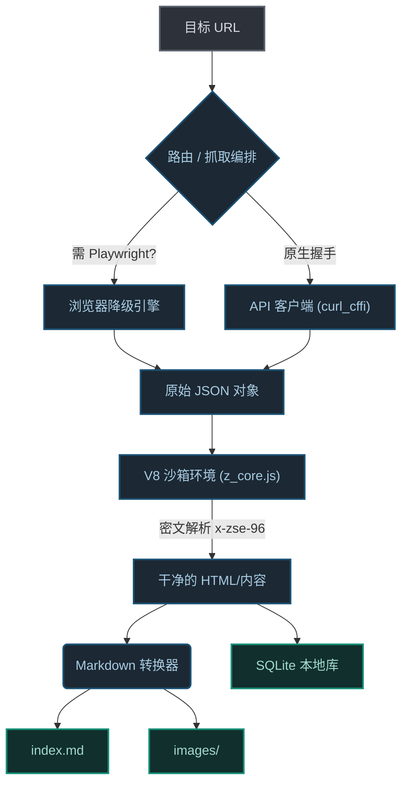

<div align="center">

# 🕷️ Zhihu Scraper
**为数据科学与大模型语料设计的高雅、稳定的知乎内容提取器**

<p align="center">
  
  
  
  
</p>

<p align="center">
  <strong>
    简体中文 | 
    <a href="README_EN.md">English</a>
  </strong>
</p>

[**🚀 快速开始**](#-快速开始) | [**🧠 项目哲学**](#-项目哲学为什么选择它) | [**🏗️ 架构设计**](#%EF%B8%8F-基础设施与架构设计) | [**📊 产出预览**](#-精选数据产出)

</div>

---

## 🧠 项目哲学 (为什么选择它？)

抓取知乎内容历来是一场针对 `x-zse-96` 签名、严格的 `zse_ck` Cookie 校验以及频繁的 Cloudflare/WAF 拦截的持久战。

`zhihu-scraper` 不仅仅是一个脚本；它是一个**工程级的数据管道**。它摒弃了脆弱的 CSS 选择器，转而与知乎后端进行原生的底层 JSON API 握手，在无需浏览器开销（除非必要）的情况下，提供高度流畅且高性能的提取体验。

### ✨ 核心特性
- 🚀 **零开销原生握手：** 使用 `curl_cffi` 完美模拟 Chrome 底层 TLS/HTTP2 指纹，静默绕过网关。
- 🛡️ **智能 Cookie 池与自动降级：** 通过 JSON 池自动轮换身份。若遭遇强力拦截，系统会平滑降级至无头 Playwright 实例，突破“知乎专栏”的硬核防线。
- 📦 **双引擎持久化：** 内容不只是简单的堆砌。它被优雅地解析为排版精美的 `Markdown`（支持完美的 LaTeX 数学公式）并结构化地 `UPSERT` 到本地 `SQLite` 知识库中。
- 🔄 **增量监控运行：** 专用的 `monitor` 模式，利用状态指针（Last ID）追踪进度。即使是上万条的收藏夹，也能通过 Cron 任务轻松实现只抓取增量数据。

---

## 🚀 快速开始

**30 秒内**即可上手运行。标准提取模式无需复杂的浏览器配置。

### 1. 安装

```bash
# 极简设置（仅原生 API 模式）
pip install zhihu-scraper

# 完整推荐（包含 CLI 与 Playwright 降级引擎）
pip install "zhihu-scraper[cli]"
playwright install chromium
```

### 2. 5 秒疾速提取

在终端中粘贴任何知乎链接（回答、文章或问题）。

```bash
# 开箱即用
zhihu fetch "https://www.zhihu.com/question/123456/answer/987654"

# 交互式仪表盘（强烈推荐，体验最佳）
zhihu interactive
```

*想要构建自己的 Agent 数据管道？这是 Python SDK 的调用方式：*

```python
import asyncio
from core.scraper import ZhihuDownloader
from core.converter import ZhihuConverter

async def extract_knowledge():
    # 1. 初始化针对某个回答的下载器
    url = "https://www.zhihu.com/question/28696373/answer/2835848212"
    downloader = ZhihuDownloader(url)
    
    # 2. 从 API 获取原始数据
    data = await downloader.fetch_page()
    
    # 3. 转换为纯净的 Markdown（自动处理 LaTeX）
    converter = ZhihuConverter()
    markdown_text = converter.convert(data['html'])
    
    print(markdown_text[:200]) # 完美适配 LLM 语料输入

asyncio.run(extract_knowledge())
```

---

## 📊 精选数据产出

`zhihu-scraper` 的输出被设计为一件精致的数字展品。它将混乱的网络源码标准化为机器可读的代码艺术。

### 本地文件系统
使用 CLI 时，数据会井然有序地存储：
```text
data/
├── [2026-02-22] 深入理解大模型的底层逻辑/
│   ├── index.md           # 纯净的 Markdown 文件
│   └── images/            # 本地存储的图片，已绕过防盗链
└── zhihu.db               # 本地 SQLite 全文知识库
```

### 结构化 JSON (SQLite 实体)
提取的核心数据对象经过完美结构化，可直接用于 RAG (检索增强生成) 数据库：

```json
{
  "type": "answer",
  "answer_id": "2835848212",
  "question_id": "28696373",
  "author": "Tech Whisperer",
  "title": "深入理解大模型的底层逻辑",
  "voteup_count": 14205,
  "created_at": "2023-01-15T08:32:00Z",
  "html": "<p>大语言模型 (LLM) 本质上是在...</p>"
}
```

---

## 🏗️ 基础设施与架构设计

该项目严格遵循领驱动设计 (DDD)，将提取机制、Markdown 解析和数据持久层完美解耦。



---

## 🕹️ 五大 CLI 工作流

CLI 提供了一个功能强大的 `zhihu` 顶级命令。

1. **`zhihu interactive`** (✨ 推荐): 启动一个赛博朋克风格的终端 UI (TUI)，直观配置批量任务和检索。
2. **`zhihu fetch [URL]`**: 带有图片下载功能的单条稳定提取。
3. **`zhihu batch [FILE]`**: 通过文本文件提供 URL 列表。自动启动异步、限频的线程池 (`-c 8`)。
4. **`zhihu monitor [ID]`**: “自动化 Cron”功能。提供收藏夹 ID，它会维护一个状态指针，仅抓取最新增加的收藏。
5. **`zhihu query "[关键词]"`**: 依托 SQLite 引擎，对所有已下载知识进行极速本地检索。

---

## 🔧 便捷脚本（新增）

为了提升日常可用性，仓库新增了 `scripts/` 助手脚本，适合“先跑起来，再精调参数”的场景：

```bash
# 1) 初始化环境（venv + 依赖）
bash scripts/ensure_env.sh

# 2) 初始化 Cookie 模板
bash scripts/setup_cookie.sh

# 3) 健康检查
bash scripts/check.sh

# 4) 单条抓取（带重试）
bash scripts/fetch.sh --url "https://www.zhihu.com/question/123" --retry 3 --sleep 1.5

# 5) 批量抓取（推荐并发 1~2）
bash scripts/batch.sh --file ./urls.txt --concurrency 2 --retry 3 --sleep 1.5

# 6) 问题回答分页抓取（offset）
bash scripts/fetch_batched.sh --url "https://www.zhihu.com/question/123" --total 50 --batch 10 --sleep 1.5 --retry 3 --dedupe id

# 7) 本地检索
bash scripts/query.sh --keyword "大模型" --limit 20
```

> 建议：高风控时段将并发控制在 `1~2`，并将 `sleep` 保持在 `>=1.2s`。

## 🤝 参与贡献

欢迎任何形式的贡献！本项目正不断突破非结构化 Web 数据解析的边界。

```bash
git clone https://github.com/yuchenzhu-research/zhihu-scraper.git
cd zhihu-scraper
pip install -e ".[dev]"
```

提交 Pull Request 之前，请确保运行 `ruff` 和 `pytest`。

<p align="center">
  <br>
  <b><a href="#top">⬆ 返回顶部</a></b>
</p>

---

*📝 **免责声明：** 本框架仅供学术研究和个人存档使用。严禁将底层 HTTP 认证指纹解析用于商业化或非法 DDoS 活动。针对因配置过高并发导致账户受限的情况，维护者不承担任何责任。*