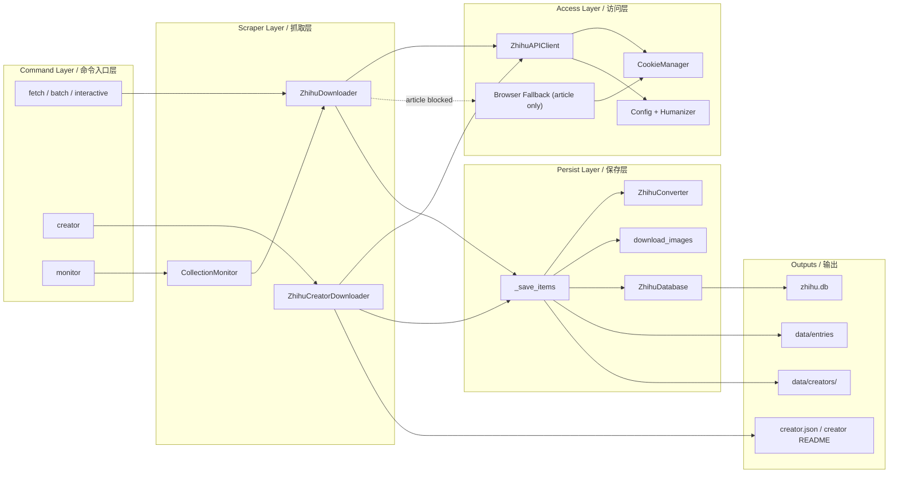

<div align="center">

# Zhihu-Scraper
### 知乎爬虫 | Local-First Zhihu Scraper

**一个面向本地归档的知乎内容抓取工具：优先走协议层，必要时降级 Playwright，输出直接落地为 Markdown、图片资源和 SQLite。**

<p>
  
  
  
  
</p>

<p>
  <strong>简体中文</strong> · <a href="README_EN.md">English</a>
</p>

<p>
  <a href="#快速开始-quick-start">快速开始</a> ·
  <a href="#核心特性-features">核心特性</a> ·
  <a href="#配置说明-configuration">配置说明</a> ·
  <a href="#架构概览-architecture">架构概览</a> ·
  <a href="#开发路线图-roadmap">开发路线图</a> ·
  <a href="#常见问题-faq">FAQ</a>
</p>

</div>

> [!WARNING]
> **Disclaimer / 免责声明**
>
> 本项目仅用于学习、研究、个人知识归档与技术交流。请遵守知乎服务条款、robots 约束以及当地法律法规。**严禁将其用于未授权的数据采集、商业倒卖、批量撞库、账号滥用等非法用途。**

## 项目简介 Overview

`Zhihu-Scraper` 不是一个重平台、重后端的在线爬虫系统，而是一个**本地优先（Local-First）**的知乎内容归档工具。

它当前适合做的事情：

- 抓取**单条回答**
- 抓取**专栏文章**
- 抓取**问题页下最近 N 条回答**
- 抓取**作者主页下的回答和专栏**
- 对**收藏夹**做增量监控
- 将结果保存为 **Markdown + 图片 + SQLite**

它当前**还没有**正式做到的事情：

- 话题维度抓取
- JSON / CSV / MySQL 导出
- GUI 图形界面
- 基于 LLM 的自动内容分析

这些会放进后面的 [开发路线图](#开发路线图-roadmap)。

## 快速开始 Quick Start

目标是让你在 **3 分钟内跑通第一次抓取**。

### 1. 环境要求

- **Python 3.10+**
- 可选：**Playwright**（专栏降级路径需要）
- 可选：系统安装 **Chrome**

### 2. 安装

推荐使用官方一键安装入口：

```bash
git clone https://github.com/yuchenzhu-research/zhihu-scraper.git
cd zhihu-scraper
./install.sh
```

如果你想**显式重建**损坏或混乱的本地环境：

```bash
./install.sh --recreate
```

这条命令会自动完成：

- 创建本地 `.venv`
- 通过 `pyproject.toml` 安装完整依赖
- 安装 Playwright Chromium
- 生成本地 `cookies.json` 模板
- 运行一次环境检查

如果你想手动安装，推荐显式使用本地 Python 模块入口：

```bash
python3 -m venv .venv
.venv/bin/python -m pip install -e ".[full]"
.venv/bin/python -m playwright install chromium
```

安装完成后，推荐直接进入首页菜单：

```bash
./zhihu
```

菜单操作方式：

- 方向键移动
- `Enter` 确认
- `Space` 勾选复选项
- `Ctrl+C` 退出当前界面

### 3. 配置 Cookie

先从模板复制一份本地 Cookie 文件：

```bash
cp cookies.example.json cookies.json
```

然后填入你自己的 `z_c0` 和 `d_c0`：

```json
[
  {
    "name": "z_c0",
    "value": "YOUR_Z_C0_HERE",
    "domain": ".zhihu.com",
    "path": "/"
  },
  {
    "name": "d_c0",
    "value": "YOUR_D_C0_HERE",
    "domain": ".zhihu.com",
    "path": "/"
  }
]
```

### 4. Hello World

最简单的一次抓取：

```bash
./zhihu fetch "https://www.zhihu.com/question/28696373/answer/2835848212"
```

如果你想显式使用本地虚拟环境里的 Python：

```bash
.venv/bin/python cli/app.py fetch "https://www.zhihu.com/question/28696373/answer/2835848212"
```

### 5. 查看完整命令手册

README 只保留首页级说明。所有命令细节统一在终端手册里：

```bash
./zhihu manual
```

## 核心特性 Features

- 🚀 **异步抓取 / Async pipeline**
  - 批量任务、问题页分页和图片下载都走异步路径，适合本地高效归档。

- 🧠 **协议优先 / Protocol-first**
  - 默认使用协议层抓取，不把浏览器当主路径，启动更轻、资源占用更小。

- 🛟 **专栏自动降级 / Fallback to Playwright**
  - 专栏接口受限时，可切换到 Playwright 路径继续提取正文。

- 👤 **作者模式 / Creator mode**
  - 支持作者主页 URL 或 `url_token`，可批量抓最近回答和专栏。

- 📚 **本地归档友好 / Archive-friendly**
  - 抓取结果直接保存为 `index.md + images/ + zhihu.db`，适合长期沉淀。

- 🔁 **Cookie 轮换 / Cookie rotation**
  - 支持 `cookies.json` 与 `cookie_pool/*.json`，遇到风控时可轮换会话。

- 📡 **增量监控 / Incremental monitoring**
  - 可对知乎收藏夹做增量抓取，并保留进度指针，避免重复下载。

- 🎛️ **双入口体验 / Two entry styles**
  - 同时提供 `./zhihu ...` 和 `python3 cli/app.py ...` 两种启动方式。

## 功能一览 What It Can Scrape

| 类型 | 当前状态 | 说明 |
|---|---|---|
| 单条回答 | 已支持 | 最稳定 |
| 专栏文章 | 已支持 | 失败时可走 Playwright |
| 问题页回答列表 | 已支持 | 支持分页与风险提示 |
| 作者主页回答 | 已支持 | `creator` 模式 |
| 作者主页专栏 | 已支持 | `creator` 模式 |
| 收藏夹增量监控 | 已支持 | `monitor` 模式 |
| 话题抓取 | 规划中 | 尚未开放 CLI |
| JSON / CSV / MySQL 导出 | 规划中 | 当前主输出为 Markdown + SQLite |

## 配置说明 Configuration

### Cookie 配置

Cookie 是当前项目最重要的运行前提之一。

- 配置文件路径默认在项目根目录：`cookies.json`
- 模板文件是：`cookies.example.json`
- 你也可以在 `config.yaml` 里修改 Cookie 路径：

```yaml
zhihu:
  cookies:
    file: "cookies.json"
    required: true
```

### Cookie 池 / Cookie Pool

如果你有多组登录态，可以放到：

```text
cookie_pool/
├── account_a.json
├── account_b.json
└── account_c.json
```

程序会加载 `cookies.json` 和 `cookie_pool/*.json`，用于会话轮换。

### 代理配置 Proxy

这里要说清楚一件事：

> [!IMPORTANT]
> **当前仓库还没有稳定开放的 `config.yaml` 代理字段。**
>
> 也就是说，README 不能把“代理已完整内建”写成现状。

如果你的环境必须走代理，当前更稳的做法是：

- 在**系统或终端环境**里配置代理
- 再运行本工具

例如：

```bash
export HTTP_PROXY=http://127.0.0.1:7890
export HTTPS_PROXY=http://127.0.0.1:7890
python3 cli/app.py check
```

但这一块目前仍属于**高级用法**，后续更合理的方案是把代理显式收进 `config.yaml`。

### 安全提示 Security Notes

> [!CAUTION]
> - `cookies.json` 必须只保留在本地，**不要提交到 Git**
> - 泄露过的 Cookie 不要继续复用，应该重新登录并更新
> - 如果你要长期维护多个账号，建议使用 `cookie_pool/` 而不是把所有值塞进一个文件

## 使用方式 Usage

项目提供两条等价路径：

```bash
./zhihu <command> ...
python3 cli/app.py <command> ...
```

常用命令速查：

- `fetch`
- `creator`
- `batch`
- `monitor`
- `query`
- `interactive`
- `config --show`
- `check`
- `manual`

详细参数与示例统一在内置手册：

```bash
./zhihu manual
```

## 输出结构 Output Layout

默认输出目录是 `data/`：

```text
data/
├── entries/
│   └── [2026-03-06] 标题 (answer-1234567890)/
│       ├── index.md
│       └── images/
├── creators/
│   └── hu-xi-jin/
│       ├── creator.json
│       ├── README.md
│       └── [2026-03-06] 标题 (article-123456)/
│           ├── index.md
│           └── images/
└── zhihu.db
```

说明：

- `entries/`：普通 `fetch / batch / monitor` 输出
- `creators/<url_token>/`：作者模式输出
- `creator.json`：作者元信息和同步状态
- `README.md`：作者目录的本地索引页
- `zhihu.db`：统一 SQLite 数据库

## 架构概览 Architecture


```mermaid
flowchart LR
    subgraph A["Command Layer / 命令入口层"]
        A1["fetch / batch / interactive"]
        A2["creator"]
        A3["monitor"]
    end

    subgraph B["Scraper Layer / 抓取层"]
        B1["ZhihuDownloader"]
        B2["ZhihuCreatorDownloader"]
        B3["CollectionMonitor"]
    end

    subgraph C["Access Layer / 访问层"]
        C1["ZhihuAPIClient"]
        C2["Browser Fallback (article only)"]
        C3["CookieManager"]
        C4["Config + Humanizer"]
    end

    subgraph D["Persist Layer / 保存层"]
        D1["_save_items"]
        D2["ZhihuConverter"]
        D3["download_images"]
        D4["ZhihuDatabase"]
    end

    subgraph E["Outputs / 输出"]
        E1["data/entries"]
        E2["data/creators/<url_token>"]
        E3["creator.json / creator README"]
        E4["zhihu.db"]
    end

    A1 --> B1
    A2 --> B2
    A3 --> B3
    B3 --> B1
    B1 --> C1
    B2 --> C1
    B1 -. article blocked .-> C2
    C1 --> C3
    C1 --> C4
    C2 --> C3
    B1 --> D1
    B2 --> D1
    D1 --> D2
    D1 --> D3
    D1 --> D4
    D1 --> E1
    D1 --> E2
    B2 --> E3
    D4 --> E4
```

### 当前架构的核心取向

- **CLI-first**
  - 这是一个命令行优先项目，不是在线服务平台

- **Protocol-first**
  - 默认优先 API / 协议层，浏览器只作为兜底

- **File + DB 双输出**
  - 一份给人看（Markdown）
  - 一份给程序查（SQLite）

## 技术栈 Tech Stack

当前代码实际使用的主栈：

- **Python 3.10+**
- **Typer**：CLI 入口
- **Rich / Questionary**：终端交互
- **curl_cffi / HTTPX**：协议层请求与异步下载
- **Playwright**：浏览器降级抓取
- **PyYAML / structlog**：配置与日志
- **SQLite**：本地数据落盘

说明：

> [!NOTE]
> 你在项目规划中提到的 **Pydantic**、**JSON / CSV / MySQL 导出**、**话题抓取**，当前仓库还没有正式落地，因此我把它们放进了路线图，而没有写成“现有能力”。

## 安装模型 Installation Model

这个仓库以 `pyproject.toml` 作为**单一依赖来源**，而不是以 `requirements.txt` 为主。

也就是说：

- 依赖声明以 `pyproject.toml` 为准
- `install.sh` 是官方一键安装入口
- `./install.sh --recreate` 可强制重建 `.venv`
- 普通用户不需要先自己跑 `pip` 或 `playwright`
- 根目录 `./zhihu` 会优先复用本地 `.venv`

## 开发路线图 Roadmap

- [x] 单条回答抓取
- [x] 专栏文章抓取
- [x] 问题页分页抓取
- [x] 作者主页抓取（回答 + 专栏）
- [x] 收藏夹增量监控
- [x] Markdown + 图片 + SQLite 输出
- [ ] 话题页抓取
- [ ] JSON / CSV 导出
- [ ] MySQL 落库
- [ ] 更正式的代理配置层
- [ ] GUI 图形界面
- [ ] 基于 LLM 的内容摘要 / 标签 / 聚类分析
- [ ] 更完整的测试覆盖与更强的 CI 检查

## 本地开发 Development

安装开发依赖：

```bash
.venv/bin/python -m pip install -e ".[dev]"
```

常用命令：

```bash
.venv/bin/python -m compileall cli core
./zhihu check
./zhihu manual
```

## 常见问题 FAQ

### 1. 为什么没有 Cookie 也能跑，但结果不完整？

游客模式可以抓一部分内容，但稳定性和可见范围都更弱。问题页、作者页、收藏夹监控更依赖登录态。

### 2. 为什么专栏更容易失败？

专栏路径的风控更强。项目现在的真实链路是：

- 先走协议层 HTML 直取
- 首轮失败后自动轮换 Cookie 再重试一次
- 仍被拦截时再切到 Playwright

所以专栏能成功抓到，并不一定代表它是纯协议拿下的；很多情况下是协议优先、浏览器兜底。

### 3. 为什么 README 不展开所有命令参数？

因为首页应该负责：

- 让新用户 3 分钟上手
- 明确能力边界
- 告诉你去哪里看完整手册

命令细节已经统一放进：

```bash
./zhihu manual
```

### 4. 为什么不直接把 `cookies.json` 提交到仓库？

因为那是敏感凭据。仓库里只应该保留模板文件 `cookies.example.json`。

## 许可协议 License

本项目采用 [MIT License](LICENSE)。
