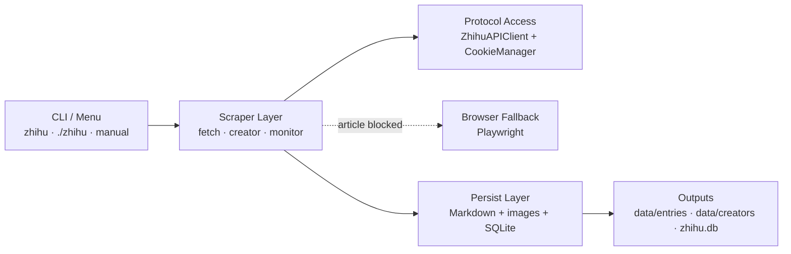

<div align="center">

# Zhihu-Scraper
### 知乎爬虫 | Local-First Zhihu Scraper

<p><strong>一个面向本地归档的知乎抓取工具：优先走协议层，必要时回退 Playwright，结果直接保存为 Markdown、图片资源和 SQLite。</strong></p>

<p>
  
  
  
  
</p>

<p>
  <strong>简体中文</strong> · <a href="README_EN.md">English</a>
</p>

<p>
  <strong>Status:</strong> active ·
  <strong>Install:</strong> <code>./install.sh</code> ·
  <strong>Manual:</strong> <code>zhihu manual</code>
</p>

<p>
  <code>fetch</code> · <code>creator</code> · <code>monitor</code> · <code>Markdown</code> · <code>images</code> · <code>SQLite</code>
</p>

<p>
  <a href="#快速开始-quick-start">快速开始</a> ·
  <a href="#核心特性-features">核心特性</a> ·
  <a href="#示例输出-examples">示例输出</a> ·
  <a href="#配置说明-configuration">配置说明</a> ·
  <a href="#架构概览-architecture">架构概览</a> ·
  <a href="#常见问题-faq">FAQ</a>
</p>

</div>

> [!WARNING]
> **免责声明 / Disclaimer**
>
> 本项目仅用于学习、研究、个人归档与技术交流。请遵守知乎服务条款、robots 约束和当地法律法规。**严禁将其用于未授权抓取、批量滥用、倒卖数据、撞库或其他非法用途。**

## 项目简介 Overview

`Zhihu-Scraper` 是一个 **本地优先** 的知乎归档工具，不是在线爬虫平台。

它解决的是一件很具体的事：

- 把知乎内容抓下来
- 转成适合人阅读的 Markdown
- 同时保留图片和本地数据库

它现在适合：

- 保存单条回答
- 保存专栏文章
- 抓问题页下最近 N 条回答
- 抓作者主页下最近回答和专栏
- 对收藏夹做增量监控

它现在还没有：

- 话题维度抓取
- JSON / CSV / MySQL 导出
- GUI 图形界面
- 基于 LLM 的自动分析

这些能力会放在后面的 [路线图](#开发路线图-roadmap)。

## 30 秒判断 Fit

| 适合 | 不适合 |
|---|---|
| 想把知乎内容保存成本地 Markdown | 想做大规模在线爬虫平台 |
| 想保留图片、本地目录和 SQLite | 想立刻得到 JSON / CSV / MySQL 导出 |
| 想用命令行或终端菜单快速归档内容 | 想直接使用完整 GUI |
| 想抓回答、专栏、作者页、收藏夹 | 想抓话题页和全站搜索结果 |

## 一眼看懂 At a Glance

| 输入 | 抓取链路 | 输出 |
|---|---|---|
| 回答 / 专栏 / 问题 / 作者 / 收藏夹 | 协议优先，专栏受限时自动补救 | `index.md + images/ + zhihu.db` |

## 快速开始 Quick Start

目标：**3 分钟内完成第一次成功抓取。**

### 1. 环境要求

- Python 3.10+
- 可选：Playwright
- 可选：系统 Chrome

### 2. 安装

推荐直接使用项目内的一键安装脚本：

```bash
git clone https://github.com/yuchenzhu-research/zhihu-scraper.git
cd zhihu-scraper
./install.sh
```

如果你本地环境已经乱了，直接重建：

```bash
./install.sh --recreate
```

安装完成后，推荐直接从首页菜单进入：

```bash
zhihu
```

一次性最短路径：

```bash
git clone https://github.com/yuchenzhu-research/zhihu-scraper.git
cd zhihu-scraper
./install.sh
# 然后编辑 .local/cookies.json 填入你自己的 z_c0 / d_c0
zhihu
```

### 3. 配置 Cookie

复制模板：

```bash
mkdir -p .local
cp cookies.example.json .local/cookies.json
```

更推荐直接运行 `./install.sh`，它会自动初始化 `.local/cookies.json` 模板。

填入你自己的 `z_c0` 和 `d_c0`。

### 4. Hello World

最简单的一次抓取：

```bash
zhihu fetch "https://www.zhihu.com/question/28696373/answer/2835848212"
```

如果你更喜欢显式调用 Python：

```bash
.venv/bin/python cli/app.py fetch "https://www.zhihu.com/question/28696373/answer/2835848212"
```

### 5. 查看完整命令手册

README 只保留首页级说明。完整命令说明统一在内置手册中：

```bash
zhihu manual
```

## 核心特性 Features

- 🚀 **异步抓取**
  批量任务、问题页分页和图片下载都走异步路径。

- 🧠 **协议优先**
  默认先走 API / HTML 协议路径，不把浏览器当主路径。

- 🛟 **专栏自动补救**
  专栏先走协议层，失败后会先轮换 Cookie，再尝试 Playwright。

- 👤 **作者抓取**
  支持作者主页 URL 或 `url_token`，可批量抓最近回答和专栏。

- 📚 **本地归档友好**
  输出直接落地为 `index.md + images/ + zhihu.db`。

- 🔁 **Cookie 轮换**
  支持 `.local/cookies.json` 与 `.local/cookie_pool/*.json`，并兼容历史上的 `cookies.json` 与 `cookie_pool/*.json`。

- 📡 **收藏夹增量监控**
  支持监控新内容并保留进度指针。

- 🎛️ **双入口**
  首选 `zhihu`，仓库内也可以继续用 `./zhihu` 或 `python3 cli/app.py`。

## 支持范围 Coverage

| 类型 | 当前状态 | 说明 |
|---|---|---|
| 单条回答 | 已支持 | 最稳定 |
| 专栏文章 | 已支持 | 可能回退到 Playwright |
| 问题页回答列表 | 已支持 | 支持分页与风险提示 |
| 作者主页回答 | 已支持 | `creator` 模式 |
| 作者主页专栏 | 已支持 | `creator` 模式 |
| 收藏夹增量监控 | 已支持 | `monitor` 模式 |
| 话题抓取 | 规划中 | 尚未开放 CLI |
| JSON / CSV / MySQL 导出 | 规划中 | 当前主输出为 Markdown + SQLite |

## 推荐入口 Recommended Paths

| 你想做什么 | 推荐命令 |
|---|---|
| 第一次进入项目 | `zhihu` |
| 抓一条链接 | `zhihu fetch "<url>"` |
| 抓作者主页 | `zhihu creator "<people url>"` |
| 批量抓取 | `zhihu batch urls.txt` |
| 环境检查 | `zhihu check` |
| 查看完整说明书 | `zhihu manual` |

## 使用方式 Usage

项目默认入口是全局命令 `zhihu`。仓库内也保留兜底入口：

```bash
zhihu <command> ...
./zhihu <command> ...
python3 cli/app.py <command> ...
```

常用命令：

- `fetch`
- `creator`
- `batch`
- `monitor`
- `query`
- `interactive`
- `config --show`
- `check`
- `manual`

完整参数和示例请看：

```bash
zhihu manual
```

`interactive` 现在已经是新的默认交互工作台：

- `Enter` 生成当前草案
- `Ctrl+R` 执行当前草案
- `Ctrl+Y` 从最近一轮失败项生成重试草案
- `zhihu interactive --legacy` 仅保留为旧版回退入口，方便回归排查

## 示例输出 Examples

仓库里保留了两份可以直接打开的样例输出：

| 展示项 | 你能看到什么 | 打开 |
|---|---|---|
| 超链接保留 | 目录页、外部链接、多层超链接 | [深度学习数学基础](examples/outputs/[2026-03-24]%20【深度学习数学基础】序章%20+%20目录（已完结，共30章）%20(article-25643286963)/index.md) |
| 图片与数学公式 | 本地图片引用、块公式、长文混排 | [线性代数学习笔记](examples/outputs/[2026-03-24]%20线性代数(Linear%20Algebra)学习笔记%20(article-641433373)/index.md) |

更详细的说明见：

- [examples/README.md](examples/README.md)
- [docs/REPOSITORY_BOUNDARY.md](docs/REPOSITORY_BOUNDARY.md)

## 输出结构 Output Layout

默认输出目录是 `data/`：

```text
data/
├── entries/
│   └── [2026-03-06] 标题 (answer-1234567890)/
│       ├── index.md
│       └── images/
├── creators/
│   └── hu-xi-jin/
│       ├── creator.json
│       ├── README.md
│       └── [2026-03-06] 标题 (article-123456)/
│           ├── index.md
│           └── images/
└── zhihu.db
```

- `entries/`：普通 `fetch / batch / monitor` 输出
- `creators/<url_token>/`：作者模式输出
- `creator.json`：作者元信息和同步状态
- `README.md`：作者目录的本地索引页
- `zhihu.db`：统一 SQLite 数据库

仓库正式目录与本地运行目录的边界说明见：

- [docs/REPOSITORY_BOUNDARY.md](docs/REPOSITORY_BOUNDARY.md)

## 配置说明 Configuration

### Cookie

默认 Cookie 文件是：

```text
.local/cookies.json
```

模板文件是：

```text
cookies.example.json
```

如果你有多组登录态，可以放到：

```text
.local/cookie_pool/
```

### 代理

> [!IMPORTANT]
> 当前仓库还没有稳定开放的 `config.yaml` 代理字段。

如果你的环境必须走代理，当前更稳的做法是先在系统或终端里设置代理，再运行本工具。

```bash
export HTTP_PROXY=http://127.0.0.1:7890
export HTTPS_PROXY=http://127.0.0.1:7890
zhihu check
```

### 安全提示

> [!CAUTION]
> - 不要提交 `.local/` 目录和 `cookies.json`
> - 泄露过的 Cookie 不要继续复用
> - 多账号建议放在 `.local/cookie_pool/`，不要全塞进一个文件

## 架构概览 Architecture


```mermaid
flowchart LR
    A["CLI / Menu<br/>zhihu · ./zhihu · manual"] --> B["Scraper Layer<br/>fetch · creator · monitor"]
    B --> C["Protocol Access<br/>ZhihuAPIClient + CookieManager"]
    B -. article blocked .-> D["Browser Fallback<br/>Playwright"]
    B --> E["Persist Layer<br/>Markdown + images + SQLite"]
    E --> F["Outputs<br/>data/entries · data/creators · zhihu.db"]
```

当前架构的核心取向：

- **CLI-first**
  这是命令行工具，不是在线服务平台。

- **Protocol-first**
  默认优先协议层，浏览器只作为补救路径。

- **File + DB 双输出**
  一份给人看，一份给程序查。

## 技术栈 Tech Stack

- Python 3.10+
- Typer
- Rich / Questionary
- curl_cffi / HTTPX
- Playwright
- PyYAML / structlog
- SQLite

> [!NOTE]
> 项目规划里提到的 Pydantic、JSON / CSV / MySQL 导出、话题抓取，目前还没有在当前仓库里完整落地，所以它们被放在路线图，而不是现有能力里。

## 开发路线图 Roadmap

- [x] 单条回答抓取
- [x] 专栏文章抓取
- [x] 问题页分页抓取
- [x] 作者主页抓取（回答 + 专栏）
- [x] 收藏夹增量监控
- [x] Markdown + 图片 + SQLite 输出
- [ ] 话题页抓取
- [ ] JSON / CSV 导出
- [ ] MySQL 落库
- [ ] 更正式的代理配置层
- [ ] GUI 图形界面
- [ ] 基于 LLM 的内容摘要 / 标签 / 聚类分析
- [ ] 更完整的测试覆盖与更强的 CI 检查

## 常见问题 FAQ

### 为什么没有 Cookie 也能跑，但结果不完整？

游客模式可以抓一部分公开内容，但稳定性和可见范围都更弱。问题页、作者页和收藏夹监控更依赖登录态。

### 为什么专栏更容易失败？

专栏路径风控更强。当前真实链路是：

1. 先走协议层 HTML 直取
2. 首轮失败后自动轮换 Cookie 再试一次
3. 仍被拦截时再切到 Playwright

### 为什么 README 不展开所有命令参数？

因为首页应该优先完成三件事：

- 让新用户快速跑通
- 说明能力边界
- 告诉你完整手册在哪里

详细命令说明统一收口到：

```bash
zhihu manual
```

### 为什么我输入 `zhihu` 没反应，或者执行成了别的东西？

先执行：

```bash
type zhihu
which zhihu
zhihu --help
```

如果 `type zhihu` 显示它是 shell function、alias，或者指向了 Conda 激活函数，那就是你的 shell 配置把真正的 `zhihu` 命令覆盖了。

这时要做的不是改项目，而是改你自己的 shell 配置，比如把：

```bash
zhihu () {
    conda activate zhihu
}
```

重命名成别的名字，例如 `zhihu_env`，然后重新执行：

```bash
source ~/.zshrc
```

### 首页菜单怎么操作？

- 方向键移动
- `Enter` 确认
- `Space` 勾选复选项
- `Ctrl+C` 退出当前界面

## 许可协议 License

本项目采用 [MIT License](LICENSE)。
