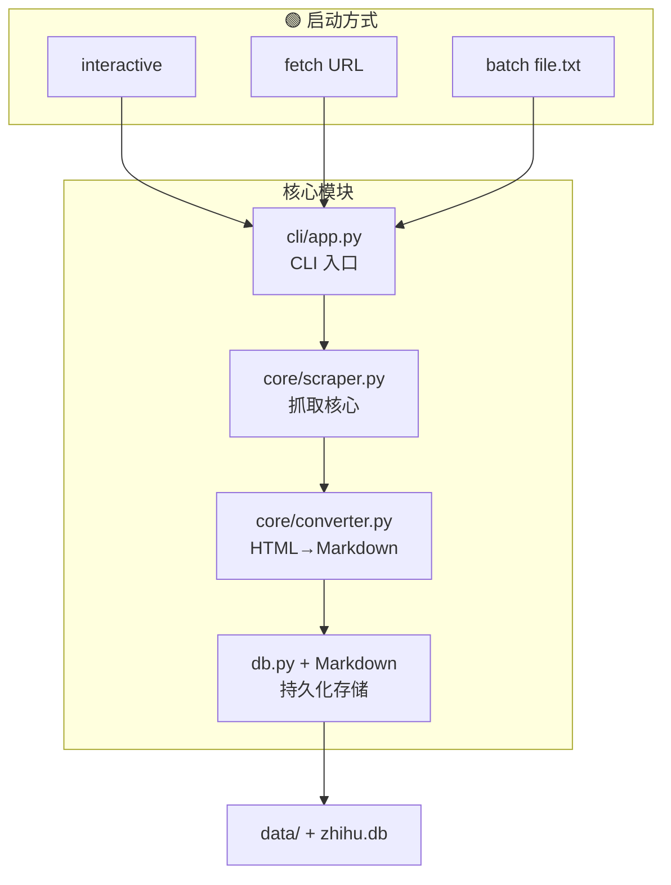
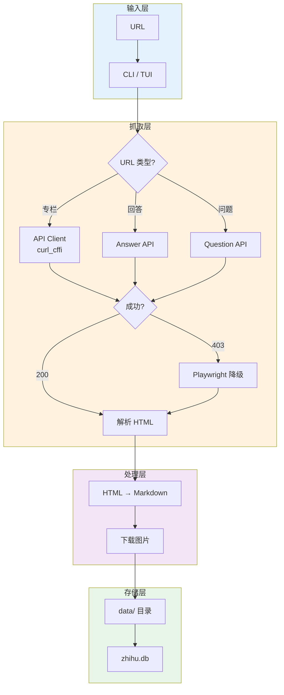
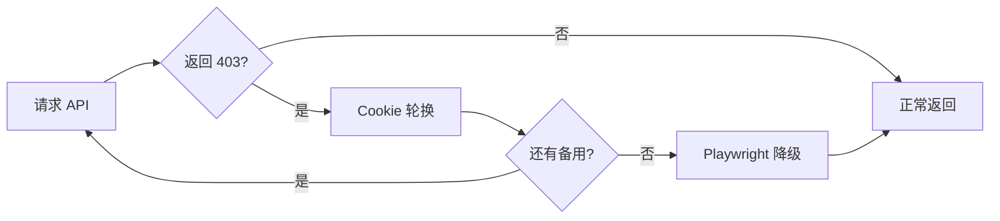

<div align="center">

# 🕷️ Zhihu Scraper
**优雅、稳定、高性能的知乎内容提取器**

<p align="center">
  
  
  
</p>

<p align="center">
  <strong>
    简体中文 |
    <a href="README_EN.md">English</a>
  </strong>
</p>

</div>

> ⚠️ **免责声明**：本项目仅供学术研究和个人学习使用。请遵守知乎服务条款，合理使用。

---

## 目录

- [为什么选择它？](#为什么选择它)
- [快速开始](#快速开始)
- [使用方式](#使用方式)
- [技术架构](#技术架构)
- [数据输出](#数据输出)
- [常见问题](#常见问题)

---

## 为什么选择它？

### 爬取知乎的三大挑战

| 挑战 | 传统方案 | 我们的方案 |
|------|----------|-----------|
| **x-zse-96 签名** | Selenium 全量渲染 | curl_cffi 纯协议层模拟指纹 |
| **Cookie 校验** | 单账号容易封 | Cookie 池自动轮换 |
| **专栏强风控** | 经常 403 | 自动降级 Playwright |

### 核心特性

- 🚀 **零开销协议层**：curl_cffi 模拟 Chrome TLS 指纹
- 🛡️ **智能降级策略**：API 失败 → 自动切换 Playwright
- 📦 **双引擎持久化**：Markdown + SQLite
- 🔄 **增量监控**：收藏夹状态追踪

---

## 快速开始

### 安装

```bash
git clone https://github.com/yuchenzhu-research/zhihu-scraper.git
cd zhihu-scraper
./install.sh
```

### 三步上手


```mermaid
flowchart TB
    subgraph 输入 ["🟢 启动方式"]
        I["interactive"]
        F["fetch URL"]
        B["batch file.txt"]
    end

    I --> A
    F --> A
    B --> A

    subgraph 核心模块
        A[cli/app.py<br />CLI 入口]
        A --> S[core/scraper.py<br />抓取核心]
        S --> C[core/converter.py<br />HTML→Markdown]
        C --> D["db.py + Markdown<br />持久化存储"]
    end

    D --> O["data/ + zhihu.db"]
```

使用示例：

**方式一：UI 交互模式（推荐）**
```bash
python cli/app.py interactive
```

**方式二：CLI 命令行模式**
```bash
python cli/app.py fetch "https://www.zhihu.com/p/123456"
```

> 💡 如果直接运行 `./zhihu` 遇到权限问题，建议统一使用 `python cli/app.py` 执行命令。

```python
import asyncio
from core.scraper import ZhihuDownloader
from core.converter import ZhihuConverter

async def main():
    downloader = ZhihuDownloader("https://www.zhihu.com/question/28696373/answer/2835848212")
    data = await downloader.fetch_page()
    converter = ZhihuConverter()
    markdown = converter.convert(data['html'])
    print(markdown[:200])

asyncio.run(main())
```

---

## 使用方式

### CLI 命令

| 命令 | 说明 | 示例 |
|------|------|------|
| `fetch` | 抓取单个链接 | `./zhihu fetch "URL"` |
| `batch` | 批量抓取 | `./zhihu batch urls.txt -c 4` |
| `monitor` | 增量监控收藏夹 | `./zhihu monitor 78170682` |
| `query` | 搜索本地数据 | `./zhihu query "关键词"` |
| `interactive` | 交互式界面 | `./zhihu interactive` |
| `config` | 查看配置 | `./zhihu config --show` |
| `check` | 环境检查 | `./zhihu check` |

### 配置 Cookie（推荐）

需要登录知乎后获取 Cookie。建议使用以下两种方法之一：

#### 方法 A：Application 面板直接找（最快）
1. 用 Chrome 打开并**确保已登录**知乎（`https://www.zhihu.com`）。
2. 按 `F12`（Mac: `⌥⌘I`）打开开发者工具。
3. 进入 **Application（应用）** 标签页。
4. 左侧导航栏展开：`Storage` → `Cookies` → `https://www.zhihu.com`。
5. 在右侧列表中直接搜索或找到：`z_c0` 和 `d_c0`。
6. 复制它们的值（Value），按如下格式填入 `cookies.json`：

```json
[
    {"name": "z_c0", "value": "你的z_c0值", "domain": ".zhihu.com"},
    {"name": "d_c0", "value": "你的d_c0值", "domain": ".zhihu.com"}
]
```
> 💡 如果这里没有找到，通常是因为未登录、登录过期，或者当前域名不是 `www.zhihu.com`（比如在专栏页）。请确保在知乎首页重试，或检查左侧所有知乎相关的域名。

#### 方法 B：Network 面板抓取（适合 HttpOnly）
如果方法 A 找不到，可以使用此方法：
1. 打开开发者工具，进入 **Network（网络）** 标签页。
2. 勾选 **Preserve log（保留日志）**。
3. 刷新页面（`Cmd+R` / `Ctrl+R`）。
4. 在请求列表中点击任意一个 Fetch/XHR 请求（如 `api` 相关请求）。
5. 在右侧面板中选择 **Headers（标头）** → **Request Headers（请求标头）**。
6. 找到 `cookie:` 字段，在其中搜索 `z_c0=` 和 `d_c0=`，提取对应的值填入 JSON 中。

### 💡 抓取策略与限制 (Scraping Strategy)

| 内容类型 | 游客模式 (无 Cookie) | 登录模式 (有 Cookie) | 建议 |
| :--- | :--- | :--- | :--- |
| **回答 / 问题** | ✅ 可抓取 (限制前 3 条) | ✅ 无限制 (极稳定/秒抓) | 推荐单次反复使用 `interactive` |
| **专栏文章** | ❌ 很难抓 (高频 403) | ✅ 可抓取 (自动切换浏览器) | **必须配置 Cookie** 以便通过校验 |

> **💡 稳定性建议**：
> - **优先单条抓取**：推荐使用 `interactive` 交互模式多次输入链接。这比一次性 `batch` 几百条链接更能模拟人类行为，且由于专栏文章常需切换 Playwright 渲染，单条处理逻辑更清晰。
> - **专栏特供**：专栏 WAF 会拦截纯协议请求。当你看到 `article_forbidden` 报错时是正常现象，系统会自动唤起 Playwright 进行“降级回退”，无需手动干预。

> 💡 不配置 Cookie 可用游客模式，但部分内容（如评论、盐选文章下半部分）会受限。

---

## 技术架构


```mermaid
flowchart TD
    subgraph 输入层
        URL[URL] --> CLI[CLI / TUI]
    end

    subgraph 抓取层
        CLI --> Type{URL 类型?}
        Type -->|专栏| API[API Client<br>curl_cffi]
        Type -->|回答| Answer[Answer API]
        Type -->|问题| Question[Question API]
        API --> OK{成功?}
        Answer --> OK
        Question --> OK
        OK -->|403| Fallback[Playwright 降级]
        OK -->|200| Parse[解析 HTML]
        Fallback --> Parse
    end

    subgraph 处理层
        Parse --> Convert[HTML → Markdown]
        Convert --> Images[下载图片]
    end

    subgraph 存储层
        Images --> Local[data/ 目录]
        Local --> SQLite[zhihu.db]
    end

    style 输入层 fill:#e3f2fd
    style 抓取层 fill:#fff3e0
    style 处理层 fill:#f3e5f5
    style 存储层 fill:#e8f5e9
```

### Cookie 轮换策略


```mermaid
flowchart LR
    A[请求 API] --> B{返回 403?}
    B -->|是| C[Cookie 轮换]
    B -->|否| D[正常返回]
    C --> E{还有备用?}
    E -->|是| A
    E -->|否| F[Playwright 降级]
    F --> D
```

---

## 数据输出

### 文件结构

```
data/
├── [2026-03-03] 深入理解大模型/
│   ├── index.md        # Markdown 文件
│   └── images/         # 本地图片
│       ├── v2-abc123.jpg
│       └── v2-def456.png
└── zhihu.db            # SQLite 数据库
```

### SQLite 数据库

```sql
CREATE TABLE articles (
    id INTEGER PRIMARY KEY AUTOINCREMENT,
    answer_id TEXT UNIQUE NOT NULL,
    type TEXT NOT NULL,
    title TEXT,
    author TEXT,
    url TEXT,
    content_md TEXT,
    collection_id TEXT,
    created_at TIMESTAMP,
    updated_at TIMESTAMP
);
```

---

## 常见问题

| 问题 | 解决 |
|------|------|
| 报错 "Cookie required" | 编辑 `cookies.json` 填入登录后的 Cookie |
| 速度太慢 | 调整 `config.yaml` 中 `humanize.min_delay` 和 `max_delay` |
| 提取失败/被拦截 | 项目会自动降级到 Playwright 模式 |
| Windows 能用吗 | 支持！Python 3.10+ 和 Git 即可 |


<p align="center">
  <a href="#top">⬆ 返回顶部</a>
</p>

---

*📝 本项目仅供学术研究和个人学习使用。*