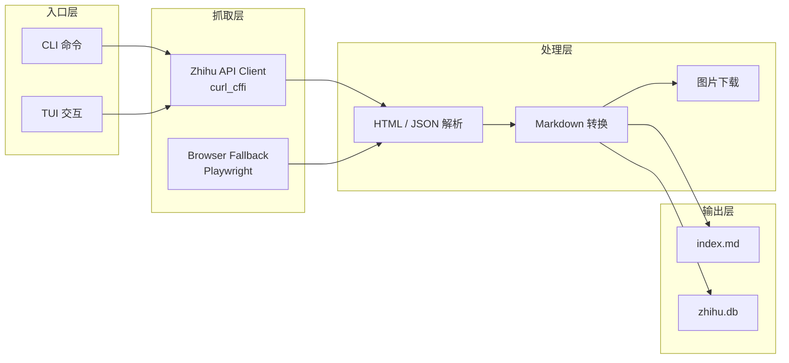
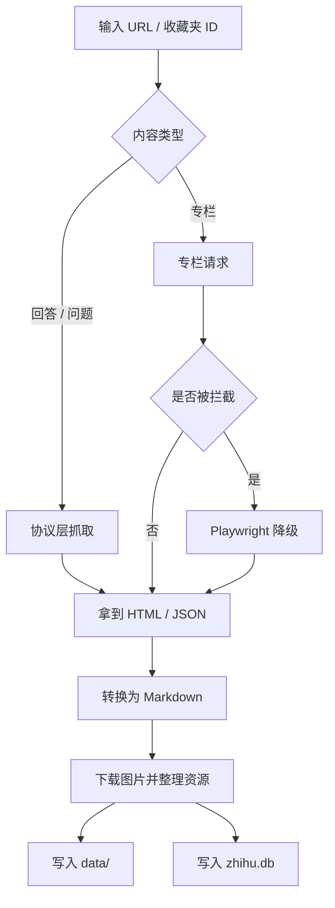

<div align="center">

# Zhihu Scraper
**面向本地归档的知乎内容提取工具。默认走协议层，专栏受限时降级 Playwright，结果同时保存为 Markdown 和 SQLite。**

<p align="center">
  
  
  
  
</p>

<p align="center">
  <strong>
    简体中文 |
    <a href="README_EN.md">English</a>
  </strong>
</p>

<p align="center">
  <a href="#快速开始">快速开始</a> ·
  <a href="#常用命令">常用命令</a> ·
  <a href="#架构设计">架构设计</a> ·
  <a href="#常见问题">常见问题</a>
</p>

</div>

> 仅供学术研究和个人学习使用。请遵守知乎服务条款。仓库中的 `cookies.json` 是占位模板，需要你自行填入真实值。

## 一句话理解

这是一个偏本地使用的知乎抓取器：优先走轻量协议层，必要时才启浏览器；抓完直接沉淀为 Markdown 文件和本地数据库，适合做个人资料归档和知识库积累。

## 适合什么场景

| 适合 | 不适合 |
|---|---|
| 批量归档回答、问题页、专栏文章 | 做长期在线爬虫平台 |
| 保存学习资料到本地知识库 | 追求零风控、零封禁风险 |
| 用 SQLite 做本地搜索和整理 | 替代正式的数据服务后端 |

## 快速开始

### 1. 环境要求

- Python `3.10+`
- 建议安装 Node.js，供 `PyExecJS` 使用
- 如需专栏降级，安装 Playwright 浏览器

### 2. 安装

```bash
git clone https://github.com/yuchenzhu-research/zhihu-scraper.git
cd zhihu-scraper
./install.sh
```

### 3. 准备 Cookie

仓库根目录已经提供 `cookies.json` 模板，直接打开并填入：

```json
[
  {"name": "z_c0", "value": "你的 z_c0", "domain": ".zhihu.com"},
  {"name": "d_c0", "value": "你的 d_c0", "domain": ".zhihu.com"}
]
```

获取步骤：

1. 登录 `https://www.zhihu.com`
2. 打开开发者工具
3. 在 `Application -> Cookies` 或 `Network -> Request Headers` 找到 `z_c0` / `d_c0`
4. 打开项目根目录的 `cookies.json`，把占位值替换成你自己的值

### 4. 先跑一条

```bash
./zhihu fetch "https://www.zhihu.com/question/28696373/answer/2835848212"
```

如果 `./zhihu` 没有执行权限：

```bash
python3 cli/app.py fetch "https://www.zhihu.com/question/28696373/answer/2835848212"
```

## 支持范围

| 内容类型 | 无 Cookie | 有 Cookie | 说明 |
|---|---|---|---|
| 单条回答 | 可用 | 可用 | 最稳定 |
| 问题页回答列表 | 受限 | 可用 | 游客模式通常只能拿到少量回答 |
| 专栏文章 | 容易被拦截 | 可用 | 失败时可降级 Playwright |
| 收藏夹监控 | 不推荐 | 可用 | 依赖登录态更稳 |

## 常用命令

| 命令 | 作用 | 示例 |
|---|---|---|
| `fetch` | 抓单条链接，或从文本中提取多条链接 | `./zhihu fetch "URL"` |
| `batch` | 批量抓文件中的链接 | `./zhihu batch urls.txt -c 4` |
| `monitor` | 增量监控收藏夹 | `./zhihu monitor 78170682` |
| `query` | 搜索本地数据库 | `./zhihu query "Transformer"` |
| `interactive` | 启动交互界面 | `./zhihu interactive` |
| `config` | 查看当前配置 | `./zhihu config --show` |
| `check` | 检查依赖和运行环境 | `./zhihu check` |

推荐的上手顺序：

1. 用 `check` 看环境是否完整
2. 用 `fetch` 跑一条回答或专栏
3. 再用 `batch` 或 `monitor` 进入批量场景

## 架构设计


```mermaid
flowchart LR
    subgraph I["入口层"]
        A["CLI 命令"]
        B["TUI 交互"]
    end

    subgraph S["抓取层"]
        C["Zhihu API Client<br/>curl_cffi"]
        D["Browser Fallback<br/>Playwright"]
    end

    subgraph P["处理层"]
        E["HTML / JSON 解析"]
        F["Markdown 转换"]
        G["图片下载"]
    end

    subgraph O["输出层"]
        H["index.md"]
        J["zhihu.db"]
    end

    A --> C
    B --> C
    C --> E
    D --> E
    E --> F
    F --> G
    F --> H
    F --> J
```

核心设计点：

- 浏览器只做兜底，不做主路径
- 抓取后立即本地化，不依赖在线服务
- 输出文件和数据库并存，方便阅读和检索

## 执行流


```mermaid
flowchart TD
    A["输入 URL / 收藏夹 ID"] --> B{"内容类型"}
    B -->|回答 / 问题| C["协议层抓取"]
    B -->|专栏| D["专栏请求"]
    C --> E["拿到 HTML / JSON"]
    D --> F{"是否被拦截"}
    F -->|否| E
    F -->|是| G["Playwright 降级"]
    G --> E
    E --> H["转换为 Markdown"]
    H --> I["下载图片并整理资源"]
    I --> J["写入 data/"]
    I --> K["写入 zhihu.db"]
```

## 项目结构

```text
cli/           命令行入口与交互界面
core/          抓取、转换、数据库、监控等核心逻辑
static/        签名脚本与静态资源
data/          本地输出目录，默认不提交
browser_data/  浏览器运行数据，默认不提交
```

## 输出结果

默认写入 `data/`：

```text
data/
├── [2026-03-06] 标题 (answer-1234567890)/
│   ├── index.md
│   └── images/
└── zhihu.db
```

其中：

- `index.md` 适合直接阅读和二次编辑
- `images/` 保存文内图片资源
- `zhihu.db` 便于本地搜索和后续整理

## 本地开发

安装开发依赖：

```bash
pip install -e ".[dev]"
```

常用检查：

```bash
python3 -m compileall cli core
python3 cli/app.py check
pytest
ruff check cli core
```

## 常见问题

### `check` 提示 Playwright 未安装

协议层依然能用，只是专栏降级不可用：

```bash
pip install -e ".[full]"
playwright install chromium
```

### 为什么游客模式抓不到完整问题页

这是知乎侧的可见性限制，不是脚本本身遗漏。

### 为什么专栏偶尔还是失败

专栏风控比回答更强，通常需要更新 Cookie、重新登录，或等待会话恢复。

### 仓库里的 `cookies.json` 为什么不能直接用

因为仓库里提交的是占位模板，`YOUR_Z_C0_HERE` 和 `YOUR_D_C0_HERE` 不是真实 Cookie。你需要手动替换成自己的登录态。
