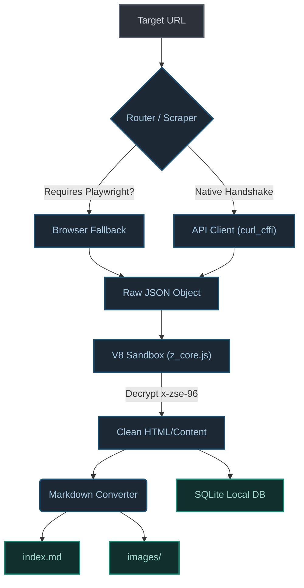

<div align="center">

# 🕷️ Zhihu Scraper
**The Elegant, Stable Zhihu Content Extractor for Data Science & LLM Corpora**

<p align="center">
  
  
  
  
</p>

<p align="center">
  <strong>
    <a href="README.md">简体中文</a> | 
    English
  </strong>
</p>

[**🚀 Quick Start**](#-quick-start) | [**🧠 Philosophy**](#-the-philosophy) | [**🏗️ Architecture**](#%EF%B8%8F-infrastructure--architecture) | [**📊 Output Preview**](#-curated-data-output)

</div>

---

## 🧠 The Philosophy (Why this Scraper?)

Scraping Zhihu (知乎) has historically been an uphill battle against `x-zse-96` signatures, strict `zse_ck` cookie validations, and frequent Cloudflare/WAF interceptions.

`zhihu-scraper` is not just another script; it is an **engineering-grade data pipeline**. It bypasses fragile CSS selectors and instead performs native, low-level JSON API handshakes with Zhihu's backend, rendering a seamless and highly performant extraction experience without the overhead of a headless browser (unless strictly necessary).

### ✨ Core Features
- 🚀 **Zero-Overhead Native Handshakes:** Uses `curl_cffi` to mimic Chrome's underlying TLS/HTTP2 fingerprints, dodging gateways silently.
- 🛡️ **Intelligent Cookie Pools & Degradation:** Auto-rotates identities via a JSON pool. If forced, it smoothly degrades to a headless Playwright instance to bypass "Zhihu Column" (Zhuanlan) hard-walls.
- 📦 **Dual-Engine Persistence:** Content isn't just dumped. It is elegantly parsed into visually pleasing `Markdown` (with robust LaTeX Math support) *and* structurally `UPSERT`ed into a localized `SQLite` knowledge base.
- 🔄 **Incremental Monitor:** A dedicated `monitor` mode tracking "Last ID" state pointers. Feed it a 10,000-item collection, and it will effortlessly grab *only the delta* via cron jobs.

---

## 🚀 Quick Start (Vibe Coding)

Get up and running in **under 30 seconds**. No complex browser setups required for standard extraction.

### 1. Installation

```bash
# Minimal setup (Native API mode only)
pip install zhihu-scraper

# Recommended (Includes CLI & Playwright Fallback Engine)
pip install "zhihu-scraper[cli]"
playwright install chromium
```

### 2. The 5-Second Extraction

Open your terminal and paste any Zhihu URL (Answer, Article, or Question).

```bash
# It works immediately out of the box.
zhihu fetch "https://www.zhihu.com/question/123456/answer/987654"

# Interactive UI Dashboard (Recommended for the best experience)
zhihu interactive
```

*Want to build your own agent pipeline? Here is the Python SDK approach:*

```python
import asyncio
from core.scraper import ZhihuDownloader
from core.converter import ZhihuConverter

async def extract_knowledge():
    # 1. Initialize Downloader targeting an Answer
    url = "https://www.zhihu.com/question/28696373/answer/2835848212"
    downloader = ZhihuDownloader(url)
    
    # 2. Fetch raw abstract syntax tree from API
    data = await downloader.fetch_page()
    
    # 3. Convert to clean Markdown (LaTeX handled automatically)
    converter = ZhihuConverter()
    markdown_text = converter.convert(data['html'])
    
    print(markdown_text[:200]) # Ready for LLM ingestion.

asyncio.run(extract_knowledge())
```

---

## 🎨 Curated Data Output

The output of `zhihu-scraper` is designed to be treated as a first-class exhibition piece. It standardizes web chaos into machine-readable art.

### Local File System
When using the CLI, data is beautifully organized:
```text
data/
├── [2026-02-22] 深入理解大模型的底层逻辑/
│   ├── index.md           # The pristine markdown file
│   └── images/            # Locally downloaded, anti-hotlinking defeated images
└── zhihu.db               # The SQLite Graph/Vector-ready database
```

### Clean JSON (SQLite Entity)
The fundamental data object extracted is perfectly structured for RAG (Retrieval-Augmented Generation) databases:

```json
{
  "type": "answer",
  "answer_id": "2835848212",
  "question_id": "28696373",
  "author": "Tech Whisperer",
  "title": "深入理解大模型的底层逻辑",
  "voteup_count": 14205,
  "created_at": "2023-01-15T08:32:00Z",
  "html": "<p>大语言模型 (LLM) 本质上是在...</p>"
}
```

---

## 🏗️ Infrastructure & Architecture

This project strictly adheres to Domain-Driven Design (DDD). It separates the extraction mechanisms, the markdown parsing, and the data persistence layers flawlessly.



---

## 🕹️ The 5 CLI Workflows 

The CLI provides a `zhihu` top-level command packed with operational power.

1. **`zhihu interactive`** (✨ Recommended): Launches a beautiful, cyberpunk-styled Terminal UI (TUI) for configuring batch tasks and queries visually.
2. **`zhihu fetch [URL]`**: Single robust extraction with image downloading capabilities.
3. **`zhihu batch [FILE]`**: Provide a text file of URLs. Automatically launches an asynchronous, rate-limited thread pool (`-c 8`).
4. **`zhihu monitor [ID]`**: The "Cron" feature. Give it a collection ID, and it maintains a state pointer (`.monitor_state.json`) to only download new bookmarks.
5. **`zhihu query "[KEYWORD]"`**: Lightning-fast local searches across all downloaded knowledge via the SQLite engine.

---

## 🔧 Utility Scripts (Added)

To improve day-to-day usability, this fork includes helper scripts under `scripts/`:

```bash
# 1) Initialize environment (venv + deps)
bash scripts/ensure_env.sh

# 2) Create cookie template
bash scripts/setup_cookie.sh

# 3) Health check
bash scripts/check.sh

# 4) Single fetch with retry
bash scripts/fetch.sh --url "https://www.zhihu.com/question/123" --retry 3 --sleep 1.5

# 5) Batch fetch (recommended concurrency 1~2)
bash scripts/batch.sh --file ./urls.txt --concurrency 2 --retry 3 --sleep 1.5

# 6) Offset-based batched answer fetch
bash scripts/fetch_batched.sh --url "https://www.zhihu.com/question/123" --total 50 --batch 10 --sleep 1.5 --retry 3 --dedupe id

# 7) Local query
bash scripts/query.sh --keyword "LLM" --limit 20
```

> Recommendation: keep concurrency at `1~2` and `sleep >= 1.2s` during sensitive periods.

## 🤝 Contributing

We welcome contributions! This is an active repository pushing the boundaries of what parsing unstructured web data should look like.

```bash
git clone https://github.com/yuchenzhu-research/zhihu-scraper.git
cd zhihu-scraper
pip install -e ".[dev]"
```

Please ensure you run `ruff` and `pytest` before submitting a Pull Request.  

<p align="center">
  <br>
  <b><a href="#top">⬆ Back to Top</a></b>
</p>

---

*📝 **Disclaimer:** This framework is designed explicitly for academic research and personal archiving. The parsing of underlying HTTP authentication fingerprints must not be commercialized or weaponized for DDoS activities. Maintainers hold no liability for accounts suspended due to overly aggressive concurrency settings.*
