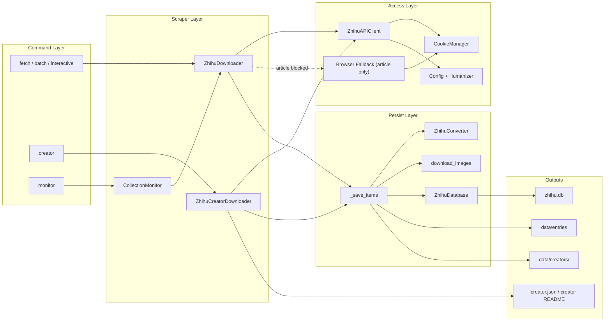

<div align="center">

# Zhihu-Scraper
### Local-First Zhihu Scraper | 知乎爬虫

**A local-first Zhihu extraction tool: protocol-first by default, Playwright as fallback when needed, and direct outputs to Markdown, image assets, and SQLite.**

<p>
  
  
  
  
</p>

<p>
  <a href="README.md">简体中文</a> · <strong>English</strong>
</p>

<p>
  <a href="#quick-start">Quick Start</a> ·
  <a href="#features">Features</a> ·
  <a href="#configuration">Configuration</a> ·
  <a href="#architecture">Architecture</a> ·
  <a href="#roadmap">Roadmap</a> ·
  <a href="#faq">FAQ</a>
</p>

</div>

> [!WARNING]
> **Disclaimer**
>
> This project is for learning, research, personal archival, and technical exploration only. Please comply with Zhihu's Terms of Service, robots restrictions, and local laws. **Do not use it for unauthorized scraping, resale, credential abuse, large-scale account operations, or any illegal activity.**

## Overview

`Zhihu-Scraper` is not a heavy hosted scraping platform. It is a **local-first archival tool** for Zhihu content.

What it currently does well:

- Fetch **single answers**
- Fetch **column articles**
- Fetch the latest **N answers from a question page**
- Fetch **answers and articles from a creator profile**
- Incrementally monitor **collections**
- Save outputs as **Markdown + images + SQLite**

What it does **not** officially provide yet:

- Topic-level scraping
- JSON / CSV / MySQL export
- GUI interface
- LLM-based content analysis

Those belong in the [Roadmap](#roadmap), not in the current feature list.

## Quick Start

The goal is to get your first successful fetch within **3 minutes**.

### 1. Requirements

- **Python 3.10+**
- Optional: **Playwright** for the browser fallback path
- Optional: a local **Chrome** installation

### 2. Install

The recommended path is the official one-shot installer:

```bash
git clone https://github.com/yuchenzhu-research/zhihu-scraper.git
cd zhihu-scraper
./install.sh
```

This command will automatically:

- create a local `.venv`
- install the full dependency set from `pyproject.toml`
- install Playwright Chromium
- create a local `cookies.json` template
- run one environment check

If you prefer manual installation, use the local Python module entrypoints explicitly:

```bash
python3 -m venv .venv
.venv/bin/python -m pip install -e ".[full]"
.venv/bin/python -m playwright install chromium
```

### 3. Configure Cookies

Start by copying the template:

```bash
cp cookies.example.json cookies.json
```

Then fill in your own `z_c0` and `d_c0` values:

```json
[
  {
    "name": "z_c0",
    "value": "YOUR_Z_C0_HERE",
    "domain": ".zhihu.com",
    "path": "/"
  },
  {
    "name": "d_c0",
    "value": "YOUR_D_C0_HERE",
    "domain": ".zhihu.com",
    "path": "/"
  }
]
```

### 4. Hello World

The simplest possible fetch:

```bash
./zhihu fetch "https://www.zhihu.com/question/28696373/answer/2835848212"
```

If you prefer calling the local virtualenv Python explicitly:

```bash
.venv/bin/python cli/app.py fetch "https://www.zhihu.com/question/28696373/answer/2835848212"
```

### 5. Open the Full Built-In Manual

This README is intentionally homepage-level. Full command details live in the terminal manual:

```bash
./zhihu manual
```

## Features

- 🚀 **Async pipeline**
  - Batch jobs, question pagination, and image downloads all run through asynchronous paths.

- 🧠 **Protocol-first**
  - The main path is API / protocol based. Browser automation is not the default runtime model.

- 🛟 **Automatic Playwright fallback**
  - Column articles can fall back to Playwright when the API path is blocked.

- 👤 **Creator mode**
  - Accepts either a creator profile URL or a raw `url_token`, then fetches recent answers and articles in batch.

- 📚 **Archive-friendly outputs**
  - Results are written directly as `index.md + images/ + zhihu.db`, which works well for long-term local knowledge bases.

- 🔁 **Cookie rotation**
  - Supports both `cookies.json` and `cookie_pool/*.json`, allowing session rotation under pressure.

- 📡 **Incremental monitoring**
  - Collections can be monitored incrementally with a persistent progress pointer.

- 🎛️ **Two entry styles**
  - Both `./zhihu ...` and `python3 cli/app.py ...` are supported.

## Coverage

| Type | Status | Notes |
|---|---|---|
| Single answer | Supported | Most stable path |
| Column article | Supported | Can fall back to Playwright |
| Question page answers | Supported | Includes pagination and risk warnings |
| Creator answers | Supported | Via `creator` mode |
| Creator articles | Supported | Via `creator` mode |
| Collection monitoring | Supported | Via `monitor` mode |
| Topic scraping | Planned | No CLI path yet |
| JSON / CSV / MySQL export | Planned | Current primary outputs are Markdown + SQLite |

## Configuration

### Cookie Configuration

Cookies are one of the most important runtime prerequisites for this project.

- Default local file: `cookies.json`
- Template file: `cookies.example.json`
- You can also change the cookie path in `config.yaml`:

```yaml
zhihu:
  cookies:
    file: "cookies.json"
    required: true
```

### Cookie Pool

If you maintain multiple sessions, place them like this:

```text
cookie_pool/
├── account_a.json
├── account_b.json
└── account_c.json
```

The program loads both `cookies.json` and `cookie_pool/*.json` for rotation.

### Proxy Configuration

One important clarification:

> [!IMPORTANT]
> **This repository does not currently expose a stable proxy field in `config.yaml`.**
>
> In other words, the README should not present "built-in proxy support" as a finished feature.

If your environment requires a proxy, the more reliable current approach is:

- Configure the proxy in your **system or shell environment**
- Then run this tool normally

For example:

```bash
export HTTP_PROXY=http://127.0.0.1:7890
export HTTPS_PROXY=http://127.0.0.1:7890
python3 cli/app.py check
```

This is still an advanced path for now. A cleaner future direction is to expose proxy configuration explicitly in `config.yaml`.

### Security Notes

> [!CAUTION]
> - Keep `cookies.json` local only. **Do not commit it**
> - If a cookie has ever leaked, do not keep using it. Re-login and replace it
> - If you maintain multiple accounts, prefer `cookie_pool/` over putting everything into one file

## Usage

The project provides two equivalent entry styles:

```bash
./zhihu <command> ...
python3 cli/app.py <command> ...
```

Common command index:

- `fetch`
- `creator`
- `batch`
- `monitor`
- `query`
- `interactive`
- `config --show`
- `check`
- `manual`

Detailed arguments and examples are intentionally centralized in:

```bash
./zhihu manual
```

## Output Layout

The default output directory is `data/`:

```text
data/
├── entries/
│   └── [2026-03-06] Title (answer-1234567890)/
│       ├── index.md
│       └── images/
├── creators/
│   └── hu-xi-jin/
│       ├── creator.json
│       ├── README.md
│       └── [2026-03-06] Title (article-123456)/
│           ├── index.md
│           └── images/
└── zhihu.db
```

Notes:

- `entries/`: normal `fetch / batch / monitor` outputs
- `creators/<url_token>/`: creator-mode outputs
- `creator.json`: creator metadata and sync status
- `README.md`: local creator index page
- `zhihu.db`: shared SQLite database

## Architecture


```mermaid
flowchart LR
    subgraph A["Command Layer"]
        A1["fetch / batch / interactive"]
        A2["creator"]
        A3["monitor"]
    end

    subgraph B["Scraper Layer"]
        B1["ZhihuDownloader"]
        B2["ZhihuCreatorDownloader"]
        B3["CollectionMonitor"]
    end

    subgraph C["Access Layer"]
        C1["ZhihuAPIClient"]
        C2["Browser Fallback (article only)"]
        C3["CookieManager"]
        C4["Config + Humanizer"]
    end

    subgraph D["Persist Layer"]
        D1["_save_items"]
        D2["ZhihuConverter"]
        D3["download_images"]
        D4["ZhihuDatabase"]
    end

    subgraph E["Outputs"]
        E1["data/entries"]
        E2["data/creators/<url_token>"]
        E3["creator.json / creator README"]
        E4["zhihu.db"]
    end

    A1 --> B1
    A2 --> B2
    A3 --> B3
    B3 --> B1
    B1 --> C1
    B2 --> C1
    B1 -. article blocked .-> C2
    C1 --> C3
    C1 --> C4
    C2 --> C3
    B1 --> D1
    B2 --> D1
    D1 --> D2
    D1 --> D3
    D1 --> D4
    D1 --> E1
    D1 --> E2
    B2 --> E3
    D4 --> E4
```

### Design Direction

- **CLI-first**
  - This is a command-line-first project, not a hosted scraping service

- **Protocol-first**
  - The default path stays on API / protocol access whenever possible

- **Files + DB**
  - One output optimized for humans to read
  - One output optimized for programs to query

## Tech Stack

What the codebase is actually using today:

- **Python 3.10+**
- **Typer** for CLI commands
- **Rich / Questionary** for terminal UX
- **curl_cffi / HTTPX** for protocol access and async downloads
- **Playwright** for browser fallback
- **PyYAML / structlog** for configuration and logging
- **SQLite** for local persistence

> [!NOTE]
> Your project direction mentions **Pydantic**, **JSON / CSV / MySQL export**, and **topic scraping**, but those are not fully implemented in the current repository yet. They belong in the roadmap, not in the present-tense feature section.

## Installation Model

This repository uses `pyproject.toml` as the **single source of truth** for dependencies, rather than treating `requirements.txt` as the primary installation model.

That means:

- dependency declarations live in `pyproject.toml`
- `install.sh` is the official one-shot installer
- normal users do not need to manually run `pip` or `playwright` first
- the root-level `./zhihu` wrapper will prefer the local `.venv`

## Roadmap

- [x] Single answer fetching
- [x] Column article fetching
- [x] Question-page pagination
- [x] Creator fetching (answers + articles)
- [x] Incremental collection monitoring
- [x] Markdown + images + SQLite outputs
- [ ] Topic scraping
- [ ] JSON / CSV export
- [ ] MySQL persistence
- [ ] More formal proxy configuration
- [ ] GUI interface
- [ ] LLM-based summarization / tagging / clustering
- [ ] Broader test coverage and stronger CI checks

## Development

Install development dependencies:

```bash
.venv/bin/python -m pip install -e ".[dev]"
```

Useful checks:

```bash
.venv/bin/python -m compileall cli core
./zhihu check
./zhihu manual
```

## FAQ

### Why does it still run without cookies, but with incomplete results?

Guest mode can fetch some public content, but both visibility and stability are weaker. Question pages, creator pages, and collection monitoring rely much more on logged-in sessions.

### Why are column articles more fragile?

Columns are more aggressively protected, which is exactly why the project reserves a Playwright fallback path for them.

### Why doesn't the README document every command flag in full?

Because the homepage should focus on three things:

- getting a new user running within minutes
- clarifying capability boundaries
- pointing to the full built-in manual

All detailed command documentation is intentionally centralized in:

```bash
./zhihu manual
```

### Why can't `cookies.json` be committed to the repository?

Because it is sensitive credential material. The repository should only contain the template file `cookies.example.json`.

## License

This project is licensed under the [MIT License](LICENSE).
