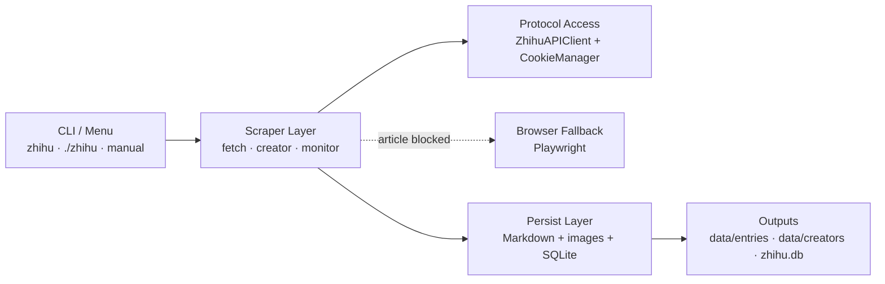

<div align="center">

# Zhihu-Scraper
### Local-First Zhihu Scraper | 知乎爬虫

<p><strong>A local-first Zhihu archival tool: protocol-first by default, Playwright only when needed, with direct outputs to Markdown, image assets, and SQLite.</strong></p>

<p>
  
  
  
  
</p>

<p>
  <a href="README.md">简体中文</a> · <strong>English</strong>
</p>

<p>
  <strong>Status:</strong> active ·
  <strong>Install:</strong> <code>./install.sh</code> ·
  <strong>Manual:</strong> <code>zhihu manual</code>
</p>

<p>
  <code>fetch</code> · <code>creator</code> · <code>monitor</code> · <code>Markdown</code> · <code>images</code> · <code>SQLite</code>
</p>

<p>
  <a href="#quick-start">Quick Start</a> ·
  <a href="#features">Features</a> ·
  <a href="#examples">Examples</a> ·
  <a href="#configuration">Configuration</a> ·
  <a href="#architecture">Architecture</a> ·
  <a href="#faq">FAQ</a>
</p>

</div>

> [!WARNING]
> **Disclaimer**
>
> This project is for learning, research, personal archiving, and technical exploration only. Please comply with Zhihu's Terms of Service, robots restrictions, and local laws. **Do not use it for unauthorized scraping, resale, credential abuse, large-scale automation, or any illegal activity.**

## Overview

`Zhihu-Scraper` is a **local-first** Zhihu archival tool, not a hosted scraping platform.

It focuses on one practical job:

- fetch Zhihu content
- convert it into readable Markdown
- keep both images and a local database

What it is good at today:

- saving single answers
- saving column articles
- fetching the latest N answers from a question page
- fetching recent answers and articles from a creator profile
- incrementally monitoring collections

What it does not officially provide yet:

- topic-level scraping
- JSON / CSV / MySQL export
- GUI interface
- LLM-based analysis

Those belong in the [Roadmap](#roadmap), not in the present-tense feature list.

## 30-Second Fit Check

| Good fit | Not a fit |
|---|---|
| You want Zhihu content saved as local Markdown | You want a hosted scraping platform |
| You want images, folders, and SQLite preserved together | You need JSON / CSV / MySQL export right now |
| You prefer CLI or terminal-menu workflows | You want a full GUI today |
| You want answers, columns, creator pages, and collections | You want topic pages and site-wide search scraping |

## At a Glance

| Input | Fetch path | Output |
|---|---|---|
| answer / article / question / creator / collection | protocol-first, automatic rescue for blocked articles | `index.md + images/ + zhihu.db` |

## Quick Start

Goal: **complete your first successful fetch within 3 minutes.**

### 1. Requirements

- Python 3.10+
- Optional: Playwright
- Optional: local Chrome

### 2. Install

The recommended path is the built-in installer:

```bash
git clone https://github.com/yuchenzhu-research/zhihu-scraper.git
cd zhihu-scraper
./install.sh
```

If your local environment is broken or messy, rebuild it:

```bash
./install.sh --recreate
```

After installation, start from the home menu:

```bash
zhihu
```

Shortest end-to-end path:

```bash
git clone https://github.com/yuchenzhu-research/zhihu-scraper.git
cd zhihu-scraper
./install.sh
# then edit .local/cookies.json with your own z_c0 / d_c0
zhihu
```

### 3. Configure Cookies

Copy the template:

```bash
mkdir -p .local
cp cookies.example.json .local/cookies.json
```

Running `./install.sh` is preferred because it initializes `.local/cookies.json` for you.

Then fill in your own `z_c0` and `d_c0`.

### 4. Hello World

The simplest fetch:

```bash
zhihu fetch "https://www.zhihu.com/question/28696373/answer/2835848212"
```

If you prefer explicit Python entrypoints:

```bash
.venv/bin/python cli/app.py fetch "https://www.zhihu.com/question/28696373/answer/2835848212"
```

### 5. Open the Full Manual

This README is intentionally homepage-level. Detailed command help lives in:

```bash
zhihu manual
```

## Features

- 🚀 **Async pipeline**
  Batch jobs, question pagination, and image downloads all use asynchronous paths.

- 🧠 **Protocol-first**
  The default path stays on API / HTML protocol access whenever possible.

- 🛟 **Article rescue path**
  Column articles first try the protocol path, then one cookie-rotation retry, then Playwright if still blocked.

- 👤 **Creator mode**
  Accepts a creator profile URL or raw `url_token`, then fetches recent answers and articles.

- 📚 **Archive-friendly outputs**
  Results are written directly as `index.md + images/ + zhihu.db`.

- 🔁 **Cookie rotation**
  Supports `.local/cookies.json` and `.local/cookie_pool/*.json`, while remaining compatible with legacy `cookies.json` and `cookie_pool/*.json`.

- 📡 **Incremental collection monitoring**
  Monitors new items while keeping a stable progress pointer.

- 🎛️ **Two entry styles**
  Prefer `zhihu`; `./zhihu` and `python3 cli/app.py` remain available as fallback entry styles.

## Coverage

| Type | Status | Notes |
|---|---|---|
| Single answer | Supported | Most stable path |
| Column article | Supported | May fall back to Playwright |
| Question page answers | Supported | Includes pagination and risk warnings |
| Creator answers | Supported | Via `creator` mode |
| Creator articles | Supported | Via `creator` mode |
| Collection monitoring | Supported | Via `monitor` mode |
| Topic scraping | Planned | No CLI path yet |
| JSON / CSV / MySQL export | Planned | Current primary outputs are Markdown + SQLite |

## Recommended Paths

| What you want to do | Recommended command |
|---|---|
| Start from the home menu | `zhihu` |
| Fetch one link | `zhihu fetch "<url>"` |
| Fetch a creator profile | `zhihu creator "<people url>"` |
| Run batch capture | `zhihu batch urls.txt` |
| Check your environment | `zhihu check` |
| Open the full manual | `zhihu manual` |

## Usage

The default entrypoint is the global `zhihu` command. Repository-local fallbacks are still available:

```bash
zhihu <command> ...
./zhihu <command> ...
python3 cli/app.py <command> ...
```

Common commands:

- `fetch`
- `creator`
- `batch`
- `monitor`
- `query`
- `interactive`
- `config --show`
- `check`
- `manual`

Full arguments and examples are centralized in:

```bash
zhihu manual
```

## Examples

The repository keeps two ready-to-open showcase exports:

| Showcase | What to look at | Open |
|---|---|---|
| Hyperlink preservation | table of contents, external links, nested links | [Deep Learning Math Basics](examples/outputs/[2026-03-24]%20【深度学习数学基础】序章%20+%20目录（已完结，共30章）%20(article-25643286963)/index.md) |
| Images and math formulas | local image references, block math, long-form mixed layout | [Linear Algebra Notes](examples/outputs/[2026-03-24]%20线性代数(Linear%20Algebra)学习笔记%20(article-641433373)/index.md) |

More detail:

- [examples/README.md](examples/README.md)
- [docs/REPOSITORY_BOUNDARY.md](docs/REPOSITORY_BOUNDARY.md)

## Output Layout

The default output directory is `data/`:

```text
data/
├── entries/
│   └── [2026-03-06] Title (answer-1234567890)/
│       ├── index.md
│       └── images/
├── creators/
│   └── hu-xi-jin/
│       ├── creator.json
│       ├── README.md
│       └── [2026-03-06] Title (article-123456)/
│           ├── index.md
│           └── images/
└── zhihu.db
```

- `entries/`: normal `fetch / batch / monitor` outputs
- `creators/<url_token>/`: creator-mode outputs
- `creator.json`: creator metadata and sync state
- `README.md`: local creator index page
- `zhihu.db`: shared SQLite database

For the official repository layout and the local-only runtime boundary, see:

- [docs/REPOSITORY_BOUNDARY.md](docs/REPOSITORY_BOUNDARY.md)

## Configuration

### Cookies

The default cookie file is:

```text
.local/cookies.json
```

The template file is:

```text
cookies.example.json
```

If you manage multiple sessions, place them under:

```text
.local/cookie_pool/
```

### Proxy

> [!IMPORTANT]
> This repository does not currently expose a stable proxy field in `config.yaml`.

If your environment requires a proxy, the reliable current path is to configure it in your shell or system environment first, then run the tool.

```bash
export HTTP_PROXY=http://127.0.0.1:7890
export HTTPS_PROXY=http://127.0.0.1:7890
zhihu check
```

### Security Notes

> [!CAUTION]
> - Do not commit `.local/` or `cookies.json`
> - If a cookie ever leaked, replace it
> - Prefer `.local/cookie_pool/` for multi-account setups

## Architecture


```mermaid
flowchart LR
    A["CLI / Menu<br/>zhihu · ./zhihu · manual"] --> B["Scraper Layer<br/>fetch · creator · monitor"]
    B --> C["Protocol Access<br/>ZhihuAPIClient + CookieManager"]
    B -. article blocked .-> D["Browser Fallback<br/>Playwright"]
    B --> E["Persist Layer<br/>Markdown + images + SQLite"]
    E --> F["Outputs<br/>data/entries · data/creators · zhihu.db"]
```

Current design direction:

- **CLI-first**
  This is a command-line tool, not a hosted service.

- **Protocol-first**
  Browser automation is a rescue path, not the default model.

- **Files + DB**
  One output optimized for humans, one for programs.

## Tech Stack

- Python 3.10+
- Typer
- Rich / Questionary
- curl_cffi / HTTPX
- Playwright
- PyYAML / structlog
- SQLite

> [!NOTE]
> The broader direction mentions Pydantic, JSON / CSV / MySQL export, and topic scraping, but those are not fully implemented in the current repository yet. They belong in the roadmap, not in the present-tense feature section.

## Roadmap

- [x] Single answer fetching
- [x] Column article fetching
- [x] Question-page pagination
- [x] Creator fetching (answers + articles)
- [x] Incremental collection monitoring
- [x] Markdown + images + SQLite outputs
- [ ] Topic scraping
- [ ] JSON / CSV export
- [ ] MySQL persistence
- [ ] Formal proxy configuration
- [ ] GUI interface
- [ ] LLM-based summarization / tagging / clustering
- [ ] Broader test coverage and stronger CI

## FAQ

### Why does it still run without cookies, but with incomplete results?

Guest mode can fetch some public content, but both visibility and stability are weaker. Question pages, creator pages, and collection monitoring depend much more on logged-in sessions.

### Why are column articles more fragile?

Columns are more aggressively protected. The real fetch chain is:

1. protocol HTML fetch first
2. one automatic cookie-rotation retry
3. Playwright only if the protocol path is still blocked

### Why doesn't the README document every flag in full?

Because the homepage should do three things well:

- get a new user running quickly
- explain capability boundaries
- point to the full manual

Detailed command help is intentionally centralized in:

```bash
zhihu manual
```

### Why does typing `zhihu` do nothing or run the wrong thing?

Run:

```bash
type zhihu
which zhihu
zhihu --help
```

If `type zhihu` says it is a shell function or alias, or points to a Conda activation helper, your shell config is shadowing the real `zhihu` command.

In that case, fix your shell config instead of the project. For example, rename:

```bash
zhihu () {
    conda activate zhihu
}
```

to something like `zhihu_env`, then reload your shell:

```bash
source ~/.zshrc
```

### How do I operate the home menu?

- arrow keys to move
- `Enter` to confirm
- `Space` to toggle checkboxes
- `Ctrl+C` to exit the current screen

## License

This project is licensed under the [MIT License](LICENSE).
