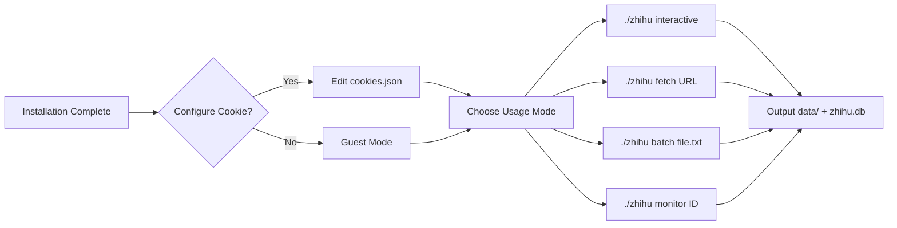
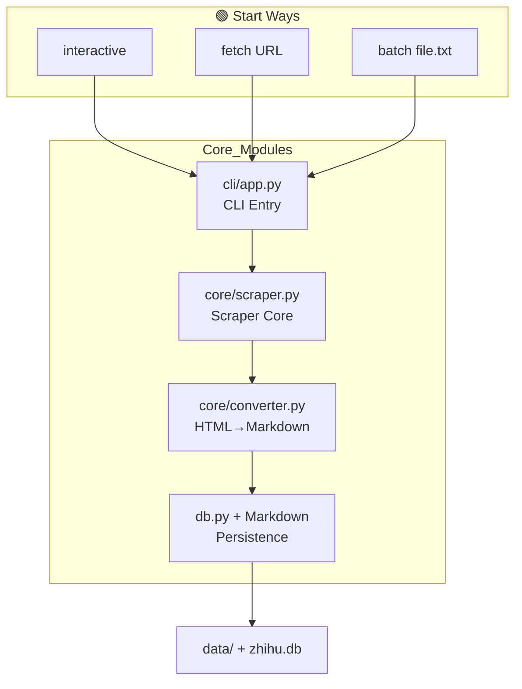
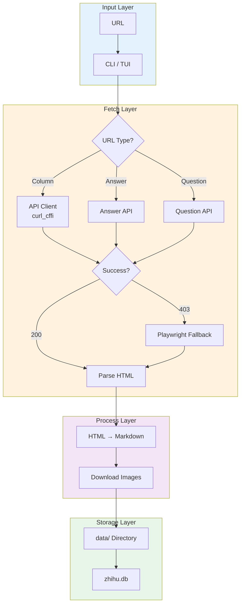
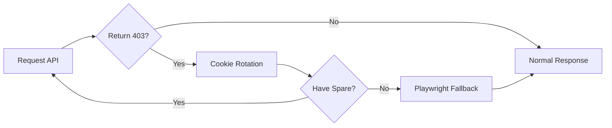

<div align="center">

# 🕷️ Zhihu Scraper
**Elegant, Stable, High-Performance Zhihu Content Extractor**

<p align="center">
  
  
  
</p>

<p align="center">
  <strong>
    <a href="README.md">简体中文</a> |
    English
  </strong>
</p>

</div>

> ⚠️ **Disclaimer**: This project is for academic research and personal learning only. Please respect Zhihu's Terms of Service and use responsibly.

---

## Table of Contents

- [Why Choose It](#why-choose-it)
- [Quick Start](#quick-start)
- [Usage](#usage)
- [Technical Architecture](#technical-architecture)
- [Data Output](#data-output)
- [FAQ](#faq)

---

## Why Choose It?

### Three Major Challenges in Scraping Zhihu

| Challenge | Traditional Solution | Our Solution |
|-----------|---------------------|--------------|
| **x-zse-96 Signature** | Selenium full rendering | curl_cffi pure protocol TLS fingerprint |
| **Cookie Validation** | Single account easily blocked | Cookie pool auto-rotation |
| **Column Hardblocking** | Often 403 errors | Auto-fallback to Playwright |

### Core Features

- 🚀 **Zero-Overhead Protocol Layer**: curl_cffi simulates Chrome TLS fingerprint
- 🛡️ **Smart Fallback Strategy**: API failure → automatic Playwright switchover
- 📦 **Dual-Engine Persistence**: Markdown + SQLite
- 🔄 **Incremental Monitoring**: Collection state tracking

---

## Quick Start

### Installation

```bash
git clone https://github.com/yuchenzhu-research/zhihu-scraper.git
cd zhihu-scraper
./install.sh
```

### Workflow


```mermaid
flowchart LR
    A[Installation Complete] --> B{Configure Cookie?}
    B -->|Yes| C[Edit cookies.json]
    B -->|No| D[Guest Mode]
    C --> E[Choose Usage Mode]
    D --> E
    E --> F[./zhihu interactive]
    E --> G[./zhihu fetch URL]
    E --> H[./zhihu batch file.txt]
    E --> I[./zhihu monitor ID]
    F --> J[Output data/ + zhihu.db]
    G --> J
    H --> J
    I --> J
```

### Three Steps


```mermaid
flowchart TB
    subgraph Input ["🟢 Start Ways"]
        I["interactive"]
        F["fetch URL"]
        B["batch file.txt"]
    end

    I --> A
    F --> A
    B --> A

    subgraph Core_Modules
        A[cli/app.py<br />CLI Entry]
        A --> S[core/scraper.py<br />Scraper Core]
        S --> C[core/converter.py<br />HTML→Markdown]
        C --> D["db.py + Markdown<br />Persistence"]
    end

    D --> O["data/ + zhihu.db"]
```
Usage Examples:

**Method 1: Interactive UI Mode (Recommended)**
```bash
python cli/app.py interactive
```

**Method 2: CLI / API Mode**
```bash
python cli/app.py fetch "https://www.zhihu.com/p/123456"
```

> 💡 If you encounter permission issues when running `./zhihu`, we recommend using `python cli/app.py` directly.

### Python SDK

```python
import asyncio
from core.scraper import ZhihuDownloader
from core.converter import ZhihuConverter

async def main():
    downloader = ZhihuDownloader("https://www.zhihu.com/question/28696373/answer/2835848212")
    data = await downloader.fetch_page()
    converter = ZhihuConverter()
    markdown = converter.convert(data['html'])
    print(markdown[:200])

asyncio.run(main())
```

---

## Usage

### CLI Commands

| Command | Description | Example |
|---------|-------------|---------|
| `fetch` | Fetch single URL | `./zhihu fetch "URL"` |
| `batch` | Batch fetch | `./zhihu batch urls.txt -c 4` |
| `monitor` | Monitor collection incrementally | `./zhihu monitor 78170682` |
| `query` | Search local data | `./zhihu query "keyword"` |
| `interactive` | Interactive UI | `./zhihu interactive` |
| `config` | Show configuration | `./zhihu config --show` |
| `check` | Environment check | `./zhihu check` |

### Configuring Cookies (Recommended)

You need to get Cookies after logging into Zhihu. We recommend using one of the following two methods:

#### Method A: Browser Application Panel (Fastest)

1. Open Chrome, ensure you are **logged in** to Zhihu (`https://www.zhihu.com`).
2. Press `F12` (Mac: `⌥⌘I`) to open Developer Tools.
3. Navigate to the **Application** tab.
4. On the left pane, expand: `Storage` → `Cookies` → `https://www.zhihu.com`.
5. In the list on the right, search for or find: `z_c0` and `d_c0`.
6. Copy their Values and format them into `cookies.json` like this:

```json
[
    {"name": "z_c0", "value": "Your z_c0 value", "domain": ".zhihu.com"},
    {"name": "d_c0", "value": "Your d_c0 value", "domain": ".zhihu.com"}
]
```
> 💡 *Note*: If you cannot find them here, it usually means you are not logged in, your session expired, or the current domain is not `www.zhihu.com` (e.g., you are on `zhuanlan.zhihu.com`). Make sure to try this on the Zhihu homepage, and check all Zhihu-related domains on the left.

#### Method B: Browser Network Panel (For HttpOnly Cookies)

If Method A doesn't work, use this method:
1. Open Developer Tools and navigate to the **Network** tab.
2. Check the **Preserve log** option.
3. Refresh the page (`Cmd+R` / `Ctrl+R`).
4. Click on any Fetch/XHR request in the list (e.g., `api` related requests).
5. On the right pane, select **Headers** → **Request Headers**.
6. Find the `cookie:` field, search for `z_c0=` and `d_c0=` within it, extract their values, and format them into the JSON.

### 💡 Scraping Strategy & Limits

| Content Type | Guest (No Cookie) | Logged In (With Cookie) | Recommendation |
| :--- | :--- | :--- | :--- |
| **Answers / Questions** | ✅ Supported (Top 3 only) | ✅ Unlimited (Fast/Stable) | Best used via `interactive` |
| **Column Articles** | ❌ Mostly Blocked (403) | ✅ Supported (Auto Fallback) | **Cookie Required** for bypassing WAF |

> **💡 Stability Tips**:
> - **Prefer Single Fetch**: We recommend using `interactive` mode to input URLs one by one. This simulates human behavior better than massive `batch` jobs. Since Columns often require browser rendering, handling them one by one is more reliable.
> - **Column Special Handling**: Zhihu's Column WAF blocks pure protocol requests. If you see an `article_forbidden` error, it is expected; the system will automatically trigger a Playwright "fallback" to get the content.

> 💡 Guest mode is available without Cookies, but some content will be restricted (e.g. comments, bottom half of Yanxuan articles).

---

## Technical Architecture


```mermaid
flowchart TD
    subgraph Input_Layer ["Input Layer"]
        URL[URL] --> CLI[CLI / TUI]
    end

    subgraph Fetch_Layer ["Fetch Layer"]
        CLI --> Type{URL Type?}
        Type -->|Column| API["API Client<br>curl_cffi"]
        Type -->|Answer| Answer[Answer API]
        Type -->|Question| Question[Question API]
        API --> OK{Success?}
        Answer --> OK
        Question --> OK
        OK -->|403| Fallback[Playwright Fallback]
        OK -->|200| Parse[Parse HTML]
        Fallback --> Parse
    end

    subgraph Process_Layer ["Process Layer"]
        Parse --> Convert[HTML → Markdown]
        Convert --> Images[Download Images]
    end

    subgraph Storage_Layer ["Storage Layer"]
        Images --> Local[data/ Directory]
        Local --> SQLite[zhihu.db]
    end

    style Input_Layer fill:#e3f2fd
    style Fetch_Layer fill:#fff3e0
    style Process_Layer fill:#f3e5f5
    style Storage_Layer fill:#e8f5e9
```

### Cookie Rotation Strategy


```mermaid
flowchart LR
    A[Request API] --> B{Return 403?}
    B -->|Yes| C[Cookie Rotation]
    B -->|No| D[Normal Response]
    C --> E{Have Spare?}
    E -->|Yes| A
    E -->|No| F[Playwright Fallback]
    F --> D
```

---

## Data Output

### File Structure

```
data/
├── [2026-03-03] Article Title/
│   ├── index.md        # Markdown file
│   └── images/         # Local images
│       ├── v2-abc123.jpg
│       └── v2-def456.png
└── zhihu.db            # SQLite database
```

### SQLite Database

```sql
CREATE TABLE articles (
    id INTEGER PRIMARY KEY AUTOINCREMENT,
    answer_id TEXT UNIQUE NOT NULL,
    type TEXT NOT NULL,
    title TEXT,
    author TEXT,
    url TEXT,
    content_md TEXT,
    collection_id TEXT,
    created_at TIMESTAMP,
    updated_at TIMESTAMP
);
```

---

## FAQ

### Q: Getting "Cookie required" error?
A: Edit `cookies.json` and fill in your login cookie.

### Q: Too slow?
A: Adjust `humanize.min_delay` and `max_delay` in `config.yaml`.

### Q: Extraction failed/blocked?
A: The project will auto-fallback to Playwright mode.

### Q: Can it run on Windows?
A: Yes! Python 3.10+ and Git are sufficient.


<p align="center">
  <a href="#top">⬆ Back to Top</a>
</p>

---

*📝 This project is for academic research and personal learning only.*