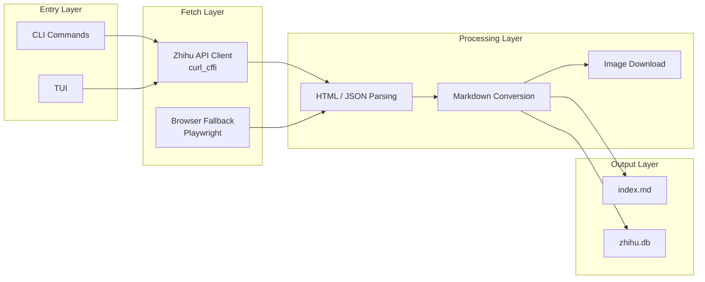
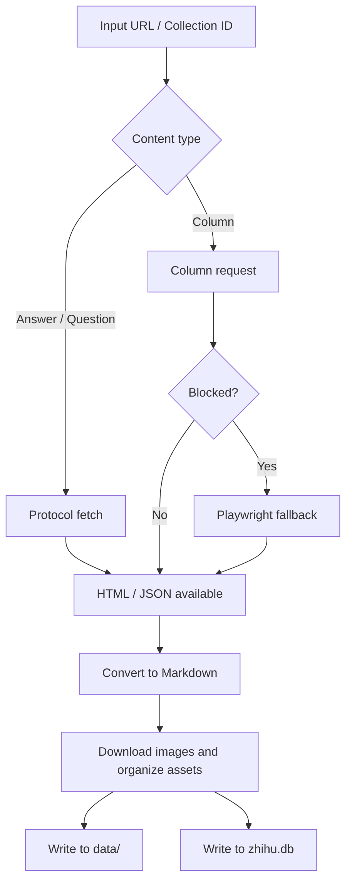

<div align="center">

# Zhihu Scraper
**A local-first Zhihu extraction tool. It uses protocol-layer fetching by default, falls back to Playwright for blocked columns, and stores results as Markdown plus SQLite.**

<p align="center">
  
  
  
  
</p>

<p align="center">
  <strong>
    <a href="README.md">简体中文</a> |
    English
  </strong>
</p>

<p align="center">
  <a href="#quick-start">Quick Start</a> ·
  <a href="#common-commands">Commands</a> ·
  <a href="#architecture">Architecture</a> ·
  <a href="#faq">FAQ</a>
</p>

</div>

> For academic research and personal learning only. Please respect Zhihu's Terms of Service. The repository provides `cookies.example.json` as a template; copy it to local `cookies.json` before adding real values.

## In One Line

This is a local-use Zhihu scraper: stay on the lightweight protocol path whenever possible, only open a browser when necessary, and archive everything into Markdown files plus a local database.

## Best-Fit Scenarios

| Good Fit | Not a Good Fit |
|---|---|
| Archiving answers, question pages, and column articles | Building a long-running online scraping platform |
| Saving learning material into a local knowledge base | Expecting zero anti-bot friction |
| Searching and organizing content with SQLite | Replacing a production-grade data service |

## Quick Start

### 1. Requirements

- Python `3.10+`
- Node.js is recommended for `PyExecJS`
- Playwright browser binaries if you want column fallback

### 2. Install

```bash
git clone https://github.com/yuchenzhu-research/zhihu-scraper.git
cd zhihu-scraper
./install.sh
```

### 3. Prepare Cookies

The repository includes a `cookies.example.json` template. Copy it first:

```bash
cp cookies.example.json cookies.json
```

Then open local `cookies.json` and fill in:

```json
[
  {"name": "z_c0", "value": "your z_c0", "domain": ".zhihu.com"},
  {"name": "d_c0", "value": "your d_c0", "domain": ".zhihu.com"}
]
```

How to get them:

1. Sign in at `https://www.zhihu.com`
2. Open browser developer tools
3. Find `z_c0` and `d_c0` in `Application -> Cookies` or `Network -> Request Headers`
4. Open the root-level `cookies.json` and replace the placeholders with your own values

### 4. Two Ways to Run It

This project has two equivalent entry paths:

- Wrapper script: `./zhihu ...`
- Direct Python entry: `python3 cli/app.py ...`

If `./zhihu` is executable in your environment, use that first. If not, or if you want the most explicit entrypoint, use `python3 cli/app.py`.

### 5. Run Your First Fetch

```bash
./zhihu fetch "https://www.zhihu.com/question/28696373/answer/2835848212"
```

Equivalent Python entry:

```bash
python3 cli/app.py fetch "https://www.zhihu.com/question/28696373/answer/2835848212"
```

Question pages can also fetch multiple answers in one run:

```bash
./zhihu fetch "https://www.zhihu.com/question/28696373" -n 10
python3 cli/app.py fetch "https://www.zhihu.com/question/28696373" -n 10
```

Notes:

- `-n 20` or below usually fits in a single page
- Above `-n 20`, the scraper automatically switches to paginated fetching
- Random waits are inserted between pages to reduce anti-bot risk
- Above `-n 50`, the CLI shows a stronger risk warning

Creator profiles can also be fetched in batches:

```bash
./zhihu creator "https://www.zhihu.com/people/hu-xi-jin" --answers 10 --articles 5
python3 cli/app.py creator "https://www.zhihu.com/people/hu-xi-jin" --answers 10 --articles 5
```

## Support Matrix

| Content Type | Without Cookie | With Cookie | Notes |
|---|---|---|---|
| Single answer | Works | Works | Most stable path |
| Question page answers | Limited | Works | Paginated fetching is supported; guest mode usually sees only a subset |
| Column article | Often blocked | Works | Can fall back to Playwright |
| Collection monitoring | Not recommended | Works | Logged-in sessions are more reliable |

## Common Commands

| Command | Purpose | Example |
|---|---|---|
| `fetch` | Fetch one URL or extract multiple URLs from text | `./zhihu fetch "URL"` |
| `creator` | Fetch answers and articles from a creator profile | `./zhihu creator "https://www.zhihu.com/people/xxx"` |
| `batch` | Fetch URLs from a file | `./zhihu batch urls.txt -c 4` |
| `monitor` | Incrementally monitor a collection | `./zhihu monitor 78170682` |
| `query` | Search the local database | `./zhihu query "Transformer"` |
| `interactive` | Launch the interactive UI | `./zhihu interactive` |
| `config` | Show current configuration | `./zhihu config --show` |
| `check` | Validate dependencies and runtime environment | `./zhihu check` |

Suggested adoption path:

1. Run `check` to validate the environment
2. Use `fetch` on a single answer or column page
3. Move to `batch` or `monitor` for larger jobs

Common command pairs:

```bash
./zhihu check
python3 cli/app.py check

./zhihu fetch "https://www.zhihu.com/question/28696373/answer/2835848212"
python3 cli/app.py fetch "https://www.zhihu.com/question/28696373/answer/2835848212"

./zhihu creator "https://www.zhihu.com/people/hu-xi-jin" --answers 10 --articles 5
python3 cli/app.py creator "https://www.zhihu.com/people/hu-xi-jin" --answers 10 --articles 5

./zhihu interactive
python3 cli/app.py interactive
```

## Architecture


```mermaid
flowchart LR
    subgraph I["Entry Layer"]
        A["CLI Commands"]
        B["TUI"]
    end

    subgraph S["Fetch Layer"]
        C["Zhihu API Client<br/>curl_cffi"]
        D["Browser Fallback<br/>Playwright"]
    end

    subgraph P["Processing Layer"]
        E["HTML / JSON Parsing"]
        F["Markdown Conversion"]
        G["Image Download"]
    end

    subgraph O["Output Layer"]
        H["index.md"]
        J["zhihu.db"]
    end

    A --> C
    B --> C
    C --> E
    D --> E
    E --> F
    F --> G
    F --> H
    F --> J
```

Core ideas:

- Browser automation is fallback-only, not the main path
- Extraction is designed for local archival rather than hosted services
- Files and database records are stored together for reading plus search

## Execution Flow


```mermaid
flowchart TD
    A["Input URL / Collection ID"] --> B{"Content type"}
    B -->|Answer / Question| C["Protocol fetch"]
    B -->|Column| D["Column request"]
    C --> E["HTML / JSON available"]
    D --> F{"Blocked?"}
    F -->|No| E
    F -->|Yes| G["Playwright fallback"]
    G --> E
    E --> H["Convert to Markdown"]
    H --> I["Download images and organize assets"]
    I --> J["Write to data/"]
    I --> K["Write to zhihu.db"]
```

## Project Layout

```text
cli/           command entrypoint and interactive UI
core/          scraping, conversion, database, monitoring logic
static/        signature scripts and static assets
data/          local output directory, ignored by Git
browser_data/  browser runtime data, ignored by Git
```

## Output

By default, results are written to `data/`:

```text
data/
├── [2026-03-06] Title (answer-1234567890)/
│   ├── index.md
│   └── images/
└── zhihu.db
```

In practice:

- `index.md` is the reading-friendly artifact
- `images/` stores local media assets
- `zhihu.db` supports local search and later organization

## Local Development

Install development dependencies:

```bash
pip install -e ".[dev]"
```

Useful checks:

```bash
python3 -m compileall cli core
python3 cli/app.py check
pytest
ruff check cli core
```

## FAQ

### `check` says Playwright is missing

Protocol mode still works. Only the column fallback path is unavailable:

```bash
pip install -e ".[full]"
playwright install chromium
```

### Why is guest mode incomplete for question pages

That is a Zhihu visibility restriction, not a scraper-side omission.

### Why do some column pages still fail

Columns are more aggressively protected. In practice you may need fresh cookies, a new login session, or time for the session to cool down.

### Why does the repository `cookies.json` not work as-is

Because the committed file is only a template. `YOUR_Z_C0_HERE` and `YOUR_D_C0_HERE` are placeholders, so you need to replace them with your own logged-in cookie values.
