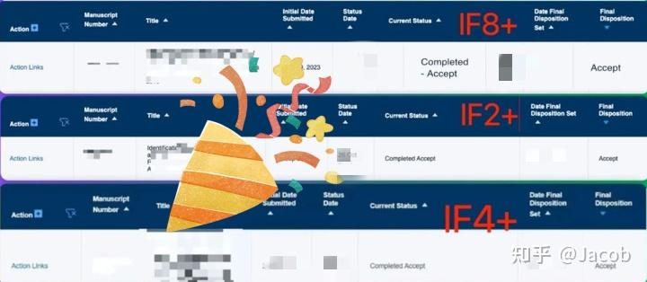
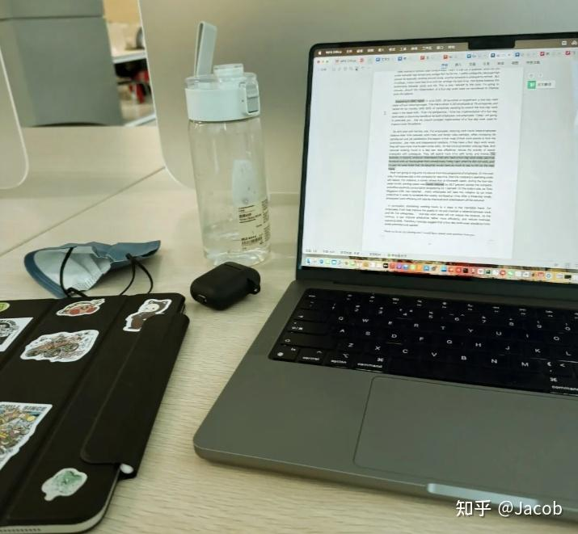

# 别闭门造车了，这是我写了3篇硕博论文（2篇二区+1篇三区）才总结出的真经验。

> **Author**: Jacob  
> **Source**: [https://zhuanlan.zhihu.com/p/1908172034707551933](https://zhuanlan.zhihu.com/p/1908172034707551933)  
> **Date**: 2026-02-12

---

大家好，我是@Jacob，作为即将毕业的博四学长，这几年最有成就感的事，应该就是发了3篇[硕博论文](https://zhida.zhihu.com/search?content_id=257966291&content_type=Article&match_order=1&q=%E7%A1%95%E5%8D%9A%E8%AE%BA%E6%96%87&zhida_source=entity)（2篇[二区](https://zhida.zhihu.com/search?content_id=257966291&content_type=Article&match_order=1&q=%E4%BA%8C%E5%8C%BA&zhida_source=entity)，1篇[三区](https://zhida.zhihu.com/search?content_id=257966291&content_type=Article&match_order=1&q=%E4%B8%89%E5%8C%BA&zhida_source=entity)，总算把发文这块搞定了~）

但如果你问我有什么遗憾，我想说：最大的遗憾，就是第一篇论文没早点找人指导，生生走了很多弯路，耗了接近8个月！！

刚开始写第一篇论文时，我和很多人一样，是典型的“闭门造车”：查文献、搭框架、自己憋稿、自己翻译英文，投出去被拒再重投，改完又投，然后又被拒。

前后被拒了4次。每次看审稿意见，都很致命：

创新点不清晰；

数据处理方式欠缺逻辑；

语言表达有明显中式痕迹；

缺少关键参考文献；

英文摘要结构混乱……

当时我最大的问题，其实不是能力，而是**缺经验、没人带、想当然**。直到被朋友点醒，我才尝试找了专业做论文辅导的团队，整个过程的效率和质量，直接拉满。

这里插一句，**如果你正好也在写硕博论文，不妨找他们做个评估，让他们帮你看看你的论文框架、选题方向有没有问题，一对一辅导。**像我当时就被老师指出，目标Scope完全不匹配，白白浪费了两个月。

第二篇文章，我一开始就把资料发给老师做了初评。他们给我列出了三大核心建议：

结构逻辑需前置清晰提炼：研究问题、方法、结论要一眼看明白；

数据图表表达不规范，影响论文“专业度”；

英文写作部分语言过于“直译”，建议做专业润色。

整个辅导过程，是一位对口方向的老师带我做全流程优化。我们从选题逻辑、创新点亮点，到图表表达和实验方法描述，全都系统过了一遍。

特别是语言润色环节，老师用的[native润色服务](https://zhida.zhihu.com/search?content_id=257966291&content_type=Article&match_order=1&q=native%E6%B6%A6%E8%89%B2%E6%9C%8D%E5%8A%A1&zhida_source=entity)，投出去之后审稿人几乎没有在语言上挑错。第二篇只小改了一次，很快就录用了。

这让我更加深切的意识到：**论文是门“技术活”，不是靠闷头苦写就能过的。**

到第三篇的时候，我已经摸清了整套写作节奏、逻辑把控和投稿策略，跟原来的老师沟通完结构和思路后，2个月内高效完成初稿，一投即中，非常顺利！！

如果你也正在准备论文，或者已经卡稿卡思路，我很建议你找专业老师帮你“过一遍”论文草稿。**很多我们自己看不出来的逻辑漏洞或者语言问题，专业的人一眼就能指出来**。

**想更高效完成论文、少走弯路的，可以加下我当时合作的老师微信，他们会做一个详细的评估，针对你当前的草稿阶段，给出清晰的修改建议和策略**

**最后总结一下，我发三篇论文的经验是——**

- 一篇文章是否能中，除了研究内容本身，更关键的是结构逻辑清晰、语言表达规范；
- 写作过程中不要闭门造车，适当引入外部专业支持，是节省时间和提高效率的关键；
- 一对一辅导可以让你的文章在最短时间内达到“可投稿”的水平，少试错、少走弯路。

尤其是现在，很多高校毕业要求和职称评审都越来越看重发文数量和质量。我们要学会**用更聪明的方式解决问题，**而不是一味硬撑。

**如果你在写作过程中也遇到类似问题，或者想做一个写作路线规划，也可以直接加老师微信聊聊，先看看你现在的稿子还有哪些提升空间**

希望你能比我更早少踩坑，顺利拿下。

