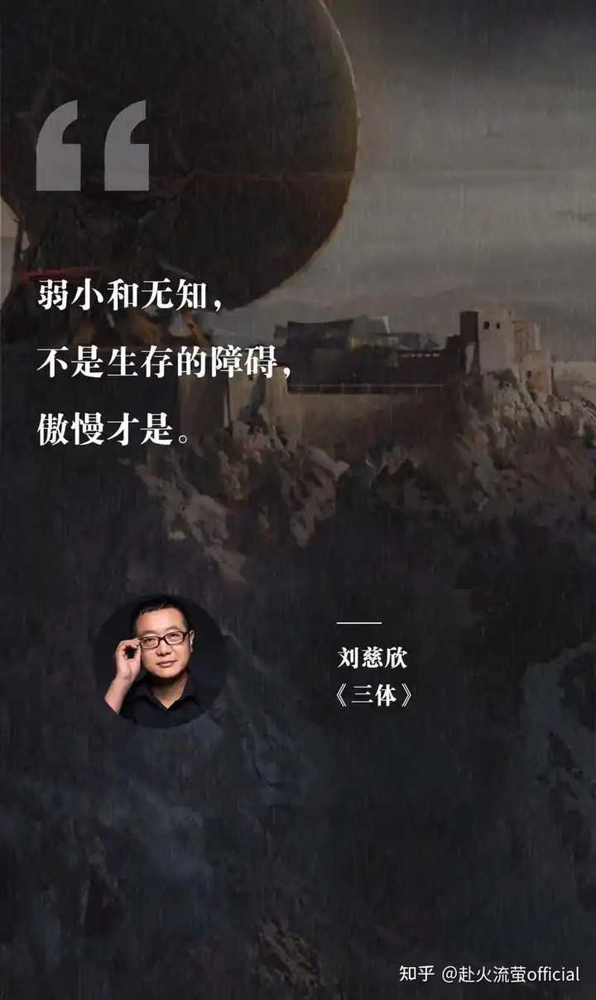
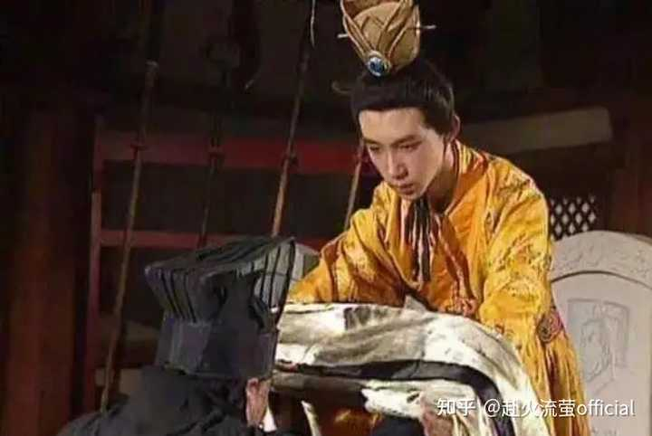

# 为什么古人说:“事以密成”?

> **作者**: 赴火流萤official  
> **来源**: [https://www.zhihu.com/question/1950851340969447783](https://www.zhihu.com/question/1950851340969447783)  
> **日期**: 2026-02-12

---

**《周易》里有句话：**

> **“君不密则失臣，臣不密则失身，几事不密则害成。是以君子慎密而不出也”**

事情保密了才能成，说漏了就会砸——这句话听起来平淡如水。实则不然，**它是中华上下五千年密谋政治所浓缩的核心**

---

曹爽去探病那天，司马懿连勺子都拿不稳。

汤水顺着胡须滴下来，眼神浑浊，说话含混。

曹爽看完

认为司马懿将不久于世

所以他轻视了

而轻视，往往是最大的破绽。

数月之后，高平陵之变爆发，曹爽族灭

当然，他的失败也并不一无是处

起码他为后世的人们留下了一个名梗

东晋的王国宝在面对劝降时就说：将曹爽我乎！

至此曹爽由魏国的权臣变成了历史的一个笑话

司马懿故意自己的状态隐藏起来，示敌以弱

所以能反戈一击

成为最后的赢家

这个故事告诉我们为什么君子慎密而不出

因为你一旦显示出了野心，就会让敌人有所防备

有所防备了，你的下一步就必将受制于人

如果你藏得好好的，示敌以弱

那么你的敌人就会轻视你

而轻视往往会带来傲慢

《三体》里已经告诉过我们了

---

东汉末年，汉献帝被曹操软禁在许昌，活得像个盖章机器人。

某天，他咬破手指，在衣带里塞进一封血诏，托董承带出宫：杀曹操，救我。

这是三国史上最危险的密谋。成功的前提只有三个字：谁都不说。

董承拿到诏书之后的操作，堪称古代保密灾难教科书：

——他先找了刘备。刘备说“知道了”，然后连夜跑路。

——他又找了种辑、吴子兰、王子服。几个人隔三差五喝酒密谈，谈完还各自回家谋划。

——更离谱的是，董承自己有个小妾，和家奴秦庆童私通。某天董承撞破奸情，把秦庆童打了一顿。秦庆童怀恨在心，连夜跑到曹操府上，把衣带诏计划一字不漏供了出来。

曹操听完，笑了。

结局就是：董承全家及同谋七族，数百口人，满门抄斩。汉献帝从此彻底沦为吉祥物。

这场谋反，其实从来没开始过。它死在“知道的人太多了”那个瞬间。

千古谋家韩非子若在场，只会冷脸问一句：你那小妾和家奴私通，你是今天才知道的，还是早就知道？如果是早就知道，为什么不防？如果是今天才知道，那说明你从来不知道自己府上谁是敌人。

---

董承的故事告诉我们“几事不密则害成”

在谋划之前没有做好背调

在谋划途中没有注意风控

在败露之后没有第一时间采取措施

董承的失败不让人惊讶，他的成功才让人惊讶

司马懿的故事告诉我们“君子慎密而不出”

你知道了对方的底牌，却不让他知道自己已经知道；你扣下扳机，但引信装在他看不见的地方。

这才是“密”的终极形态。

**不是藏住自己的牌，是让对手的牌，打到你的局里来**。

> 这里是赴火流萤official。
> 一个将唯物史观与人文视角相结合，致力于深度调查与时政分析的账号。
> 如果您喜欢我们的回答，也可以关注我们。
> 让我们下一个回答再见
