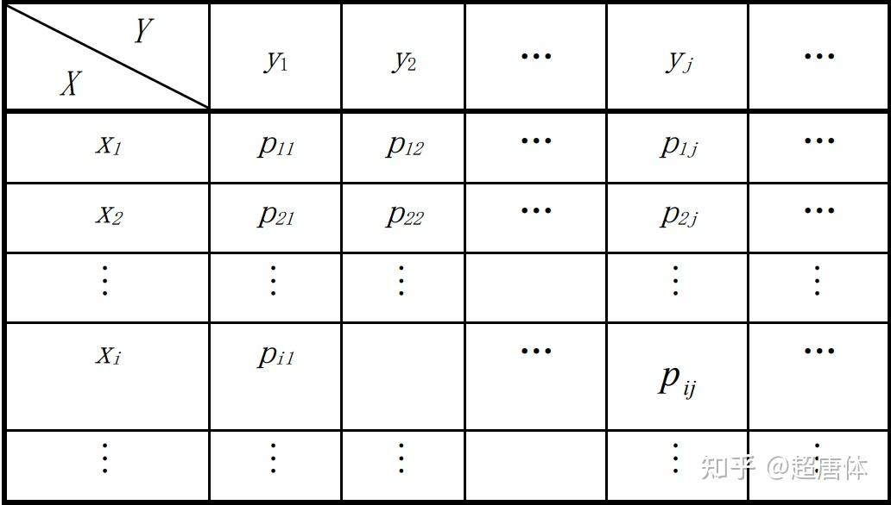
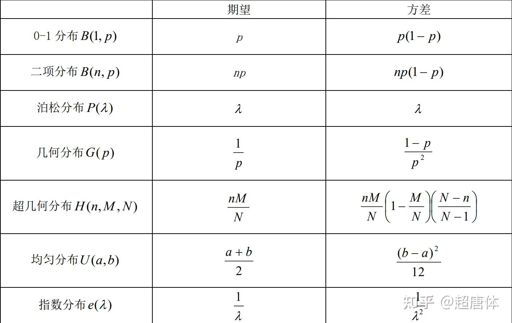
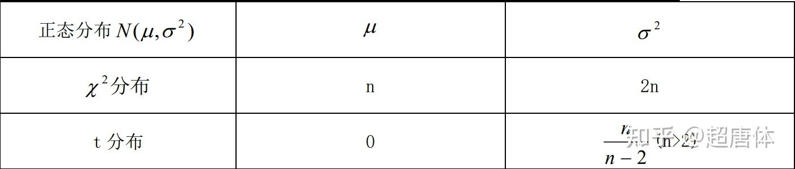

# 概率论公式定理大全

> **Author / 作者**: 超唐体​
​  
> **Source / 来源**: [https://zhuanlan.zhihu.com/p/11617075708](https://zhuanlan.zhihu.com/p/11617075708)  
> **Date / 日期**: 2026-03-05

---

## 一、随机事件及其概率

### 1.排列组合

排列数： $P_m^n=\frac{m!}{(m-n)!}$

组合数： $C_m^n=\frac{m!}{n!(m-n)!}$

### 2.加法/乘法原理

加法原理（两种方法均能完成此事）： $m+n$

乘法原理（两个步骤分别完成这件事）： $m\times n$

### 3.随机试验和随机事件

如果一个试验在**相同条件**下可以**重复进行**，而每次试验的结果可能不止一个，但在进行一次试验之前却不能断言它出现哪个结果，则称这种试验为**随机试验**。**试验的可能结果称为随机事件**。

### 4.基本事件、样本空间和事件

在一个试验下，**不管事件有多少个**，总可以从其中找出这样一组事件，它具有如下性质：

- 每进行一次试验，**必须发生**且**只能发生这一组中的一个事件**；
- **任何事件，都是由这一组中的部分事件组成的;**

这样一组事件中的每一个事件称为**基本事件**，用 $\omega$ 表示；基本事件的全体，称为试验的**样本空间**，用 $\Omega$ 表示。

一个事件就是由 $\Omega$ 中的**部分点（基本事件 $\omega$ ）**组成的集合。通常用**大写字母** $ A，B，C，…$ 表示**事件**，它们是 $\Omega$ 的**子集**。

### 5.事件的关系与运算

**（1）事件的关系**

**包含：**如果事件 $ A $ 的组成部分也是事件 $ B $ 的组成部分，（**$A $ 发生必有事件 $ B $ 发生**），记作 $A\subset B$

**等价**：如果**同时**有 $A\subset B\mathrm{~,~}B\supset A$ ，称 $A$ 与 $B$ **等价**，记作 $A=B$

**和事件**： $A、B $ 中**至少有一个发生**的事件记作 $A\bigcup B$

**积事件**： $A、B $ **同时发生**的事件记作 $A\cap B$

**互斥**：如果 $A\cap B=\emptyset$ ，称$A$ 与 $B$ **互斥（互不相容）**。

**对立事件**： $\Omega-\mathrm{A}$ 称为 $A$ 的**逆事件**。

**（2）运算法则**

**结合律：** $ A\cup \left( B\cup C \right) =\left( A\cup B \right) \cup C  $

**分配律：** $ (\mathrm{A}\cup \mathrm{B)}\cap \mathrm{C}=(\mathrm{A}\cup \mathrm{C)}\cup (\mathrm{B}\cup \mathrm{C)}  $

**德摩根律：** $\overline{A\bigcup B}=\overline{A}\bigcap\overline{B}\\\overline{A\bigcap B}=\overline{A}\bigcup\overline{B}$

### 6.概率的公理化定义

设 $\Omega$ 为样本空间， $A$ 为事件，对每一个事件 $A$ 都有一个实数 $ P(A)$ ，若满足下列三个条件：

- $0≤P(A)≤1$
- $P(Ω) =1$
- 对于两两互不相容的事件 $A_1,A_2$ 有 $P\left(\bigcup_{i=1}^\infty A_i\right)=\sum_{i=1}^\infty P(A_i)$

则称 $ P(A)$ 为事件 $A$ 的概率。

### 7.古典概型

- $\Omega=\{\omega_1,\omega_2\cdots\omega_n\}$
- $P(\omega_1)=P(\omega_2)=\cdots P(\omega_n)=\frac{1}{n}$

### 8.几何概型

若随机试验的结果为无限不可数并且每个结果出现的可能性均匀，同时样本空间中的每一个基本事件可以使用一个有界区域来描述，则称此随机试验为几何概型。对任一事件 $ A$ ， $P(A)=\frac{L(A)}{L(\Omega)}$

### 9.概率公式

**加法公式：$P(A+B)=P(A)+P(B)-P(AB)$**

**减法公式： $P(A-B)=P(A)-P(AB)$**

**条件概率： $P(B/A)=\frac{P(AB)}{P(A)}$**

**乘法公式： $P(AB)=P(A)P(B/A)$**

**全概率公式： $P(B)=\sum_{i=1}^nP(A_i)P(B/A_i)$**

**贝叶斯公式：** $P(B_i/A)=\frac{P(B_i)P(A/B_i)}{\sum_{j=1}^nP(B_j)P(A/B_j)}$

### 10.独立性

设事件 $A,B$ 满足 $P(AB)=P(A)P(B)$ ，称 $A,B$ 为独立事件。

## 二、随机变量及其分布

### 1.离散型随机变量的分布律

设离散型随机变量 $X$ 的可能取值为 $ X_k(k=1,2,…)$ 且取各个值的概率，即事件 $X=X_k$ 的概率为 $P(X=X_k)=p_k$ ，则称上式为离散型随机变量 $X$ 的概率分布或分布律。有时也用分布列的形式给出 $\frac{X}{P(X=x_k)}|\frac{x_1,x_2,\cdots,x_k,\cdots}{p_1,p_2,\cdots,p_k,\cdots}$

### 2.连续型随机变量的分布密度

设 $F(x)$ 是随机变量 $X$ 的分布函数，若存在非负函数 $f(x)$ ，对任意实数 $x$ ，有 $F(x)=\int_{-\infty}^xf(x)dx$。 则称 $X$ 为连续型随机变量。 $f(x)$ 称为 $X$ 的概率密度函数或密度函数，简称概率密度。

### 3.离散与连续型随机变量的关系

$P(X=x)\approx P(x<X\leq x+dx)\approx f(x)dx$

### 4.分布函数

设 $X$ 为随机变量， $x$ 是任意实数，则函数 $F(x)=P(X\leq x)$ 称为随机变量 $ X $ 的**分布函数**，本质上是一个累积函数。 $P(a<X\leq b)=F(b)-F(a)$ 可以得到 $ X $ 落入区间 $\left(a,b\right]$ 的概率。分布函数 $F(x)$ 表示随机变量落入区间 $\left(-\infty,x\right]$ 的概率。

分布函数具有如下性质：

- $0\leq F(x)\leq1,\quad-\infty<x<+\infty$
- $F(x)$ 是单调不减的函数，即 $x_1<x_2$ 时，有 $F(x_1)\leq F(x_2)$
- $F(-\infty)=\lim_{x\to-\infty}F(x)=0,\quad F(+\infty)=\lim_{x\to+\infty}F(x)=1$
- $F(x+0)=F(x)$ ，即 $F(x)$ 是右连续的
- $P(X=x)=F(x)-F(x-0)$
- 对于离散型随机变量， $F(x)=\sum_{x_k\leq x}p_k$
- 对于连续型随机变量， $F(x)=\intop_{-\infty}^xf(x)dx$

### 5.常见分布

**（1） $0-1$ 分布** $P\{X{=}k\}=p^{k}(1-p)^{1-k},k{=}0,1$

**（2）二项分布**  $ P\{X=k\}=\left( \begin{array}{c} 	n\\ 	k\\ \end{array} \right) p^k(1-p)^{n-k}\,\,  ,k=0,1,\cdots ,n  $

**（3）泊松分布**  $\begin{aligned}P\{X=k\}=&\frac{\lambda^{k}\mathrm{e}^{-\lambda}}{k!}&k=&0,1,2,\cdots\end{aligned}$

**（4）超几何分布** $P\{X=k\}=\frac{\binom{M}{k}\binom{N-M}{n-k}}{\binom{N}{k}}\\k\text{ 为整数,max}\{0,n-N+M\}\leqslant k\leqslant\min\{n,M\}$

**（5）几何分布**  $ P\{X=k\}=(1-p)^{k-1}p\,\, k=1,2,...  $

**（6）均匀分布** $f(x)=\begin{cases}\frac{1}{b-a},&a<x<b\\0,&\text{其他}&\end{cases}$

**（7）指数分布** $f(x)=\begin{cases}\frac{1}{\theta}\mathrm{e}^{-x/\theta},x>0\\0,\quad\text{其他}&\end{cases}$

**（8）正态分布** $f(x)=\frac{1}{\sqrt{2\pi}\sigma}\mathrm{e}^{-(x-\mu)^{2}/(2\sigma^{2})}$

### 6.分位数

下分位表： $P(X\leq\mu_\alpha){=}\alpha$

上分位表： $P(X>\mu_\alpha){=}\alpha$

### 7.函数分布

**(1)离散型**

已知 $X$ 的分布列为 $\frac{X}{P(X=x_i)}|\frac{x_1,-x_2,-\cdots,-x_n,-\cdots}{p_1,-p_2,-\cdots,-p_n,-\cdots}$

$Y=\mathrm{g}(X)$ 的分布列如下： $\frac{Y}{P(Y=y_i)}|\frac{g(x_1),g(x_2),\cdots,g(x_n),\cdots}{p_1,p_2,\cdots,p_n,\cdots}$

**(2)连续型**

先利用 $ X $ 的概率密度 $ f_X(x)$ 写出 $ Y $ 的分布函数 $ F_Y(y)＝P(g(X)≤ y)$ ，再利用变上下限积分的求导公式求出 $ f_Y(y)$ 。

## 三、二维随机变量及其分布

### 1.联合分布

**（1）离散型**

如果二维随机向量 $\xi(X,Y) $ 的所有可能取值为至多可列个有序对 $(x,y) $ ，则称 $\xi$ 为离散型随机量。

设 $\xi=(X,Y) $ 的所有可能取值为 $(x_i,y_j)(i,j=1,2,\cdots)$ 且事件 $\{\xi=(x_i,y_j)\}$ 的概率记为 $p_{ij}$ ，称 $P\{(X,Y)=(x_i,y_j)\}=p_{ij}\left(i,j=1,2,\cdots\right)$ 为 $\xi=(X,Y) $ 的分布律或称为 $ X $ 和 $ Y $ 的联合分布律。联合分布有时也用下面的概率分布表来表示：

概率分布表

这里 $p_{ij}$ 具有下面两个性质：

- $p_{ij}\geqslant0\text{(i,j=1,2,...)}$
- $\sum_i\sum_j\quad p_{ij}=1$

**（2）连续型**

对于二维随机向量 $\xi=(X,Y)$ ，如果存在非负函数 $f(x,y)(-\infty<x<+\infty,-\infty<y<+\infty)$ ，使对任意一个其邻边分别平行于坐标轴的矩形区域 ，即 $D={(X,Y)|a<x<b,c<y<d}$ ，有： $P\{(X,Y)\in D\}=\iint_Df(x,y)dxdy$

则称 $\xi$ 为连续型随机向量，并称 $f(x,y)$ 为 $\xi=(X,Y)$ 的分布密度或称为 $ X $ 和 $ Y $ 的联合分布密度。

分布密度 $ f(x,y)$ 具有下面两个性质：

- $f(x,y)≥0$
- $\int_{-\infty}^{+\infty}\int_{-\infty}^{+\infty}f(x,y)dxdy=1$

### 2.二维随机变量的本质

$\xi(X=x,Y=y)=\xi(X=x\bigcap Y=y)$

### 3.联合分布函数

设 $(X,Y)$ 为二维随机变量，对于任意实数 $ x,y$ 二元函数 $F(x,y)=P\{X\leq x,Y\leq y\}$

称为二维随机向量 $(X,Y)$ 的分布函数，或称为随机变量 $X$ 和 $Y$ 的联合分布函数。

分布函数是一个以全平面为其定义域，以事件 $\{(\omega_1,\omega_2)\mid-\infty<X(\omega_1)\leq x,-\infty<Y(\omega_2)\leq y\}$

的概率为函数值的一个实值函数。分布函数 $ F(x,y)$ 具有以下的基本性质：

- $0\leq F(x,y)\leq1$
- $ F(x,y)$ 对 $x$ 和 $y$ 都是非减的
- $ F(x,y)$ 分别对 $ x $ 和 $ y $ 是右连续的
- $F(-\infty,-\infty)=F(-\infty,y)=F(x,-\infty)=0,F(+\infty,+\infty)=1$

### 4.离散型与连续型的关系

$P(X=x,Y=y)\approx P(x<X\leq x+dx,y<Y\leq y+dy)\approx f(x,y)dxdy$

### 5.边缘分布

**（1）离散型**

$X $ 的边缘分布为 $P_{i\bullet}=P(X=x_i)=\sum_jp_{ij}(i,j=1,2,\cdots)$

$Y $ 的边缘分布为 $P_{\bullet j}=P(Y=y_j)=\sum_ip_{ij}(i,j=1,2,\cdots)$

**（2）连续型**

$X $ 的边缘分布密度为 $f_X(x)=\int_{-\infty}^{+\infty}f(x,y)dy$

$Y $ 的边缘分布密度为 $f_Y(y)=\int_{-\infty}^{+\infty}f(x,y)dx$

### 6.条件分布

**（1）离散型**

在已知 $ X=x_i$ 的条件下， $Y $ 取值的条件分布为 $P(Y=y_j\mid X=x_i)=\frac{p_{ij}}{p_{i\bullet}}$

在已知 $ Y=y_j$ 的条件下， $X $ 取值的条件分布为 $P(X=x_i\mid Y=y_j)=\frac{p_{ij}}{p_{\bullet j}}$

**（2）连续型**

在已知 $ Y=y $ 的条件下， $X $ 的条件分布密度为 $f(x\mid y)=\frac{f(x,y)}{f_Y(y)}$

在已知 $ X=x $ 的条件下， $Y $ 的条件分布密度为 $f(y\mid x)=\frac{f(x,y)}{f_X(x)}$

### 7.独立性

**（1）一般型** $F(X,Y)=F_X(x)F_Y(y) $

**（2）离散型** $p_{ij}=p_{i\bullet}p_{\bullet j}$

**（3）连续型**  $f(x,y)=f_X(x)f_Y(y)$

**直接判断充要条件： ①可分离变量 ②正概率密度区间为矩形**

**（4）二维正态分布**

$f(x,y)=\frac{1}{2\pi\sigma_1\sigma_2\sqrt{1-\rho^2}}e^{-\frac{1}{2(1-\rho^2)}\left[\left(\frac{x-\mu_1}{\sigma_1}\right)^2-\frac{2\rho(x-\mu_1)(y-\mu_2)}{\sigma_1\sigma_2}+\left(\frac{y-\mu_2}{\sigma_2}\right)^2\right]}$

$\rho=0$

**（5）随机变量的函数**

自变量互相独立的连续函数之间相互独立。

### 8.二维均匀分布

设随机向量 $(X,Y)$ 的分布密度函数为 $f(x,y)=\begin{cases}\frac{1}{S_D}&\quad(x,y)\in D\\0&\quad\text{其他}&\end{cases}$

其中 $S_D$ 为区域 $ D $ 的面积，则称 $(X,Y)$ 服从 $ D $ 上的均匀分布，记为 $(X,Y)～ U(D)$ 。

### 9.二维正态分布

$f(x,y)=\frac{1}{2\pi\sigma_{_1}\sigma_{_2}\sqrt{1-\rho^2}}e^{-\frac{1}{2(1-\rho^2)}\left[\left(\frac{x-\mu_1}{\sigma_1}\right)^2-\frac{2\rho(x-\mu_1)(y-\mu_2)}{\sigma_1\sigma_2}+\left(\frac{y-\mu_2}{\sigma_2}\right)^2\right]}$

记为 $(\mathrm{X,Y})\sim\mathcal{N}(\mu_1,\mu_{2,}\sigma_1^2,\sigma_2^2,\rho)$

由边缘密度的计算公式，可以推出**二维正态分布的两个边缘分布仍为正态分布**。

### 10.函数分布

## 四、随机变量的数字特征

### 1.一维随机变量的数字特征

**（1）期望**

**离散型一维随机变量：** $E(X)=\sum_{k=1}^nx_kp_k$

**连续型一维随机变量：** $ E(X)=\int_{-\infty}^{+\infty}{xf(x)dx}  $

**（2）方差/标准差**

$D(X)=E[X-E(X)]^2$

$\sigma(X)=\sqrt{D(X)}$

**离散型一维随机变量：** $D(X)=\sum_k\left[x_k-E(X)\right]^2p_k$

**连续型一维随机变量：** $D(X)=\int_{-\infty}^{+\infty}[x-E(X)]^2f(x)dx$

**（3）矩**

**原点矩**：对于正整数 $ k$ ，称随机变量 $ X $ 的 $ k $ 次幂的数学期望为 $ X $ 的 $ k $ 阶原点矩，记为 $v_k$ ，即 ${v}_{k}=E\left(X^{k}\right)=\sum_{i}x_{i}^{k}p_{i}=\int_{-\infty}^{+\infty}x^kf(x)dx$

**中心矩**：对于正整数 $ k$ ，称随机变量 $ X $ 与 $E(X)$ 差的 $ k $ 次幂的数学期望为 $ X $ 的 $ k $ 阶中心矩，记为 $\mu_k$ ，即 $\mu_k=E(X-E(X))^k=\sum_i\left(x_i-E(X)\right)^kp_i=\int_{-\infty}^{+\infty}(x-E(X))^kf(x)dx$

**（4）切比雪夫不等式**

设随机变量 $X$ 具有数学期望 $E(X)=μ$ ，方差 $D(X)=\sigma^2$ ，则对于任意正数 $ε$ ，有下列切比雪夫不等式 $P(\left|X-\mu\right|\geq\varepsilon)\leq\frac{\sigma^2}{\varepsilon^2}$

### 2.期望与方差的性质

（1）期望

- $E(C)=C$
- $E(CX)=CE(X)$
- $E(X+Y)=E(X)+E(Y)$
- $E(\sum_{i=1}^{n}C_{i}X_{i})=\sum_{i=1}^{n}C_{i}E(X_{i})$
- 若 $X $ 和 $ Y $ 不相关，则 $E(XY)=E(X) E(Y)$

> 注：不相关只是没有线性关系，独立是没有任何关系

（2）方差

- $D(C)=0；E(C)=C$
- $D(aX)=a^2 D(X)$
- $D(aX+b)= a^2 D(X)$
- $D(X)=E(X^2 )-E ^2 (X) $
- $D(X±Y)=D(X)+D(Y) ±2E[(X-E(X))(Y-E(Y))]$

### 3.常见期望与方差

常见期望与方差

常见期望与方差

### 4.二维随机变量的数字特征

（1）期望

离散型二维随机变量：$E(X)=\sum_{i=1}^nx_ip_{i\bullet}\\E(Y)=\sum_{j=1}^ny_jp_{\bullet j}$

> $X $ 的边缘分布为 $P_{i\bullet}=P(X=x_i)=\sum_jp_{ij}(i,j=1,2,\cdots)$
>  $Y $ 的边缘分布为 $P_{\bullet j}=P(Y=y_j)=\sum_ip_{ij}(i,j=1,2,\cdots)$

连续型二维随机变量：

$\begin{aligned}&E(X)=\int_{-\infty}^{+\infty}xf_X(x)dx\\&E(Y)=\int_{-\infty}^{+\infty}yf_Y(y)dy\end{aligned}$

> $X $ 的边缘分布密度为 $f_X(x)=\int_{-\infty}^{+\infty}f(x,y)dy$
>  $Y $ 的边缘分布密度为 $f_Y(y)=\int_{-\infty}^{+\infty}f(x,y)dx$

**（2）方差** $D(X)=\mathbb{E}[X^2]-(\mathbb{E}[X])^2$

**离散型二维随机变量：**$D(X)=\sum_i\left[x_i-E(X)\right]^2p_{i\bullet}\\D(Y)=\sum_j\left[x_j-E(Y)\right]^2p_{\bullet j}$

**连续型二维随机变量：**

$\begin{aligned}&D(X)=\int_{-\infty}^{+\infty}[x-E(X)]^2f_X(x)dx\\&D(Y)=\int_{-\infty}^{+\infty}[y-E(Y)]^2f_Y(y)dy\end{aligned}$

**（3）协方差 $\mathrm{Cov}(X,Y)=\mathbb{E}[XY]-\mathbb{E}[X]\mathbb{E}[Y]$**

对于随机变量 $ X $ 与 $ Y$ ，称它们的二阶混合中心矩 $\mu_{11}$ 为 $ X $ 与 $ Y $ 的协方差或相关矩，记为 $\sigma_{XY}$ ，即 $\sigma_{_{XY}}=\mu_{_{11}}=E[(X-E(X)(Y-E(Y)].$

因此 $ \sigma _{xx}=D\left( X \right)   $ ， $ \sigma _{yy}=D\left( Y \right)   $

**（4）相关系数**

对于随机变量 $X$ 和 $Y$ ，记 $\rho=\frac{\sigma_{XY}}{\sqrt{D(X)}\sqrt{D(Y)}}$ 为相关系数， $ \left| \rho \right|\leqslant 1  $ ， $\rho$ 越接近 $1$ ，代表着样本相关性越高， $\rho$ 是正数代表正相关，负数代表负相关。

以下五个命题是等价的：

- $ \rho _{XY}=0  $
- $cov(X,Y)=0$
- $E(XY)=E(X)E(Y)$
- $D(X+Y)=D(X)+D(Y)$
- $D(X-Y)=D(X)+D(Y)$

定义**协方差矩阵**： $\begin{pmatrix}\sigma_{XX}&\sigma_{XY}\\\sigma_{YX}&\sigma_{YY}\end{pmatrix}$

（5）混合矩

对于随机变量 $ X $ 与 $ Y$ ，如果有 $E(X^kY^l)$ 存在，则称之为 $ X $ 与 $ Y $ 的 $ k+l $ 阶混合原点矩，记为 $V_{kl}$ ； $k+l $ 阶混合中心矩记为： $u_{kl}=E[(X-E(X))^k(Y-E(Y))^l]$

### 5.协方差的性质

$cov (X, Y)=cov (Y, X)$

$cov(aX,bY)=ab cov(X,Y)$

$cov(X_1+X_2, Y)=cov(X_1,Y)+cov(X_2,Y)$

$cov(X,Y)=E(XY)-E(X)E(Y)$

### 6.独立和不相关

若随机变量 $ X $ 与 $ Y $ 相互独立，则 $\rho_{_{XY}}=0$

## 五、大数定律和中心极限定理

1.大数定律

2.中心极限定理

3.二项定理

4.泊松定理

## 六、样本及抽样分布

1.数理统计的基本概念

2.正态总体下的四大分布

## 七、参数估计

**1.点估计**

**（1）矩估计**

设总体 $ X $ 的分布中包含有未知数 $\theta_1,\theta_2,\cdots,\theta_m$ 则其分布函数可以表成 $F(x;\theta_1,\theta_2,\cdots,\theta_m)$ 。它的 $ k $ 阶原点矩 $\nu_{k}=E(X^{k})(k=1,2,\cdots,m)$ 中也包含了未知参数 $\theta_1,\theta_2,\cdots,\theta_m$ ，即 $\nu_k=\nu_k(\theta_1,\theta_2,\cdotp\cdotp\cdotp,\theta_m)$ 又设 $x_1,x_2,\cdots,x_n$ 为总体 $ X $ 的 $ n $ 个样本值，其样本的 $ k $ 阶原点矩为 $\frac{1}{n}\sum_{i=1}^nx_i^k(k=1,2,\cdots,m)$

这样，我们按照“**当参数等于其估计量时，总体矩等于相应的样本矩**”的原则建立方程，即有 $ \begin{cases} 	\nu _1(\overset{\land}{\theta}_1,\overset{\land}{\theta}_2,\cdots ,\overset{\land}{\theta}_m)=\frac{1}{n}\sum_{i=1}^n{x_i}\\ 	\nu _2(\overset{\land}{\theta}_1,\overset{\land}{\theta}_2,\cdots ,\overset{\land}{\theta}_m)=\frac{1}{n}\sum_{i=1}^n{{x^2}_i}\\ 	\cdots \cdots\\ \end{cases} $

由上面的 $ m $ 个方程中，解出的 $ m $ 个未知参数 $ \overset{\land}{\theta}_1,\overset{\land}{\theta}_2,\cdots ,\overset{\land}{\theta}_m  $ 即为参数 $ \left( \overset{\land}{\theta}_1,\overset{\land}{\theta}_2,\cdots ,\overset{\land}{\theta}_m \right)   $ 的矩估计量。

若 $\overset{\land}{\theta}$ 为 $\theta$ 的矩估计， $g(x)$ 为连续函数，则 $g(\hat{\theta})$ 为 $g(\theta)$ 的**矩估计**。

**（2）极大似然估计**

当总体 $X$ 为连续型随机变量时，设其分布密度为 $f(x;\theta_1,\theta_2,\cdots,\theta_m)$ ，其中 $\theta_1,\theta_2,\cdots,\theta_m$

2.估计量的评选标准

3.区间估计

## 八、假设检验
