# 线性代数(Linear Algebra)学习笔记

> **Author / 作者**: 冰fusion  
> **Source / 来源**: [https://zhuanlan.zhihu.com/p/641433373](https://zhuanlan.zhihu.com/p/641433373)  
> **Date / 日期**: 2026-03-24

---

## 前言

---

<https://www.zhihu.com/question/28478353/answer/3175529313>

> 2023.12.26 补充 激励别人，也激励自己

---

> 很多人说国内的线性代数教的不好，其实感觉就和国外差了一篇引言的内容，国内讲究一个磨刀不误砍柴工，先学行列式这个工具也没什么不对，所以，在人生路上，先遇见谁或许真的很重要。
> 还有就是大家学起来比较痛苦的原因可能在于——线性代数他是高等代数阉割后的产物，处于核心地位的线性空间、线性变换被阉割致使其理论不完整，很多结论靠自身储备也无法顺利推导，所以只能背结论，形成一种应试教育的环境。但是这本来就是工科特供，仔细想想咱这专业真的能用上线性空间这些吗，能用上的话学校肯定会安排
> Purpose ：尽可能综合国内国外的授课优点，兼顾理解与计算
> 另本人实力有限，恐词不达意，多多包涵
> 引言这一部分国内关于向量的考察不算特别多，没那么抽象，只需要和后面的特征向量啥的串起来就可以了，我们只需要建立一个观点——任意矩阵我都可以拆成向量空间中的变化
> ok，希望大家可以有些收获

---

相信大家都已经听说了，我们的核心要义是矩阵 $(Matrix)$ 。接下来，我们要对很多矩阵打招呼，比如——零矩阵，行矩阵，列矩阵……

$$
B-U-T\ \ How \ did\ it \ come\ about?
$$

## $\mathcal{\mathit{Chapter\ \ 0\ \ } }$引言

### $Part\ \ 1$ 向量

首先，大家不用去害怕矩阵这个新概念，因为他的出身真的很一般。

矩阵的来源——代数中的**线性方程组（与偷懒的数学家）**

> 代数一词源自公元 9 世纪波斯学者 al-Khwārizmī 的著作. 李善兰和 A. Wylie 在 1859 年合译 A. De Morgan 的 Elements of Algebra 时解释为 “补足相消” 之术, 亦即解方程式的技艺
>
> **以下属个人理解**
> **代数**或者又称带数，是研究数字一般运算规律以及寻求方程(组)解的基础学科。
> 形如——
>
> 
> $$
> a\times(b+c)=a\times b+a\times c
> $$
>  我们只需要简单将数字代(**带**)入即可得到一个必然成立的结论。以及大家很久之前就学的一元二次方程的求根公式，都是只需要带数就行。
> 而什么是**线性**呢？
> 这是我们引入的几何语言，线性也就是未知量(元)的幂是一次的
> 形如——
>  
> $$
> x=1;y=1;z=1;x+y=1;x+y+z=1
> $$
>  大家可以分别在一维，二维，三维中画一下他们的图像便可直观的感受到了

在实际应用问题中，常常会面对一些的线性方程组。比如鸡兔同笼问题，对于现在的各位可能很简单了，但对于当时还幼小的我，真的被整哭了。并且如果我现在将这个笼子放入不止只有两只脚的鸡和四只脚的兔，还有三足蟾(三只脚)，蝴蝶(六只脚)等等生物，阁下又该如何应对？看似都是一次方程，人畜无害，但是每次都写一大堆也确实hin烦。

难受的也许不仅是我们，对于那些（或许只有一两位）专门研究这类方程组的数学家来说，也是挺难受的一件事，毕竟每次都得写出这样一堆方程：

$$
\left\{\begin{matrix} a_{11}x_1+a_{12}x_2+\cdots+a_{1n}x_n=b_1\\ a_{21}x_1+a_{22}x_2+\cdots+a_{2n}x_n=b_2\\ a_{31}x_1+a_{32}x_2+\cdots+a_{3n}x_n=b_3\\ \vdots \\ a_{m1}x_1+a_{m2}x_2+\cdots+a_{mn}x_n=b_m \end{matrix}\right.
$$

但奈何人家确实聪明(懒)啊，仔细观察就会发现，每一行方程都是关于 $x_1,x_2,\cdots,x_n$ 这些变量的

所以我们有一个什么思想？——消去公因式

于是就把里面的系数保留下来，其余省去：

$$
\begin{bmatrix} a_{11}&a_{12}&\cdots&a_{1n}&b_1\\ a_{21}&a_{22}&\cdots&a_{2n}&b_2\\ a_{31}&a_{32}&\cdots&a_{3n}&b_3\\ \vdots&\vdots&\ddots&\vdots&\vdots\\ a_{m1}&a_{m2}&\cdots&a_{mn}&b_m \end{bmatrix}
$$

这样的一组数组成的方块（通常还会用小括号 $(\ \ \ )$ 或中括号 $[\ \ \ ]$ 括起来），就是我们所说的**矩阵** $(matrix)$ 了。

其中，等号左边的数全是未知量 $x$ 前的系数，于是这些系数所组成的矩阵就称**系数矩阵**，常常用大写的 $A$ 表示：

$$
A=\begin{bmatrix} a_{11}&a_{12}&\cdots&a_{1n}\\ a_{21}&a_{22}&\cdots&a_{2n}\\ a_{31}&a_{32}&\cdots&a_{3n}\\ \vdots&\vdots&\ddots&\vdots\\ a_{m1}&a_{m2}&\cdots&a_{mn} \end{bmatrix}
$$

这时候，我们建立了比较一般的概念—— ${\color {red}{一个矩阵 (m \times n) 可以被视为 1 个矩阵, mn 个数, n 个列和 m 个行.}}$

而对于等号右边的一列数组成的矩阵常用 $b$ 表示：

$$
b=\begin{bmatrix} b_1\\ b_2\\ b_3\\ \vdots\\ b_m \end{bmatrix}
$$

这样，用于简记方程的矩阵实际上就是将上述两者（ $A$ 和 $b$ ）拼起来，我们称其为**增广矩阵**：

$$
(A,b)=\begin{bmatrix} a_{11}&a_{12}&\cdots&a_{1n}&b_1\\ a_{21}&a_{22}&\cdots&a_{2n}&b_2\\ a_{31}&a_{32}&\cdots&a_{3n}&b_3\\ \vdots&\vdots&\ddots&\vdots&\vdots\\ a_{m1}&a_{m2}&\cdots&a_{mn}&b_m \end{bmatrix}
$$

OK,有了简便的形式，手写起来终于好了一点，但该如何运算呢，我们还是要回到他的本质——线性方程组。

回想鸡兔同笼，我们设鸡有 $x_1$ 只，设兔有 $x_2$ 只，已知鸡兔共 $b_1$ 只，脚共 $b_2$ 只.

> 易得 
> $$
> \left\{\begin{matrix} x_1+x_2=b_1\\ 2x_1+4x_2=b_2\\ \end{matrix}\right.
> $$
> 

如果我们想解出这个方程的解，我们通常会怎么做呢，没错，**高斯消元。** ${\color {red} {法 1}}$ 这是第一种理解的方式

如果我想做一个图呢， ${\color {red} {法 2}}$ 为了便于计算，也为了方便做图，我将给出一个具体的例子，(当然不是在鸡兔同笼的情景下，毕竟头不能为设为0)

$$
example\_1:\left\{\begin{matrix} 2x-y=0\\ -x+2y=3\\ \end{matrix}\right.
$$

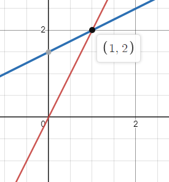

大家也可以利用高斯消元去做一做，所以，你明白这个坐标系与线性方程的关系了吗？

> 这与后面的向量空间有关系，我提前给大家讲一个感性的观点——每多一个未知量就会多一个维度。当只有一个未知量的时候，我们在坐标轴上就可以解决问题；当有两个未知量的时候，我们在坐标平面上；当有三个未知量的时候，我们在三维坐标体上。此时对于图像来说已经相当复杂了，但在实际设计中，我们对于一个问题越要追求精细，引入的变量越多，故我们要抽象向高维进发。
> 到这里我们就要引入向量的概念了。
>
> 这里我们说一个一直没有讨论的问题——什么是向量？
> **在数学中**指的是向量空间中的基本构成元素。它可以将代数运算直接引入几何中，是线性空间的几何基础。在这个空间中对**加法**和**数乘封闭。**
> 即对于一个向量空间 $V$ 是一个以 $\alpha$ , $\beta$ , $\gamma$ , $\cdots$ 为元素的非空集合, $F$ 是一个数域，
> 满足加法： $\forall\alpha,\beta\in V$ , $\alpha+\beta\in V$ ；
> 数乘 $\forall k\in F$ , $\alpha\in V$ , $k\alpha\in V$ ；
> **在物理中**指的是具有大小（magnitude）和方向的量。它可以形象化地表示为带箭头的线段。箭头所指：代表向量的方向；线段长度：代表向量的大小。在物理中，它更多地被称为**矢量**。

补充几条向量的基本性质

$$
加法运算：\overrightarrow{a}  + \overrightarrow{b}
$$

$$
交换律：\overrightarrow{a}  + \overrightarrow{b}  = \overrightarrow{b}  +  \overrightarrow{a}
$$

$$
结合律：(\overrightarrow{a}  + \overrightarrow{b} ) + \overrightarrow{c}  = \overrightarrow{a}  +( \overrightarrow{b}  + \overrightarrow{c})
$$

$$
存在唯一零元，记为\overrightarrow{0}，对任意\overrightarrow{a}，满足：\overrightarrow{a} + \overrightarrow{0}=\overrightarrow{0} + \overrightarrow{a} = \overrightarrow{a}
$$

$$
对任意\overrightarrow{a}，存在负元，记为(-\overrightarrow{a}),满足：\overrightarrow{a} + (-\overrightarrow{a}) = (-\overrightarrow{a}) + \overrightarrow{a} = \overrightarrow{0}
$$

$$
数乘运算: c\overrightarrow{a}
$$

$$
(数的)交换律：kl\overrightarrow{a} = lk\overrightarrow{a}
$$

$$
结合律：(kl)\overrightarrow{a} = k(l\overrightarrow{a})
$$

$$
分配律：（向量对数）(k+l)\overrightarrow{a}=k\overrightarrow{a}+l\overrightarrow{a}
$$

$$
(数对向量)k(\overrightarrow{a}  + \overrightarrow{b} )=k\overrightarrow{a}+k\overrightarrow{b}
$$

Okay，大家还记得我们之前提到的系数矩阵吗，我们对于相同的未知量，也可以提出其系数。

$$
\begin{bmatrix} a_{11}\\ a_{21}\\ a_{31}\\ \vdots\\ a_{m1} \end{bmatrix}for\ x_1
$$

 ， 

$$
\begin{bmatrix} a_{12}\\ a_{22}\\ a_{32}\\ \vdots\\ a_{m2} \end{bmatrix}for\ x_2
$$

 ， $\cdots$ ， 

$$
\begin{bmatrix} a_{1n}\\ a_{2n}\\ a_{3n}\\ \vdots\\ a_{mn}\end{bmatrix}for\ x_n
$$

这个形式，像不像大家高中学的向量，尤其是当我们取定 $m=2,3$ ，大家更熟悉，我们现在用的只不过维数更高而已，由于其形式来源于矩阵的列，我们姑且称为**列向量**，我们再去看上面的那个例子 $example\_1$

${\color {red} {法3}}$ 我们可以把向量 

$$
\begin{bmatrix} 0\\ 3\\ \end{bmatrix}
$$

 视作向量 

$$
\begin{bmatrix} 2\\ -1\\ \end{bmatrix}
$$

 和向量 

$$
\begin{bmatrix} -1\\ 2\\ \end{bmatrix}
$$

 的线性组合，进而求出 $(x,y)$

$$
\begin{bmatrix} 2\\ -1 \end{bmatrix} \begin{bmatrix} x\\ \end{bmatrix}+\begin{bmatrix} -1\\ 2 \end{bmatrix} \begin{bmatrix} y\\ \end{bmatrix} = \begin{bmatrix} 0\\ 3\\ \end{bmatrix}
$$

同样也可以画图得到，大家最好画一下加深印象。

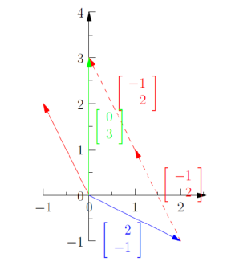

想象一下如果任意取 $x$ , $y$ ，则得到的线性组合又是什么？其结果就是以上两个列向量的所有线性组合将会布满整个坐标平面。

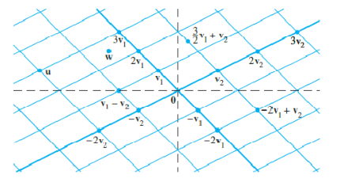

如果我们再任意地取一组向量，它一定能布满整个空间吗？大家思考一下

答案是不一定，如果在二维平面中，我们不小心取到共线的向量，那就一定无法布满整个二维平面了

$$
{\LARGE \mathbf{{\color{red}{所以，我们现在的基本认知是——矩阵是扩充的向量。(n个m维列向量拼成了矩阵)}}} }
$$

那么我们构建好矩阵只是为了好写吗？我们的目的还是在于回归本质，我们更关心这个线性方程组里的解。

我们知道，方程是一种**等式**。但是我们把线性方程组写成 $(A|b)$ 增广矩阵的形式之后，就失去了等式的形式。我们希望，在用矩阵 $A、b$ 表示方程的同时，保留**等式**的形式。于是我们引入了一个新的由未知数 $x$ 组成的单列矩阵（或者说列向量）：

$$
x=\begin{bmatrix} x_1\\ x_2\\ x_3\\ \vdots\\ x_m \end{bmatrix}
$$

进而有

$$
Ax=b
$$

$$
\begin{bmatrix} a_{11}&a_{12}&\cdots&a_{1n}\\ a_{21}&a_{22}&\cdots&a_{2n}\\ a_{31}&a_{32}&\cdots&a_{3n}\\ \vdots&\vdots&\ddots&\vdots\\ a_{m1}&a_{m2}&\cdots&a_{mn} \end{bmatrix} \begin{bmatrix} x_1\\ x_2\\ x_3\\ \vdots\\ x_m \end{bmatrix} = \begin{bmatrix} b_1\\ b_2\\ b_3\\ \vdots\\ b_m \end{bmatrix}
$$

这样的写法很自然地就有矩阵 $A$ 乘矩阵 $x$ 的味道在里面，根据运算的结果我们可以反过来定义矩阵的乘法。

或者大家这样理解，先看这一部分

$$
\begin{bmatrix} a_{11}&a_{12}&\cdots&a_{1n}\end{bmatrix} \begin{bmatrix} x_1\\ x_2\\ x_3\\ \vdots\\ x_m \end{bmatrix} = \begin{bmatrix} b_1 \end{bmatrix}
$$

 ,再稍微降降维度

$$
\begin{bmatrix} a_{11}&a_{12}\end{bmatrix} \begin{bmatrix} x_1\\ x_2\end{bmatrix} = \begin{bmatrix} b_1 \end{bmatrix}
$$

 这不就是大家曾经在高中学过的数量积吗？

我们再由此向回看，矩阵是扩充的向量。( $n$ 个 $m$ 维列向量拼成了矩阵)大家可能就懂了。

由于本部分较为简单，可以去以下链接了解，不想讲的很深。大家可以由低阶缓慢延申到高阶。

<https://link.zhihu.com/?target=https%3A//www.shuxuele.com/algebra/matrix-multiplying.html>

> 实在不懂也没关系，在 $Part\ \ 3$ 还会暴力推导一下

那么 $Question:是否对于所有的 b，方程 Ax=b都有解？$

从列向量上看，问题转化为“列向量的线性组合是否覆盖整个向量空间？”

反例：在三维空间中，若三个向量在同一平面内——比如“列 3”恰好等于“列 1”加“列 2”，而若 $b$ 不在该平面内，则三个列向量无论怎么组合也得不到平面外的向量 $b$ 。此时矩阵 $A$ 为奇异阵或称不可逆矩阵。在矩阵 $A$ 不可逆条件下，不是所有的 $b$ 都能令方程 $Ax=b$ 有解。

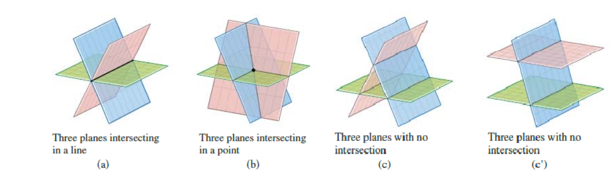

从行向量的角度来看，三元方程组是否有解意味着什么？

- 三个平面交于一条直线则方程有无穷多解；
- 当方程所代表的三个平面相交于一点时方程有唯一解；
- 平面的两两交线互相平行方程也无解；
- 三个平面中至少两个平行则方程无解。

对 $n$ 维情形则是，$n$ 个列向量如果相互独立——“线性无关”，则方程组有解。否则这 $n$ 个列向量起不到 $n$ 个的作用，其线性组合无法充满 $n$ 维空间，方程组未必有解。

那我们到这里已经积累了两个看待方程组的基本方式——矩阵和向量。

我们将在 $Part\ \ 2\sim4$ 介绍矩阵，$Part\ \ 5\sim6$ 介绍向量，$Part\ \ 7\sim8$ 介绍在 $n$ 个未知元的情形下，方程组解的结构。为了更适应国内的教学环境，大家可以自己选择挑着看，当然我还是希望大家耐着性子慢慢先看完引言的

### $Part\ \ 2$ 矩阵消元

给出一组线性方程组

$$
\left\{\begin{matrix} 1x_1+2x_2+1x_3=2\\ 3x_1+8x_2+1x_3=12\\ 0x_1+4x_2+1x_3=2 \end{matrix}\right.
$$

$$
A=\begin{bmatrix} 1&2&1\\ 3&8&1\\ 0&4&1\\ \end{bmatrix}
$$

 ， 

$$
b= \begin{bmatrix} 2\\ 12\\ 2 \end{bmatrix}
$$

高斯消元法 $(Gauss\ \  elimination)$ 就是通过对方程组中的某两个方程进行适当的数乘和加减，以达到将某一未知数系数变为零，从而削减未知数个数的目的。

给大家演示一遍

1. 我们将矩阵左上角的 1 称之为“主元一” $(the\ \ first \ \ pivot)$
2. 第一步要通过消元将第一列中除了主元之外的数字均变化为 0。操作方法就是用之后的每一行减去第一行的适当倍数，此例中第二行应减去第一行的 3 倍。
3. 之后应对第三行做类似操作，本例中三行第一列数字已经为 0，故不用进行操作。
4. 处在第二行第二列的主元二为 2，因此用第三行减去第二行的两倍进行消元，得到第三个主元为 5。

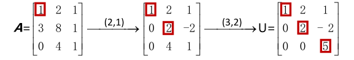

矩阵 $A$ 为可逆矩阵，消元结束后得到上三角阵 $U$ $(Uppertriangular \ \ matrix)$ ，其左侧下半部分的元素均为 0，而主元 1,2,5 分列在 $U$ 的对角线上。主元之积即行列式的值。

需要说明的是，主元不能为 0，如果恰好消元至某行，0 出现在了主元的位置上，应当通过与下方一行进行“行交换”使得非零数字出现在主元位置上。如果 0 出现在了主元位置上，并且下方没有对等位置为非 0 数字的行，则消元终止，并证明矩阵 $A$ 为不可逆矩阵，且线性方程组没有唯一解。

$$
such\ \ as\begin{bmatrix} *&*&*\\ 0&*&*\\ 0&0&0\\ \end{bmatrix}
$$

 ，这样的话就是一个不可逆矩阵

做方程的高斯消元时，需要对等式右侧的 $b$ 做同样的乘法和加减法。手工计算时比较有效率的方法是应用“增广矩阵” $(augmented\ \ \ matrix)$ ，将 $b$ 插入矩阵 $A$ 之后形成最后一列，在消元过程中带着 $b$ 一起操作。

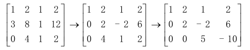

### $Part\ \ 3$ 矩阵乘法与逆

在 $Part\ \ 1$ 中，我们简单提及了一下矩阵的乘法。现在我们通过更加一般的方法来看矩阵乘法的原理

假定矩阵 $A$ 与 $B$ 相乘得到矩阵 $C$ 。其中 $A$ 为 $m\times n$ （ $m$ 行 $n$ 列）矩阵，而 $B$ 为 $n\times p$ 矩阵，则 $C$ 为 $m\times p$ 矩阵，记 $c_{ij}$ 为矩阵 $C$ 中第 $i$ 行第 $j$ 列的元素。

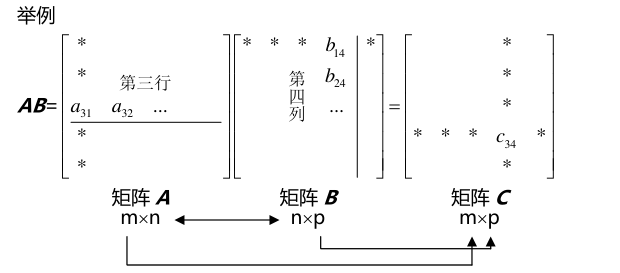

$$
c_{34}=row3\cdot col4=\sum\limits_{k=1}^{n}a_{3k}b_{k4}=a_{31}b_{14}+a_{32}b_{24}+a_{33}b_{34}+\cdots\cdots
$$

> 假定 
> $$
> w_{(m\times n)}=Ay\Rightarrow\left\{\begin{matrix} a_{11}y_1+a_{12}y_2+\cdots+a_{1n}y_n=w_1\\ a_{21}y_1+a_{22}y_2+\cdots+a_{2n}y_n=w_2\\ a_{31}y_1+a_{32}y_2+\cdots+a_{3n}y_n=w_3\\ \vdots \\ a_{m1}y_1+a_{m2}y_2+\cdots+a_{mn}y_n=w_m \end{matrix}\right.
> $$
> 
>  
> $$
> y_{(n\times p)}=Bx\Rightarrow\left\{\begin{matrix} b_{11}x_1+b_{12}x_2+\cdots+b_{1p}x_p=y_1\\ b_{21}x_1+b_{22}x_2+\cdots+b_{2p}x_p=y_2\\ b_{31}x_1+b_{32}x_2+\cdots+b_{3p}x_p=y_3\\ \vdots \\ b_{n1}x_1+b_{n2}x_2+\cdots+b_{np}x_p=y_n \end{matrix}\right.
> $$
> 
>  
> $$
> C_{(m\times p)}=A_{(m\times n)}y=A_{(m\times n)}B_{(n\times p)}x\\ \Rightarrow \left\{\begin{matrix} a_{11}(b_{11}x_1+b_{12}x_2+\cdots+b_{1p}x_p)+\cdots+a_{1n}(b_{11}x_1+b_{12}x_2+\cdots+b_{1p}x_p)=w_1\\ a_{21(}b_{21}x_1+b_{22}x_2+\cdots+b_{2p}x_p)+\cdots+a_{2n(}b_{21}x_1+b_{22}x_2+\cdots+b_{2p}x_p)=w_2\\ a_{31}(b_{31}x_1+b_{32}x_2+\cdots+b_{3p}x_p)+\cdots+a_{3n}(b_{31}x_1+b_{32}x_2+\cdots+b_{3p}x_p)=w_3\\ \vdots \\ a_{m1}(b_{n1}x_1+b_{n2}x_2+\cdots+b_{np}x_p)+\cdots+a_{mn}(b_{n1}x_1+b_{n2}x_2+\cdots+b_{np}x_p)=w_m \end{matrix}\right.\\ \Rightarrow \left\{\begin{matrix} (a_{11}b_{11}+\cdots+a_{1n}b_{11})x_1+\cdots+(a_{11}b_{1p}+\cdots+a_{1n}b_{1p})x_p=w_1\\  (a_{21}b_{21}+\cdots+a_{2n}b_{21})x_1+\cdots+(a_{21}b_{2p}+\cdots+a_{2n}b_{2p})x_p=w_2\\  (a_{31}b_{31}+\cdots+a_{3n}b_{31})x_1+\cdots+(a_{31}b_{3p}+\cdots+a_{3n}b_{3p})x_p=w_3\\  \vdots \\ (a_{m1}b_{n1}+\cdots+a_{mn}b_{n1})x_1+\cdots+(a_{m1}b_{np}+\cdots+a_{mn}b_{np})x_p=w_m \end{matrix}\right.
> $$
> 
> 这样，我们就可以清楚看到矩阵乘法究竟是怎么来的了

特别的，我们在对此进行引申，前面我们将矩阵拆成了一个个向量，对于矩阵的性质似乎没有影响。

那么如果我们将矩阵 $A$ 与 $B$，划分为严格匹配的区块，则矩阵乘法可以通过分块的乘法加以实现。

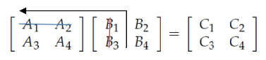

$C_1=A_1B_1+A_2B_3$ ,计算方法与标准算法中矩阵里元素的操作方式相同

对于矩阵乘法的记忆，一个好的小技巧是改换矩阵 $B$ 的位置，如下所示：

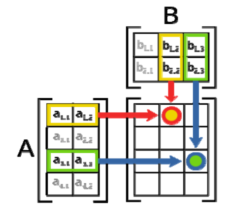

在 $Part\ \ 2$ 中，我们提到了逆矩阵这个概念。

$$
\mathbf{{\color{red}{我们认为如果 0 出现在了主元位置上，并且下方没有对等位置为非 0 数字的行，则消元终止，并证明矩阵 A 为不可逆矩阵。}}}
$$

通过这句话我们可以判定什么是可逆矩阵，什么是不可逆矩阵。

$$
B-U-T\ \ why?
$$

> $\mathbf{{\color{red}{法1}}}$ 让我们从**变换的角度**去看一下，$Answer:$ 原因在于判定时我们要将一般矩阵 $A$ 化为上三角阵 $U$ ，
>  $like \ \ this$

> 此时才能判断。而我们对一般矩阵 $A$做的初等变换如果还可以从上三角阵 $U$通过逆变换回到一般矩阵 $A$，就说明是可逆了，而对于主元为零的行操作必然是失败的，故我们将这样的矩阵叫不可逆矩阵。

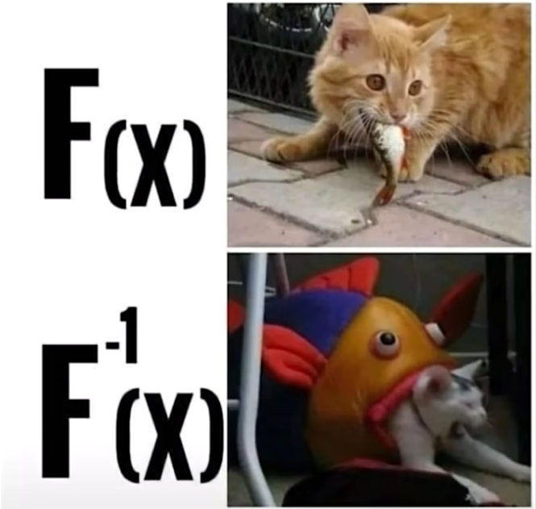

所以，如果条件ok的话，我们总是可以把一个可逆矩阵 $A$ 变成单位矩阵 $I$ (只是将主元单位化而已)

$$
A\rightarrow I \begin{bmatrix} 1&0&0\\ 0&1&0\\ 0&0&1\\ \end{bmatrix}
$$

 ,我们定义变换 $f$ ，有 $f(A)=I$ ,由于矩阵 $A$ 可逆，故 $f^{-1}(I)=A$

相信你已经明白了这种变换我们称它为矩阵的逆，因为它总是做出和矩阵 $A$相反的决策，二者一抵消，就相当于原矩阵乘以单位阵$I$ 。那么我们有结论 $AA^{-1}=A^{-1}A=I$ , $(A^{-1})^{-1}=A$ ,可得逆矩阵一定是方阵

由以上性质，我们可以轻易地想到构造一个分块矩阵 $(A|I)$ 乘上 $A^{-1}$ ，可得 $(I|A^{-1})$

特别地对于三阶可逆矩阵有一种快速求法

<https://link.zhihu.com/?target=https%3A//www.bilibili.com/video/BV1s94y147jK/%3Fspm_id_from%3D333.337.search-card.all.click%26vd_source%3D143406279634ec39026be9d724d5ac8c>

> $\mathbf{{\color{red}{法2}}}$ 回想求解一元一次方程$Ax=b$我们可以用 $A$ 的倒数，$A^{-1}$ 同乘方程两边$A^{-1}Ax=A^{-1}b$从而得到
> $$
> x=A^{-1}b
> $$
> 而要验证解是否成立就要将这个解代回原方程，即验证
> $$
> A(A^{-1}b)=b
> $$
> 
> $$
> (AA^{-1})b=b
> $$
> 是否成立。
> 在上述过程中，成立的关键是存在 $A^{-1}$ 使得 $A^{-1}A=1$ ， $AA^{-1}=1$ 。
> 定义了矩阵乘法后，线性方程组
> $$
> \begin{cases} a_{11}x_1+\cdots+a_{1n}x_n=b_1\\ a_{21}x_1+\cdots+a_{2n}x_n=b_2\\ \cdots\\ a_{m1}x_1+\cdots+a_{mn}x_n=b_m\\ \end{cases}
> $$
> 就可以写作：
> $$
> \boldsymbol A_{n\times n}\boldsymbol X_{n\times1}=\boldsymbol B_{n\times1}。
> $$
> 如果存在 ${\boldsymbol A^{-1}}_{n\times n}$ ，使得
> $$
> {\boldsymbol A^{-1}}_{n\times n}\boldsymbol A_{n\times n}=\boldsymbol I_{(n)}
> $$
> 那么就可以得到
> $$
> {\boldsymbol A^{-1}}_{n\times n}\boldsymbol A_{n\times n}\boldsymbol X_{n\times1}={\boldsymbol A^{-1}}_{n\times n}\boldsymbol B_{n\times1}，
> $$
> 从而得
> $$
> \boldsymbol X_{n\times1}={\boldsymbol A^{-1}}_{n\times n}\boldsymbol B_{n\times1}，
> $$
> 并且再将该式代回原方程组验证要成立，即
> $$
> \boldsymbol A_{n\times n}({\boldsymbol A^{-1}}_{n\times n}\boldsymbol B_{n\times1})=\boldsymbol B_{n\times1}。
> $$
> 
> $$
> (\boldsymbol A_{n\times n}{\boldsymbol A^{-1}}_{n\times n})\boldsymbol B_{n\times1}=\boldsymbol B_{n\times1}。
> $$
> 这就要求
> $$
> \boldsymbol A_{n\times n}{\boldsymbol A^{-1}}_{n\times n}=\boldsymbol I_{(n)}。
> $$
> 这样的矩阵 ${\boldsymbol A^{-1}}_{n\times n}$ 称为逆矩阵。

### $Part\ \ 4$ 矩阵的LU分解

先来几张宏观的图

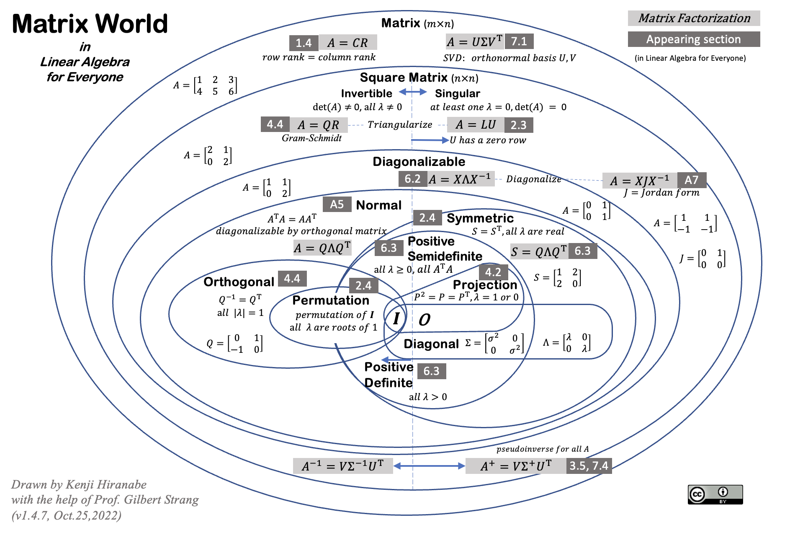

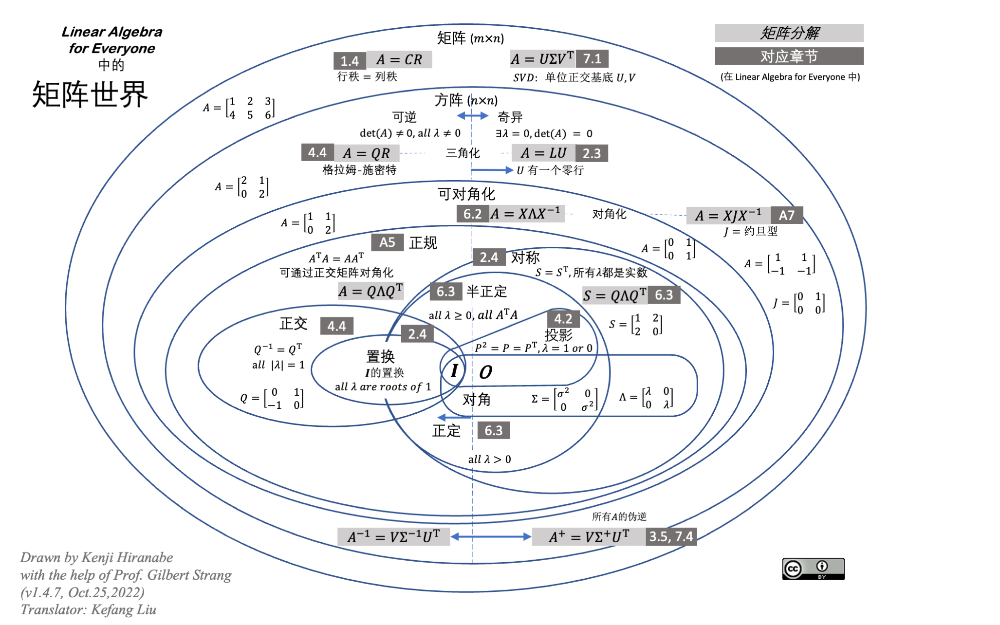

本节的主要目的是从矩阵的角度理解高斯消元法，最后找到所谓的 $L$ 矩阵，使得矩阵 $A$ 可以转变为上三角阵 $U$ 。即完成 $LU$ 分解得到 $A=LU$ 。

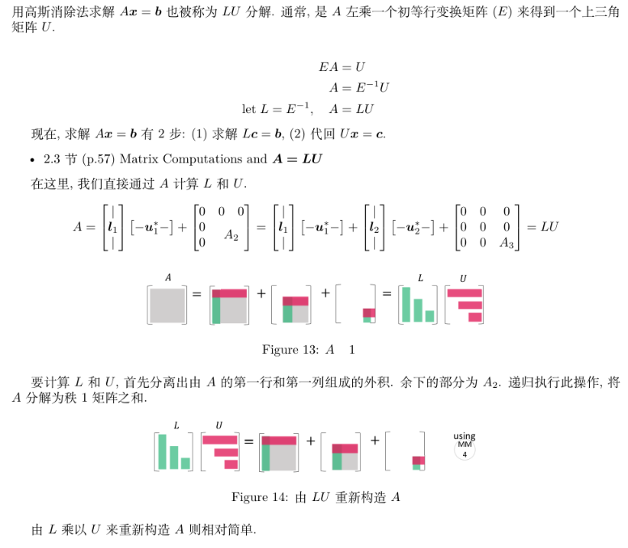

首先继续了解一些矩阵乘法和逆矩阵的相关内容。

**$\mathbf{{\color{brown}{Section\ \ 0.4.1\ \ 矩阵乘积的逆矩阵 }}}$**

$$
(AB)^{-1}=B^{-1}A^{-1}
$$

$ABB^{-1}A^{-1}=A(BB^{-1})A^{-1}=I$ 比较等式两端可得 $(AB)^{-1}=B^{-1}A^{-1}$ 。

同理，我们可以轻易地拓展到多元的情形

$$
(A_1A_2\cdots A_n)^{-1}=A_n^{-1}\cdots A_2^{-1}A_1^{-1}
$$

$$
\mathbf{{\color{brown}{Section\ \ 0.4.2\ \ 矩阵的转置}}}
$$

矩阵 $A$ 的转置矩阵记为 $A^T$ ，对矩阵进行转置就是将 $A$ 矩阵的行变为 $A^T$ 的列，则完成后 $A$ 的列也就成为了 $A^T$ 的行，看起来矩阵如同沿着对角线进行了翻转。

$$
A=\begin{bmatrix} 2&1&4\\ 0&0&3\\ \end{bmatrix}
$$

 , 

$$
A^T=\begin{bmatrix} 2&0\\ 1&0\\4&3 \end{bmatrix}
$$

其数学表达式为 $(A^T)_{ij}=A_{ji}$ ，即 $A^T$ 的第 $i$ 行 $j$ 列的元素为原矩阵 $A$ 中第 $j$ 行 $i$ 列的元素。

特别的我们对于置换(行交换)矩阵，有$P^T=P^{-1}$

对于二阶有

$$
\begin{bmatrix} 1&0\\ 0&1\\ \end{bmatrix}
$$

 ， 

$$
\begin{bmatrix} 0&1\\ 1&0\\ \end{bmatrix}
$$

对于三阶有

$$
\begin{bmatrix} 1&0&0\\ 0&1&0\\0&0&1 \end{bmatrix}
$$

 ， 

$$
\begin{bmatrix} 1&0&0\\ 0&0&1\\0&1&0 \end{bmatrix}
$$

 ， 

$$
\begin{bmatrix} 0&1&0\\ 1&0&0\\0&0&1 \end{bmatrix}
$$

 ， 

$$
\begin{bmatrix} 0&1&0\\ 0&0&1\\1&0&0 \end{bmatrix}
$$

 ， 

$$
\begin{bmatrix} 0&0&1\\ 1&0&0\\0&1&0 \end{bmatrix}
$$

 ， 

$$
\begin{bmatrix} 0&0&1\\ 0&1&0\\1&0&0 \end{bmatrix}
$$

对于 $n$ 阶矩阵

有 $n!$ 个置换矩阵

并且任意给定一个矩阵 $R$ ，$R$ 可以不是方阵，则乘积 $R^TR$ 一定是对称阵。利用性质 $(A^T)^T=A$ 易证

> $Prove:(R^TR)^T=R^T(R^T)^T=R^TR$

还有三个性质： 

$$
\begin{align} &1. \ {\textbf{Sum}} \quad \quad \quad (A+B)^T=A^T+B^T\\ &2.\ {\textbf{Product}} \quad \ (AB)^T=B^TA^T\\ &3.\ {\textbf{Inverse}} \quad \ \ \  (A^{-1})^T=(A^T)^{-1}  \end{align}
$$

### $Part\ \ 5$ 向量空间

> 本节的将引入向量空间 $(vector\ \ spaces)$ 和子空间 $(subspaces)$ 。

在 $Part\ \ 1$ 中我们利用大家高中熟悉的向量，为大家引入了矩阵。回过头我们再来看看向量，思考一下，在一个向量空间中，我们能做哪些线性变换呢?

——旋转，缩放

那我们又如何去得到这种变换呢？

让我们先做一些准备工作

在 $Part\ \ 4$ 的末尾，我们提到了置换矩阵，而置换矩阵说白了就是行变换，相信大家在代数方向上已经对置换矩阵看的比较清楚了，那么他在图像上呢？表现为什么作用？

以二阶为例，举例演示几种初等行变换

> 交换两行： 
> $$
> \begin{bmatrix} 0&1\\ 1&0\\ \end{bmatrix} \begin{bmatrix} x\\ y\\ \end{bmatrix} =\begin{bmatrix} y\\ x\\ \end{bmatrix}
> $$
>  ，相当于交换了 $x$ , $y$ 轴，即关于 $y=x$ 对称
> 用 $k(k\neq0)$ 乘某一行： 
> $$
> \begin{bmatrix} 0&-1\\ 1&0\\ \end{bmatrix} \begin{bmatrix} x\\ y\\ \end{bmatrix} =\begin{bmatrix} -y\\ x\\ \end{bmatrix}
> $$
>  ，相当于逆时针旋转了 $90^{\circ}$
> 某一行的 $t$ 倍加到另一行上去 
> $$
> \begin{bmatrix} 1&1\\ 0&1\\ \end{bmatrix} \begin{bmatrix} x\\ y\\ \end{bmatrix} =\begin{bmatrix} x+y\\ y\\ \end{bmatrix}
> $$
>  ，错切

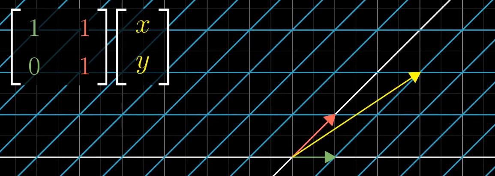

> 相应的，列变换就是将置换矩阵放在待乘矩阵的右侧

以二阶为例

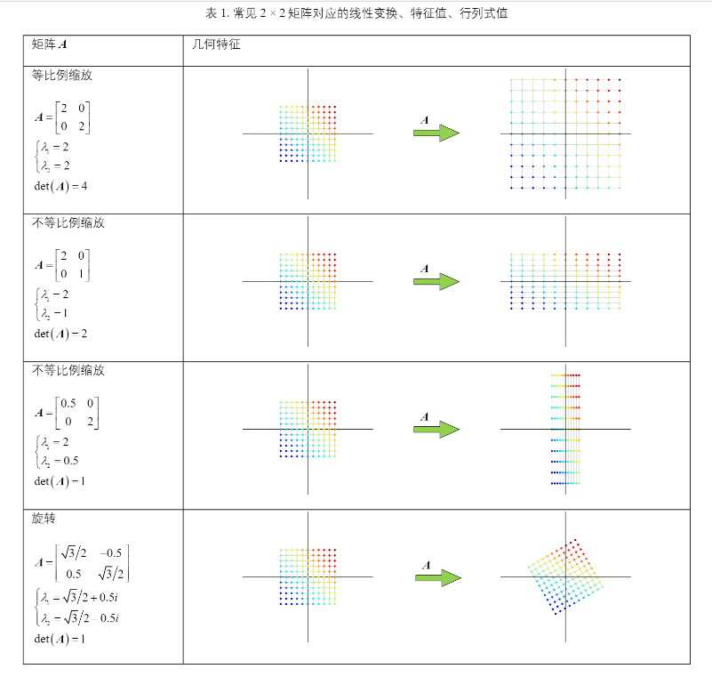

图源：Ch13\_特征值分解\_\_矩阵力量\_\_从加减乘除到机器学习

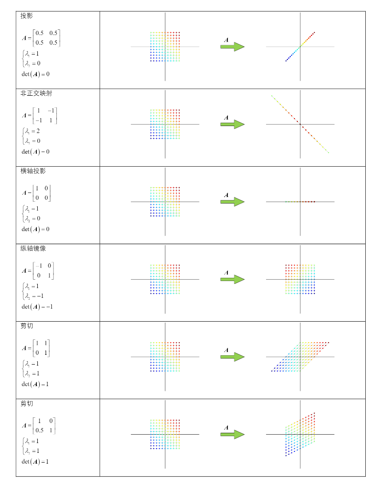

图源：Ch13\_特征值分解\_\_矩阵力量\_\_从加减乘除到机器学习

> 插播一下，大佬在知乎也有号，大家可以关注一下

<https://www.zhihu.com/people/jamestong-xue>

---

> 除了乘以单位阵，原来的点集不会变以外，乘以其他任意的矩阵都会使原来的点集发生**畸变**

---

$$
\mathbf{ {\color{red}{一个计算的小技巧就是看置换矩阵和单位阵的区别，就能迅速的求出矩阵，变换呢，就是左行右列}}}
$$

> $e.g.$
> 已知 
> $$
> A=\begin{bmatrix} 1  &2  &3 \\ 4  &5  &6 \\ 7  &8  &9 \\ \end{bmatrix}
> $$
>  ， 
> $$
> \Lambda=\begin{bmatrix} 1  &  &  \\   & 2 &  \\   &  &-1  \\ \end{bmatrix}
> $$
>  ,则 $A\Lambda-\Lambda A=$
> 解： 
> $$
> A\Lambda-\Lambda A=\begin{pmatrix} 1  &2  &3 \\ 4  &5  &6 \\ 7  &8  &9 \\ \end{pmatrix}\begin{pmatrix} 1  &  &  \\   & 2 &  \\   &  &-1  \\ \end{pmatrix}-\begin{pmatrix} 1  &  &  \\   & 2 &  \\   &  &-1  \\ \end{pmatrix}\begin{pmatrix} 1  &2  &3 \\ 4  &5  &6 \\ 7  &8  &9 \\ \end{pmatrix}
> $$
> 
>  
> $$
> =\begin{pmatrix} 1  &4  &-3 \\ 4  &10  &-6 \\ 7  &16  &-9 \\ \end{pmatrix}-\begin{pmatrix} 1  &2  &3 \\ 8  &10  &12 \\ -7  &-8  &-9 \\ \end{pmatrix}
> $$
>  
> $$
> =\begin{pmatrix} 0  &2  &-6 \\ -4  &0  &-18 \\ 14  &24  &0 \\ \end{pmatrix}
> $$
> 

$$
\mathbf{{\color{brown}{Section\ \ 0.5.1\ \ 向量空间}}}
$$

我们可以对向量进行所谓“线性运算”，即通过加和 $（v+w）$ 与数乘运算 $（3v）$ 得到向量的线性组合。向量空间对线性运算封闭，即空间内向量进行线性运算得到的向量仍在空间之内。

$$
\mathbf{{\color{brown}{Section\ \ 0.5.2\ \ 子空间 Subspaces}}}
$$

包含于向量空间之内的一个向量空间称为原向量空间的一个子空间。例如用**实数** $c$ 数乘 $R^2$ 空间中**向量** $v$ 所得到的向量集合就是 $R^2$ 空间的一个子空间，其图像为二维平面上穿过原点的一条直线，它**对于线性运算封闭**。

反例：$R^2$中不穿过原点的直线就不是向量空间。**子空间必须包含零向量**，原因就是数乘 0 的到的零向量必须处于子空间中。

$R^2$的子空间包括：

- $R^2$ 空间本身
- 过原点的一条直线（这是$R^2$空间中的一条直线，与$R^1$空间有区别）
- 原点 仅包含 0 向量

$R^3$ 的子空间包括：

- $R^3$ 空间本身 3 维
- 过原点的一个平面 2 维
- 过原点的一条直线 1 维
- 原点 仅包含 0 向量

$$
\mathbf{{\color{brown}{Section\ \ 0.5.3\ \  列空间 Column spaces}}}
$$

假使给定矩阵$A$，其列向量属于 $R^3$ 空间，这些列向量和它们的线性组合张成了 $R^3$ 空间中的一个子空间，即矩阵 $A$ 的列空间 $C(A)$ 。

如果 

$$
A=\begin{bmatrix} 1&3\\ 2&3\\4&1 \end{bmatrix}
$$

 ，则 $A$ 的列空间是 $R^3$ 空间中包含向量 

$$
\begin{bmatrix} 1\\ 2\\4 \end{bmatrix}
$$

 和 

$$
\begin{bmatrix} 3\\ 3\\1 \end{bmatrix}
$$

 并穿过原点的平面，空间内包含两向量的所有线性组合。下面的任务就是在列空间和子空间的基础上理解 $Ax=b$ 。

矩阵 $A$ 的列空间 $C(A)$ 是其列向量的所有线性组合所构成的空间。求解 $Ax=b$ 的问题，对于给定的矩阵 $A$ ，对于任意的 $b$ 都能得到解么？

如果 

$$
A=\begin{bmatrix} 1&1&2\\ 2&1&3\\3&1&4\\4&1&5 \end{bmatrix}
$$

显然并不是所有的 $b$ 都能保证 $Ax=b$ 有解，因为它有 4 个线性方程而只有 3 个未知数，矩阵 $A$ 列向量的线性组合无法充满 $R^4$ ，因此如果 $b$ 不能被表示为 $A$ 列向量的线性组合时，方程是无解的。只有当 $b$ 在矩阵 $A$ 列空间 $C(A)$ 里时， $x$ 才有解。

对于我们所给定的矩阵 $A$ ，由于列向量不是线性无关的，即第三个列向量为前两个列向量的线性组合，所以尽管有 3 个列向量，但是只有 2 个对张成向量空间有贡献。矩阵 $A$ 的列空间为 $R^4$ 内的一个二维子空间。

**对于一个矩阵，列向量生成的空间，称为列空间；行向量生成的空间，称为行空间**

> 对应的我们也可以给出行空间的概念，在这里就不细说了，占用篇幅

### $Part\ \ 6$ 零空间（或化零空间） $Nullspace$

矩阵 $A$ 的零空间 $N(A)$ 是指满足 $Ax=0$ 的所有解的集合。对于所给定这个矩阵 $A$ ，其列向量含有 4 个分量，因此列空间是空间 $R^4$ 的子空间， $A$ 为含有 3 个分量的向量，故矩阵 $A$ 的零空间是 $R^3$ 的子空间。对于 $m\times n$ 矩阵，列空间为 $R^m$ 的子空间，零空间为 $R^n$ 空间的子空间。

本例中矩阵 $A$ 的零空间 $N(A)$ 为包含 

$$
A=\begin{bmatrix} 1\\ 1\\-1\end{bmatrix}
$$

 的任何倍数的集合，因为很容易看到第一列向量（1）和第二列向量（1）相加减去第三列向量（-1）为零。此零空间为 $R^3$ 中的一条直线。为了验证 $Ax=0$ 的解集是一个向量空间，我们可以检验它是否对线性运算封闭。

若 $v$ 和 $w$ 为解集中的元素，则有：

$A(v+w)=Av+Aw=0+0=0$ ，

$A(cv)=cAv=0$ ，

因此得证 $N(A)$ 确实是 $R^n$ 空间的一个子空间。

$b$ 值的影响 $(Other\ \  values\ \ of\ \ b)$

若方程变为 

$$
\begin{bmatrix} 1&1&2\\ 2&1&3\\ 3&1&4\\ 4&1&5\end{bmatrix} \begin{bmatrix} x_1\\ x_2\\ x_3\end{bmatrix} = \begin{bmatrix} 1\\ 2\\ 3\\4 \end{bmatrix}
$$

则其解集不能构成一个子空间。零向量并不在这个集合内。解集是空间 $R^3$ 内过 

$$
\begin{bmatrix} 1\\ 0\\0 \end{bmatrix}
$$

 和 

$$
\begin{bmatrix} 0\\ -1\\1 \end{bmatrix}
$$

 的一个平面，但是并不穿过原点 

$$
\begin{bmatrix} 0\\ 0\\0 \end{bmatrix}
$$

 。

以上我们给出了关于矩阵的两种子空间，同时给出了两种构造子空间的方法。对于列空间，它是由列向量进行线性组合张成的空间；而零空间是从方程组出发，通过让 $x$ 满足特定条件而得到的子空间。

### $Part\ \ 7$ 求解齐次线性方程组 $Ax=0$ ：主变量，特解

进行到这里，其实有一个问题——

$$
{\color{red}{Question:如果我一眼看不出线性相关呢?我们的判断如此感性吗?况且在低阶我还可以这么玩，到高阶呢?甚至我们如果仔细思考的话线性组合稍微复杂一点的低阶都有问题}}
$$

不过，不必担心，高斯会出手，在高斯消元法中，结果的每一行，就是原矩阵各行的一个线性组合。无论原来矩阵是什么样子，经过高斯消元法，我们总是能够把线性相关的向量剔除，而其中非零行的个数就是我们生成空间的维度，我们称作**秩**

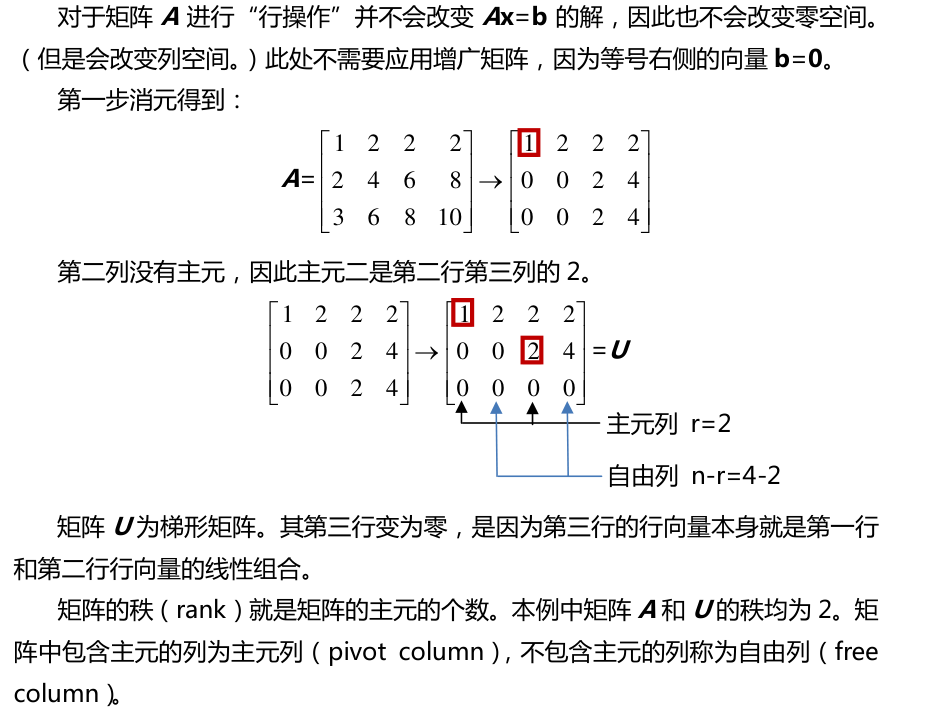

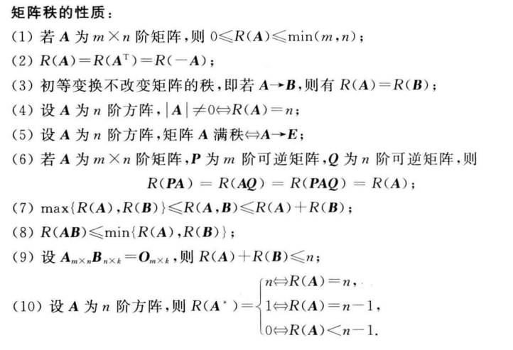

少年郎，大记忆术懂不懂

### $Part\ \ 8$ 求解非齐次线性方程组 $Ax=b$ ：可解性与结构

齐次线性方程组 $Ax=0$

$r(A)=r(\overline{A})=n$ ,只有零解$\Leftrightarrow |A|\neq0\Leftrightarrow AA^*=|A|E\Leftrightarrow|A^*|=|A|^{n-1}\neq0\Leftrightarrow|A^*|\neq0$

$r(A)=r(\overline{A})\lt n$ ,有非零解 $\Leftrightarrow |A|=0\Leftrightarrow AA^*=|A|E=0 \Leftrightarrow r(A)+r(A^*)\le n\Leftrightarrow r(A^*)=1$

非齐次线性方程组 $Ax=b$

$r(A)=r(\overline{A})=n$ ,有唯一解

$r(A)=r(\overline{A})\lt n$ ,有无穷解

$r(A)\neq r(\overline{A})$ ,无解

### $Part\ \ 9$ 线性方程组解的性质

$$
\mathbf{{\color{brown}{Section\ \ 0.9.1\ \ 线性方程组解的性质}}}
$$

$$
\left\{\begin{array}\ \left.\begin{array}\   (1)  \eta _ {1}  ,  \eta _ {2}  是Ax=0的解,  \eta _ {1}  +  \eta _ {2}  也是它的解  \\(2)  \eta  是Ax=0的解,对任意k,使得k  \eta  也是它的解  \\(3)  \eta _ {1}  ,  \eta _ {2}  ,  \cdots  ,  \eta _ {k}  是Ax=0的解,对任意k个常数\\ \lambda _ {1},\lambda _ {2}, \cdots  ,  \lambda _ {k}  ,  \lambda _ {1}\eta _ {1}+  \lambda _ {2}\eta _ {2}  + \cdots \lambda _ {k}   \eta _ {k}  也是它的解  \end{array}\right\}齐次方程组  \\(4)  \gamma  是Ax=  \beta  的解,  \eta  是其导出组Ax=0的解,  \gamma  +  \eta  是Ax=  \beta  的解  \\(5)  \eta  ,  \eta _ {2}  是Ax=  \beta  的两个解,  \eta _ {1}  -  \eta _ {2}  是其导出组Ax=0的解  \\(6) \eta _ {1}  -  \eta _ {2}  是其导出组Ax=0的解  \Leftrightarrow  \eta _ {2}  是Ax=  \beta  的解,则  \eta _ {1}  也是它的解    \\(7) \eta _ {1} , \eta _ {2}  , \cdots  ,  \eta _ {k}  是Ax=  \beta  的解,\\则\lambda _ {1}   \eta _ {1}  +  \lambda _ {2}   \eta _ {2} +\cdots +  \lambda _ {k}   \eta _ {k}  也是Ax=  \beta  的解  \Leftrightarrow   \lambda _ {1}  +  \lambda _ {2}  +\cdots+  \lambda _ {k}  =1 \\ \lambda _ {1}   \eta _ {1}  +  \lambda _ {2}   \eta _ {2} +\cdots +  \lambda _ {k}   \eta _ {k}   ,是Ax=0的解  \Leftrightarrow \lambda _ {1}  +  \lambda _ {2}  +\cdots+  \lambda _ {k}   =0 \end{array}\right.
$$

$\mathbf{{\color{brown}{Section\ \ 0.9.2\ \ 方程组同解问题}}}$ [[1]](#ref_1)

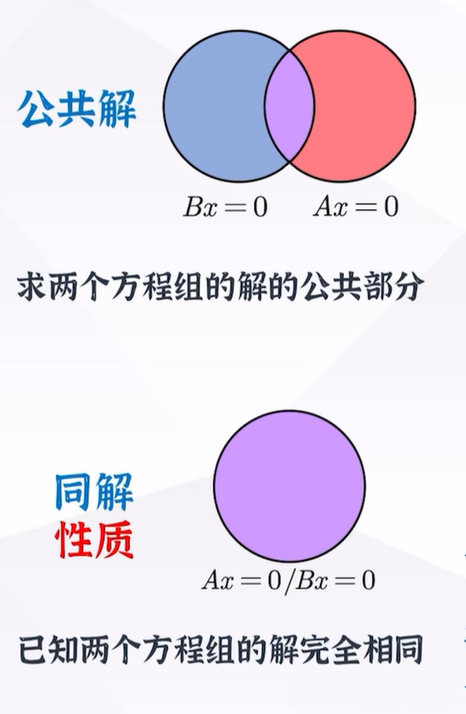

齐次方程组 $Ax=0$ 与 $Bx=0$ 同解的四个充要条件

① $Ax=0$ 的解均是 $Bx=0$ 的解，且 $Bx=0$ 的解均是 $Ax=0$ 的解

② 

$$
r(A)=r(B)=r\begin{pmatrix}A \\B\end{pmatrix}=r\begin{pmatrix}A^T &B^T\end{pmatrix} =r\begin{bmatrix}\begin{pmatrix}A^T &B^T\end{pmatrix} &\begin{pmatrix}A \\B\end{pmatrix}\end{bmatrix}
$$

③ $Ax=0$ 的解均是 $Bx=0$ 的解，且 $r(A)=r(B)$

④ $A$ 与 $B$ 行向量组等价

> $Ax=0$ 的解均是 $Bx=0$ 的解 $\Rightarrow r(A)\ge r(B)$
>  $Ax=0$ 的解均是 $Bx=0$ 的解，且 $Bx=0$ 的解均是 $Ax=0$ 的解 
> $$
> \Leftrightarrow r(A)= r\begin{pmatrix}A \\B\end{pmatrix}
> $$
> $\Leftrightarrow$ $Ax=0$ 与 
> $$
> \left\{\begin{array}\ Ax=0 \\Bx=0\end{array}\right.
> $$
>  同解

非齐次方程组 $Ax=\xi$ 与 $Bx=\eta$ 同解的四个充要条件

① $Ax=\xi$ 的解均是 $Bx=\eta$ 的解，且 $Bx=\eta$ 的解均是 $Ax=\xi$ 的解

② $Ax=0$ 与 $Bx=0$ 同解且 $Ax=\xi$ 与 $Bx=\eta$ 有一公共解。

② 

$$
\begin{pmatrix}A &\xi\end{pmatrix} \begin{pmatrix}x \\-1\end{pmatrix}=0\Leftrightarrow\begin{pmatrix}B &\eta\end{pmatrix} \begin{pmatrix}x \\-1\end{pmatrix}=0
$$

 ,即可化为齐次同解问题

$$
\Leftrightarrow r(A)=r(B)=r(A,\xi)=r(B,\eta)=r\left(\begin{array}{c:c}A &\xi \\ B&\eta\end{array}\right)
$$

③ $A$ 、 $B$ 的行向量组等价且 $Ax=\xi$ 与 $Bx=\eta$ 有一公共解。

④ $(A,\xi)$ 与 $(B,\eta)$ 行向量组等价

> $Ax=\xi$ 的解均是 $Bx=\eta$ 的解 $\Rightarrow r(A,\xi)\ge r(B,\eta)$
>  $Ax=\xi$ 的解均是 $Bx=\eta$ 的解 
> $$
> \Leftrightarrow r(A,\xi)=r\left(\begin{array}{c:c}A &\xi \\ B&\eta\end{array}\right)
> $$
> $\Leftrightarrow$ $Ax=\xi$ 与 
> $$
> \left\{\begin{array}\ Ax=\xi \\Bx=\eta\end{array}\right.
> $$
>  同解

$$
\mathbf{{\color{brown}{Section\ \ 0.9.3\ \ 线性方程组与几何关系}}}
$$

> 一般只考察三维情况

①空间平面

$$
平面之间有无公共点\Rightarrow \left\{\begin{array}\ 有,r(A)=r(A,\beta)\left\{\begin{array}\ 有唯一解\Leftrightarrow相交于一点  \\有无穷多解\Leftrightarrow相交于一条直线或一整个平面  \end{array}\right.  \\没有,r(A)\neq r(A,\beta);再观察两平面是否相交从而确定r(A)\Rightarrow \left\{\begin{array}\ 相交,两法向量不平行\Rightarrow 线性无关  \\不相交,两法向量平行\Rightarrow 线性相关 \end{array}\right. \end{array}\right.
$$

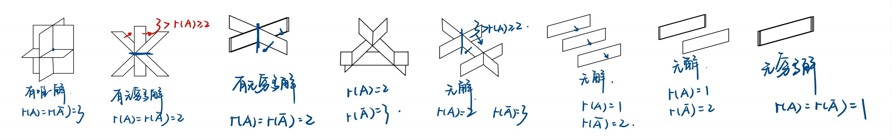

②空间直线

> 引例： 设 
> $$
> A=\begin{pmatrix}a_{1}&b_{1}&c_{1}\\a_{2}&b_{2}&c_{2}\\a_{3}&b_{3}&c_{3}\end{pmatrix}
> $$
>  的秩为 3, 则直线 $I_1:\frac{x-a_3}{a_1-a_2}=\frac{y-b_3}{b_1-b_2}=\frac{z-c_3}{c_1-c_2}$ 与 $I_{2}:\frac{x-a_1}{a_2-a_3}=\frac{y-b_1}{b_2-b_3}=\frac{z-c_1}{c_2-c_3}$ 满足 $\_\_\_\_$ 关系
> A.异面.
> B.重合
> C.平行但不重合.
> D.交于一点.

不想画图了，用了我的高数下里的图

对于 

$$
(S_1,S_2,\overrightarrow {M_1M_2})\left\{\begin{align}=0共面 &\ \ \ \ \left\{\begin{matrix}平行 &S_1\parallel S_2\nparallel M_1M_2  \\重合&S_1\parallel S_2\parallel M_1M_2 \\相交 &S_1\nparallel S_2 \end{matrix}\right.  \\ \neq0异面 & \end{align}\right.
$$

> 对于本题
>  
> $$
> \begin{align*} (S_1,S_2,\overrightarrow {M_1M_2})  &\ \ =\begin{vmatrix}a_{1}-a_{2}&b_{1}-b_{2}&c_{1}-b_{2}\\a_{2}-a_{3}&b_{2}-b_{3}&c_{2}-c_{3}\\a_{1}-a_{3}&b_{1}-b_{3}&c_{1}-c_{3}\end{vmatrix} \\   &\overset{r_1+r_2}{=} \begin{vmatrix}a_{1}-a_{2}&b_{1}-b_{2}&c_{1}-b_{2}\\a_{1}-a_{3}&b_{1}-b_{3}&c_{1}-c_{3}\\a_{1}-a_{3}&b_{1}-b_{3}&c_{1}-c_{3}\end{vmatrix}=0 \end{align*}
> $$
> 
>  
> $$
> \left.A\rightarrow\left(\begin{matrix}a_{1}-a_{2}&b_{1}-b_{2}&c_{1}-c_{2}\\a_{2}-a_{3}&b_{2}-b_{3}&c_{2}-c_{3}\\a_{3}&b_{3}&c_{3}\end{matrix}\right.\right)\Rightarrow S_1\nparallel S_2
> $$
> 
> 故选 $D$

### $Part\ \ 10$ 线性无关，基和维数

$$
\mathbf{{\color{brown}{Section\ \ 0.10.1\ \ 线性无关}}}
$$

矩阵 $A$ 为 $m\times n$ 矩阵，其中 $m\times n$（因此 $Ax=b$ 中未知数个数多于方程数）。则 $A$ 中具有至少一个自由变量，那么 $Ax=0$ 一定具有非零解。 $A$ 的列向量可以线性组合得到零向量，所以 $A$ 的列向量是线性相关的。

若 $c_1x_1+c_2x_2+\cdots\cdots+c_nx_n=0$ 仅在 $c_1=c_2=\cdots\cdots=c_n=0$ 时才成立，则称向量 $x_1,x_2,\cdots \cdots x_n$ 是线性无关的。若这些向量作为列向量构成矩阵 $A$ ，则方程 $Ax=0$ 只有零解 $x=0$ ，或称矩阵 $A$ 的零空间只有零向量。换而言之，若存在**非零向量** $c$ ，使得 $Ac=0$ ，则这个矩阵 $A$ 的列向量线性相关。

在 $R^2$ 中，两个向量只要不在一条直线上就是线性无关的。（在 $R^3$ 中，三个向量线性无关的条件是它们不在一个平面上。若选定空间$R^2$中的三个向量，则他们必然是线性相关的

特别地，若向量组 $\alpha_1,\alpha_2,\cdots,\alpha_m$ 存在部分组 $\alpha_{i_1},\alpha_{i_2},\cdots,\alpha_{i_r}$ 线性相关，则向量组 $\alpha_1,\alpha_2,\cdots,\alpha_m$ 线性相关；反之，若一个向量组线性无关，则他的任何部分向量组也线性无关

$$
\mathbf{{\color{brown}{Section\ \ 0.10.2\ \ 极大线性无关组}}}
$$

若向量组 $\alpha _ {1}  ,  \alpha _ {2}  ,  \cdots  ,  \alpha _ {s}$ 中可以选出 $r$ 个向量 $\alpha_{i_1},\alpha_{i_2},\cdots,\alpha_{i_r}$ ,满足

(1)向量组 $\alpha_{i_1},\alpha_{i_2},\cdots,\alpha_{i_r}$ ,线性无关;

(2)向量组 $\alpha _ {1}  ,  \alpha _ {2}  ,  \cdots  ,  \alpha _ {s}$ 中任意 $r+1$ 个向量(如果存在)线性相关,

则称向量组 $\alpha_{i_1},\alpha_{i_2},\cdots,\alpha_{i_r}$ 是向量组 $\alpha _ {1}  ,  \alpha _ {2}  ,  \cdots  ,  \alpha _ {s}$ ,的一个**极大线性无关组**.

**极大无关组的等价定义:**

若向量组 $\alpha _ {1}  ,  \alpha _ {2}  ,  \cdots  ,  \alpha _ {s}$ 中可以选出 $r$ 个向量 $\alpha_{i_1},\alpha_{i_2},\cdots,\alpha_{i_r}$ ,满足

(1)向量组 $\alpha_{i_1},\alpha_{i_2},\cdots,\alpha_{i_r}$ ,线性无关;

(2)向量组 $\alpha _ {1}  ,  \alpha _ {2}  ,  \cdots  ,  \alpha _ {s}$ ,中任意一个向量均可被 $\alpha_{i_1},\alpha_{i_2},\cdots,\alpha_{i_r}$ 线性表示,则称向量组 $\alpha_{i_1},\alpha_{i_2},\cdots,\alpha_{i_r}$ 是向量组 $\alpha _ {1}  ,  \alpha _ {2}  ,  \cdots  ,  \alpha _ {s}$ 的一个极大**线性无关组**.

**极大无关组的性质:**

(1)向量组与它的极大无关组等价.

(2)一个向量组的两个极大无关组是等价的,它们所含向量的个数相等.

**极大线性无关组的求解**

$e.g.$ 求矩阵 

$$
A=\begin{bmatrix}2&-1&-1&1&2\\1&1&-2&1&4\\4&-6&2&-2&4\\3&6&-9&7&9\end{bmatrix}
$$

 的列向量组的一个极大线性无关组,并将其余的向量用该极大线性无关组线性表示.

> 解 对 $A$ 进行初等行变换,化为行阶梯形矩阵 
> $$
> A=\begin{bmatrix}2&-1&-1&1&2\\1&1&-2&1&4\\4&-6&2&-2&4\\3&6&-9&7&9\end{bmatrix}\to\begin{bmatrix}1&1&-2&1&4\\0&-1&1&-3&6\\0&0&0&1&-3\\0&0&0&0&0\end{bmatrix}
> $$
> 
>
> 因此 $R(A)=3$ ,且向量组 $\alpha_1 ,  \alpha_2,  \alpha_3$ 为极大线性无关组.进一步将 $A$ 进行初等行变换,化为行最简形矩阵,
>  
> $$
> A\to\begin{bmatrix}1&0&-1&0&4\\0&1&-1&0&3\\0&0&0&1&-3\\0&0&0&0&0\end{bmatrix}
> $$
> 
> 因此 $\alpha_ {3}  =-\alpha_1- \alpha_ {2} ,  \alpha_5=4\alpha_ {1}  +  3\alpha_ {2}  -  3\alpha_ {4}  .$

$$
\mathbf{{\color{brown}{Section\ \ 0.10.3\ \ 基}}}
$$

向量空间的基是具有如下两个性质的一组向量 $v_1，v_2\cdots \cdots v_d$ ：

•$v_1，v_2\cdots \cdots v_d$ 线性无关

•$v_1，v_2\cdots \cdots v_d$ 张成该向量空间

空间的基告诉我们了该空间的一切信息——即属于该空间的向量都可以由其基来表示

### $Part\ \ 11$ 四个基本子空间

本讲讨论矩阵的四个基本子空间以及他们之间的关系。

四个子空间 Four subspaces

> 任意的 $m\times n$ 矩阵 $A$ 都定义了四个子空间。

- 列空间 Column space $C(A)$

> 矩阵 $A$ 的列空间是 $A$ 的列向量的线性组合在 $R^m$ 空间中构成的子空间。

- 零空间 Nullspace $N(A)$

> 矩阵 $A$ 的零空间是 $Ax=0$ 的所有解 $x$ 在 $R^n$ 空间中构成的子空间。

- 行空间 Row space $C(A^T)$

> 矩阵 $A$ 的行空间是 $A$ 的行向量的线性组合在 $R^n$ 空间中构成的子空间，也就是矩阵 $A^T$ 的列空间。

- 左零空间 Left nullspace $N(A^T)$

> 我们称矩阵 $A^T$ 的零空间为矩阵 $A$ 的左零空间，它是 $R^m$ 空间中的子空间。

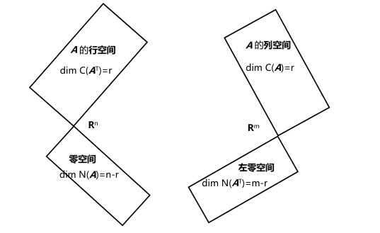

---

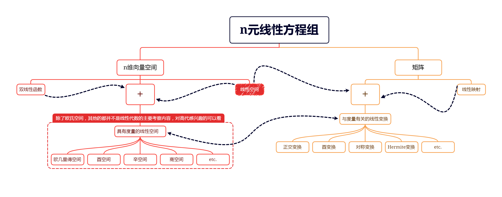

2024.01.14补充

---

## $\mathcal{\mathit{Chapter\ \ 1\ \ } }$ 行列式

### $Part\ \ 1$ 行列式的几何与代数解释

$$
\mathbf{{\color{brown}{Section\ \ 1.1.1\ \ 行列式的代数解释 }}}
$$

给定方程组 

$$
\begin{cases}  5x+6y=7\\  9x+4y=3\\  \end{cases}
$$

 ,可解得 

$$
\begin{cases}  x=\frac{7\times4-6\times3}{5\times4-6\times9}=\frac{\begin{vmatrix} 7  &6 \\ 3  &4 \end{vmatrix}}{\begin{vmatrix} 5  &6 \\ 9  &4 \end{vmatrix}}\\  y=\frac{3\times5-7\times9}{5\times4-6\times9}=\frac{\begin{vmatrix} 5  &7 \\ 9  &3 \end{vmatrix}}{\begin{vmatrix} 5  &6 \\ 9  &4 \end{vmatrix}}\\  \end{cases}
$$

抽象出来就是 

$$
\begin{cases}  ax+by=b_1\\  cx+dy=b_2\\  \end{cases}\Rightarrow \begin{cases}  x=\frac{b_1\times d-b\times b_2}{a\times d-b\times c}=\frac{\begin{vmatrix} b_1  &b \\ b_2  &d \end{vmatrix}}{\begin{vmatrix} a  &b \\ c  &d \end{vmatrix}}\\  y=\frac{b_2\times a-c\times b_1}{a\times d-b\times c}=\frac{\begin{vmatrix} a  &b_1\\ c  &b_2\end{vmatrix}}{\begin{vmatrix} a  &b \\ c  &d \end{vmatrix}}\\  \end{cases}
$$

定义新运算 

$$
\begin{vmatrix} a  &b \\ c  &d \end{vmatrix}=ad-bc
$$

 ,其中ad所在的对角线被称做主对角线，bc所在对角线被称为次对角线

对于三阶行列式，有以下方法

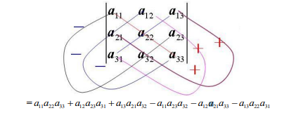

普通同学看到的

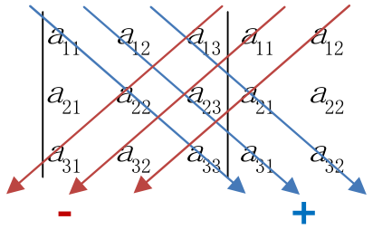

大佬同学看到的

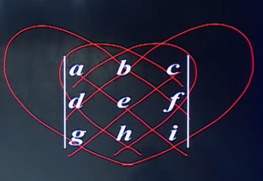

恋爱脑看到的

解方程得

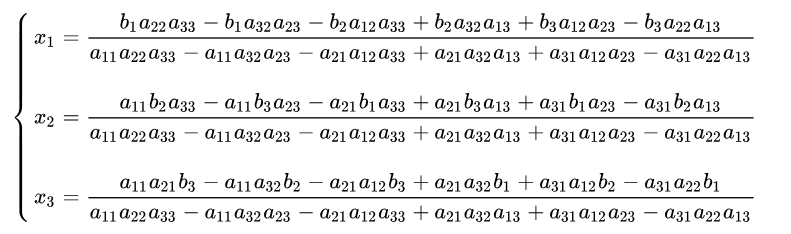

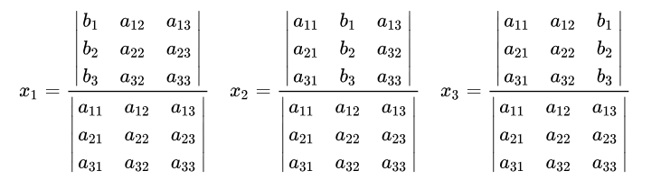

$$
{\LARGE{Why?}}
$$

 这 $|\ |$ 符号之间的东西只是为了方便，直接延续了矩阵里的东西，而为什么后面他要这么计算，我们先引入一些概念

**排列：**由 $1,2,\cdots,n$ 组成的一个有序数组，叫 $n$ 级排列，中间不可缺数

例如, $\{ 5, 3, 4, 2, 1 \}$ 是一个排列。

**排列的个数** 记 $P_{n}$ 为 $n$ 个元素的排列的个数，则有

$$
P_{n} = n! 
$$

**排列数** 记 $P_{n}^{m}$ 为从 $n$ 个不同的元素中取出 $m$ 个元素的全排列的个数，则有

$$
P_{n}^{m} = A_{n}^{m} = \frac{n!}{(n - m)!} 
$$

特别地，当 $m=n$ 时， $P_{n}^{m} = P_{n}$ 成立。

**逆序** 在排列中，大数在小数的前面，就说它构成 $1$ 个逆序。

**逆序数** 一个排列中所有逆序的总数叫做这个排列的逆序数。记排列 $a_{n}$ 的逆序数为 $\tau$ ，则有

$$
\tau = \sum_{i = 1}^{n}{\sum_{j = 1}^{i - 1}{[a_{i} < a_{j}]}} 
$$

**奇排列与偶排列** 逆序数为奇数的排列叫做奇排列，逆序数为偶数的排列叫做偶排列。

如2431中，21，43，41，31是逆序，逆序数是4，为偶排列。

序列612345中，61，62，63，64，65是逆序, 逆序数是5，为奇排列。

**对换** 在排列中，将任意两个元素对调，其余的元素不动的操作叫做对换。特别地，将相邻的两个元素对换，叫做相邻对换。

**对换定理** 一个排列中的任意两个元素对换一次，排列改变一次奇偶性。

有了逆序数的概念，我们就可以得到一定的结论了

$$
A=\begin{vmatrix} a_{11}&a_{12}\\ a_{21}&a_{22}\\ \end{vmatrix}=\sum(-1)^\tau a_{1p_1}a_{2p_2}
$$

$$
A=\begin{vmatrix} a_{11}&a_{12}&a_{13}\\ a_{21}&a_{22}&a_{23}\\ a_{31}&a_{32}&a_{33}\\ \end{vmatrix}=\sum(-1)^\tau a_{1p_1}a_{2p_2}a_{3p_3}
$$

$$
A=\begin{vmatrix} a_{11}&a_{12}&\cdots&a_{1n}\\ a_{21}&a_{22}&\cdots&a_{2n}\\ \vdots&\vdots&\ddots&\vdots\\ a_{n1}&a_{n2}&\cdots&a_{nn}\\ \end{vmatrix}=\sum(-1)^\tau a_{1p_1}a_{2p_2} \cdots a_{np_n}
$$

第一种定义(按行展开)：**行**标取标准排列，**列**标取排列的所有可能，从不同行不同列取三个元素相乘，符号由**列**标排列的奇偶性决定

第二种定义(按列展开)：**列**标取标准排列，**行**标取排列的所有可能，从不同行不同列取三个元素相乘，符号由**行**标排列的奇偶性决定

$$
=a_{11}a_{22}a_{33}+a_{31}a_{12}a_{23}+a_{21}a_{32}a_{13}-a_{31}a_{22}a_{13}-a_{21}a_{12}a_{33}-a_{11}a_{32}a_{23}
$$

第三种定义(既不按行展开也不按列展开)：

$$
=\sum(-1)^{\tau(i_1\cdots i_n)+\tau(j_1\cdots j_n)}a_{i_1j_1}a_{i_2j_2}\cdots a_{i_nj_n}
$$

> 第三个定义的发展莱布尼茨和拉普拉斯做出了卓越贡献

以上是代数的角度

接下来将从几何直观角度出发

$$
\mathbf{{\color{brown}{Section\ \ 1.1.2\ \ 行列式的几何解释 }}}
$$

$$
\mathbf{{\color{orange}{SubSection\ \ 1.1.2.1\ \  一阶行列式}}}
$$

对于一阶行列式 $|a_{11}|=a_{11}$ ，意思就是 $a_{11}$ 的一阶行列式就是数 $a_{11}$ 或者讲是向量 $a_{11}$ 的本身，这个数 $a_{11}$ 的本身是一维坐标轴上的有向长度。这里主要强调的是有向的，长度是有向的，是个向量，这一直是个很重要的概念。

$$
\mathbf{{\color{orange}{SubSection\ \ 1.1.2.2\ \  二阶行列式}}}
$$

二阶行列式 

$$
\begin{vmatrix}a_{11}&a_{12}\\a_{21}&a_{22}\end{vmatrix}
$$

 的几何意义是 $xoy$ 平面上以行向量 

$$
\mathbf{a_{1}}=\begin{pmatrix}a_{11}&a_{12}\end{pmatrix},\mathbf{a_{2}}=\begin{pmatrix}a_{21}&a_{22}\end{pmatrix}
$$

 为邻边的平行四边形的有向面积。为什么？其实，我们可以简单推导一下这个几何意义：

我们考察这个平行四边形与构成它的两个向量之间的关系。

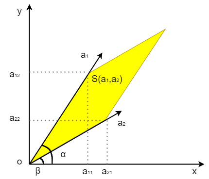

我们在二维几何空间 $R^2$ 中取定一个直角坐标系 

$$
\begin{bmatrix}\mathbf{e}_1;\mathbf{e}_2\end{bmatrix}
$$

 , 设 $\mathbf{a_1}=a_{11}\mathbf{e}_1+a_{12}\mathbf{e}_2$ , $\mathbf{a_2}=a_{21}\mathbf{e}_1+a_{22}\mathbf{e}_2$ ,则以 $\mathbf{a_1}$ , $\mathbf{a_2}$ 为边的平行四边形的面积为：

$$
S(\mathbf{a_1},\mathbf{a_2})=a_1a_2Sin\langle\mathbf{a_1},\mathbf{a_2}\rangle 
$$

这里： $a_1=\sqrt{a_{11}^2+a_{12}^2}$ , $a_2=\sqrt{a_{21}^2+a_{22}^2}$ , $Sin\langle\mathbf{a_1},\mathbf{a_2}\rangle$ 为向量 $\mathbf{a_1},\mathbf{a_2}$ 之间的夹角正弦。

$$
Sin\langle\mathbf{a_1},\mathbf{a_2}\rangle=Sin(\alpha-\beta)=Sin\alpha Cos\beta-Cos\alpha Sin\beta
$$

参照图中的关系把三角式用坐标值表示出来： 则

$$
Sin\langle\mathbf{a_1},\mathbf{a_2}\rangle= \frac{a_{22}}{a_2}\cdot\frac{a_{11}}{a_1}-\frac{a_{21}}{a_2}\cdot\frac{a_{12}}{a_1}=\frac{a_{11}a_{22}-a_{12}a_{21}}{a_1a_2}  
$$

把上式整理得: 

$$
a_1a_2Sin\langle\mathbf{a_1},\mathbf{a_2}\rangle=a_{11}a_{22}-a_{12}a_{21} 
$$

又

$$
\begin{vmatrix}a_{11}&a_{12}\\a_{21}&a_{22}\end{vmatrix}=a_{11}a_{22}-a_{12}a_{21}
$$

 故 

$$
S(\mathbf{a_1},\mathbf{a_2})=\begin{vmatrix}a_{11}&a_{12}\\a_{21}&a_{22}\end{vmatrix}
$$

 得证

$$
\mathbf{{\color{orange}{SubSection\ \ 1.1.2.3\ \  三阶行列式}}}
$$

一个 $3\times3$ 阶的行列式是其行向量或列向量所张成的平行六面体的有向体积。如下图所示。

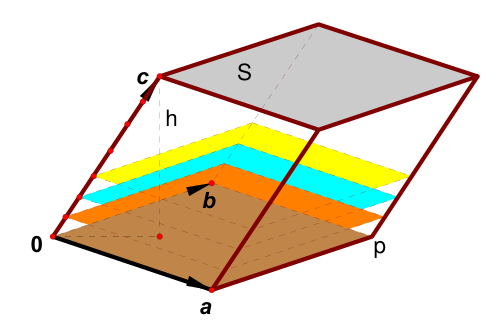

> 自是所谓点动成线，线动成面，面动成体

### $Part\ \ 2$ 行列式的性质

① $det(I)=1$

②如果交换行列式的两行，则行列式的数值会反号。(可由逆序数的概念推得)

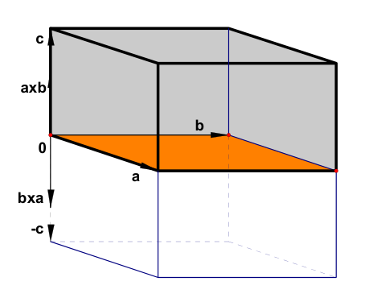

> 如图，阴影的平行六面体 $det(a,b,c)$ ， $a\times b$ 的方向与向量 $c$ 同向（据右手法则)；当向量 $a$ , $b$ 的位置交换后， $b\times a$ 的方向与 $a\times b$ 相反，因而与向量 $c$ 点乘后得到向下的平行六面体。所以平行六面体 $det(b,a,c)$ 和 $det(a,b,c)$ 以 $a$ , $b$ 张成的平面为镜面互为反射。

③(a)如果在矩阵的一行乘上 $k$ ，则行列式的值就要乘上 $k$。 

$$
\begin{vmatrix} ka  &kb \\ c  &d \end{vmatrix}=k\begin{vmatrix} a  &b \\ c  &d \end{vmatrix}
$$

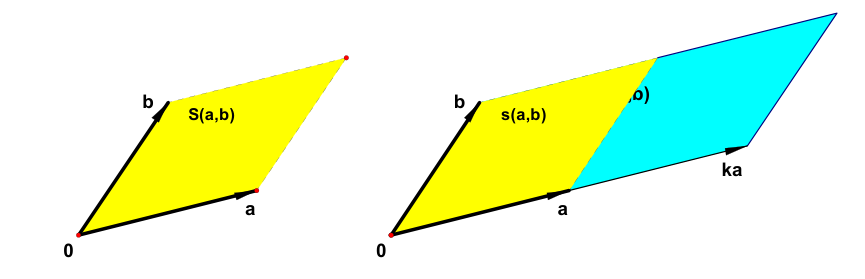

(b)行列式是“矩阵的行”的线性函数。 

$$
\begin{vmatrix} a+a'  &b+b' \\ c  &d \end{vmatrix}=\begin{vmatrix} a  &b \\ c  &d \end{vmatrix}+\begin{vmatrix} a'  &b' \\ c  &d \end{vmatrix}
$$

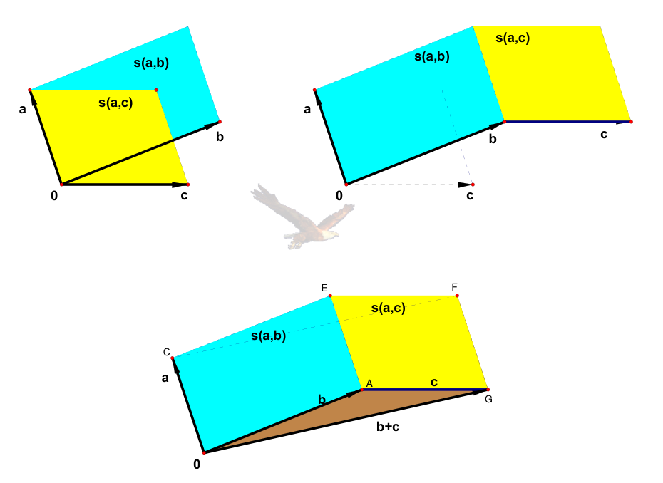

> $e.g.$
> 设四阶方阵 
> $$
> A=\begin{bmatrix} \alpha  &\gamma_2  &\gamma_3  &\gamma_4 \end{bmatrix}
> $$
>  ， 
> $$
> B=\begin{bmatrix} \beta  &\gamma_2  &\gamma_3  &\gamma_4 \end{bmatrix}
> $$
>  ，其中 $\alpha,\gamma_2  ,\gamma_3 , \gamma_4$ 均为四维列向量，且 $|A|=5,|B|=-\frac{1}{2}$ ，则 $|A+2B|=$
> 解： 
> $$
> |A+2B|=\begin{vmatrix} \alpha+2\beta  &3\gamma_2  &3\gamma_3  &3\gamma_4 \end{vmatrix}
> $$
>  
> $$
> =\begin{vmatrix} \alpha  &3\gamma_2  &3\gamma_3  &3\gamma_4 \end{vmatrix}+\begin{vmatrix} 2\beta  &3\gamma_2  &3\gamma_3  &3\gamma_4 \end{vmatrix}
> $$
>  
> $$
> =27\begin{vmatrix} \alpha  &\gamma_2  &\gamma_3  &\gamma_4 \end{vmatrix}+54\begin{vmatrix} \beta  &\gamma_2  &\gamma_3  &\gamma_4 \end{vmatrix}
> $$
>  $=27*5+54*(-\frac{1}{2})=108$

**以下性质都可以通过以上三条推得**

④如果矩阵的两行是完全相同的，则它的行列式为 0。这可以从第二条性质推导出来，因为交换这个相同的两行，行列式应该变号；但是新生成的矩阵跟原矩阵没有区别，因此行列式应该不变，所以有 $det=-det$ ，所以 $det=0$ 。

⑤从矩阵的某行 $k$ 减去另一行 $i$ 的倍数，并不改变行列式的数值，我们以二阶为例：

$$
\begin{vmatrix} a  &b \\ c-ta  &d-tb \end{vmatrix}=\begin{vmatrix} a  &b \\ c  &d \end{vmatrix}-\begin{vmatrix} a  &b \\ ta  &tb \end{vmatrix}=\begin{vmatrix} a  &b \\ c  &d \end{vmatrix}-t\begin{vmatrix} a  &b \\ a  &b \end{vmatrix}=\begin{vmatrix} a  &b \\ c  &d \end{vmatrix}
$$

⑥如矩阵 $A$ 的某一行都是 0，则其行列式为 0。可以应用性质 ③(a)，取 $t=0$ 证明

⑦三角阵的行列式的值等于其对角线上数值（主元）的乘积。

$$
\begin{vmatrix} d_1  &* &* &\cdots &*\\ 0  &d_2 &* &* &*\\ 0  &0 &\ddots &\ddots &\vdots\\ \vdots  &\vdots &\ddots &\ddots &\vdots\\ 0  &0 &\cdots &\cdots &d_n\\ \end{vmatrix}=\begin{vmatrix} d_1  &0 &0 &\cdots &0\\ 0  &d_2 &0 &0 &0\\ 0  &0 &\ddots &\ddots &\vdots\\ \vdots  &\vdots &\ddots &\ddots &\vdots\\ 0  &0 &\cdots &\cdots &d_n\\ \end{vmatrix}=d_1d_2\cdots d_n\begin{vmatrix} 1  &* &* &\cdots &*\\ 0  &1 &* &* &*\\ 0  &0 &\ddots &\ddots &\vdots\\ \vdots  &\vdots &\ddots &\ddots &\vdots\\ 0  &0 &\cdots &\cdots &1\\ \end{vmatrix}=d_1d_2\cdots d_n
$$

> 这里给大家举一个几何上二阶的例子帮助大家理解我们为什么这么做

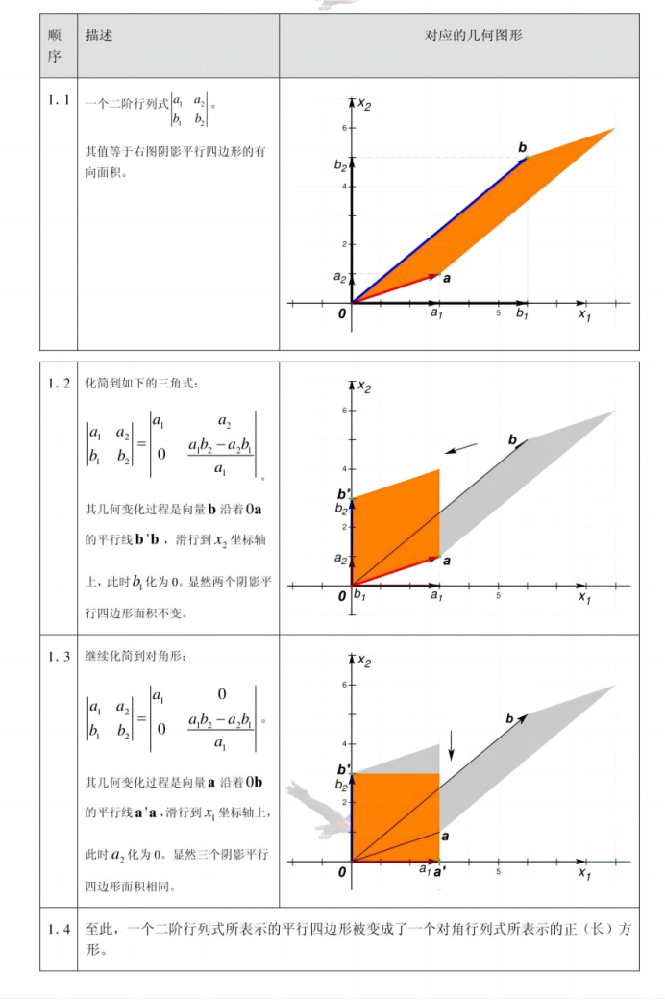

> 而三阶行列式有类似的变换情形，对角化的过程会把一个平行六面体变化为一个等体积的立方体或长方体。

而同时我们也对于中间这些展开项有疑问，他们有没有几何意义呢？

特别地，以二阶为例， 

$$
\begin{vmatrix}a_1,a_2\\b_1,b_2\end{vmatrix}=a_1b_2-a_2b_1
$$

 。

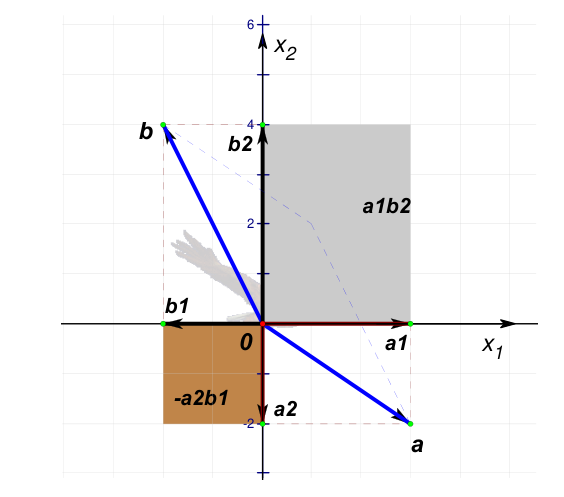

⑧当且仅当矩阵 $A$ 为奇异矩阵时，其行列式为 0。

⑨ $|AB|$ = $|A||B|$ $(a)\Rightarrow AA^{-1}=I\ \ ,|AA^{-1}|=|I|\Rightarrow |A||A^{-1}|=|I|\Rightarrow |A^{-1}|=\frac{1}{|A|}$ $(b)\Rightarrow |A^2|=|A|^2 并且有 |2A|=2^n|A|$

⑩ $|A^T|=|A|$ ，在引言中我们知道矩阵消元可得 $A=LU$ ，则 $A^T=U^TL^T$ ，由性质9可知 $|A|=|L||U|$ ， $|A^T|= |L^T||U ^T|$ ，根据性质 7 可知 $|L^T|=|L|$ ， $|U ^T|=|U|$ ,则二者乘积相等。

### $Part\ \ 3$ 代数余子式及余子式

从$\mathcal{\mathit{Chapter\ \ 1\ \ } }$ $Part\ \ 2$ 中我们得到了三阶行列式的公式 ，如果我们将部分合并可以观察到

$$
|A|=a_{11}(a_{22}a_{33}-a_{23}a_{32})-a_{12}(a_{21}a_{23}-a_{23}a_{31})+a_{13}(a_{21}a_{32}-a_{22}a_{31})
$$

$$
由分块矩阵的性质得,原式=\begin{bmatrix} a_{11}&0&0\\ 0&a_{22}&a_{23}\\0&a_{32}&a_{33}\end{bmatrix}  + \begin{bmatrix} 0&a_{12}&0\\ a_{21}&0&a_{23}\\a_{31}&0&a_{33}\end{bmatrix}  + \begin{bmatrix} 0&0&a_{13}\\ a_{21}&a_{22}&0\\a_{31}&a_{32}&0\end{bmatrix}
$$

对矩阵中任意元素 $a_{ij}$ 而言，其代数余子式 $A_{ij}$ 就是矩阵的行列式的公式中 $a_{ij}$ 的系数。 $A_{ij}$ 等于原矩阵移除第 $i$ 行和第 $j$ 列后剩余元素组成的 $n-1$ 阶矩阵的行列式数值乘以 $(-1)^{i+j}$ 。（$A_{ij}$ 在 $( i+j)$ 为偶数时为正，奇数时为负数。）对于 $n$ 阶方阵，其行列式的代数余子式公式为(以第一行展开为例,可按行(列)展开)：

$$
|A|=a_{11}A_{11}+a_{12}A_{12}+\cdots+a_{1n}A_{1n}
$$

更进一步我们有**拉普拉斯展开定理：**行列式等于它任意选定 $k$ 行(列)的全部k阶子式与其代数余子式乘积之和.若在 $n$ 阶行列式 $A$ 中任意取定 $k$ 行后得到的子式为 $M_1,M_2,\cdots,M_t$ ,它们的代数余子式分别为 $A_1,A_2 ,\cdots,A_t$ ,则

$$
|A|=M_1A_1+M_2A_2＋\cdots＋M_tA_t
$$

而我们称这种方法为**拉普拉斯展开定理**

代数余子式是用较小的矩阵的行列式来写出 n 阶行列式的公式。

余子式$M_{ij}$——代数余子式去掉$(-1)^{i+j}$

**异乘变零定理：某行元素与另一行元素的代数余子式乘积和为0**

### $Part\ \ 4$ 伴随矩阵及克莱默法则

在 $Part\ \ 3$ 代数余子式及余子式中我们得到了行列式的按行展开公式 ，如果我们利用矩阵的乘法去构造一个形如这样的矩阵

> 
> $$
> AC^T=\begin{bmatrix} a_{11}&a_{12}&\cdots&a_{1n}\\ a_{21}&a_{22}&\cdots&a_{2n}\\ a_{31}&a_{32}&\cdots&a_{3n}\\ \vdots&\vdots&\ddots&\vdots\\ a_{n1}&a_{n2}&\cdots&a_{nn} \end{bmatrix} \begin{bmatrix} A_{11}&A_{12}&\cdots&A_{1n}\\ A_{21}&A_{22}&\cdots&A_{2n}\\ A_{31}&A_{32}&\cdots&A_{3n}\\ \vdots&\vdots&\ddots&\vdots\\ A_{n1}&A_{n2}&\cdots&A_{nn} \end{bmatrix}
> $$
> 
> 前一个矩阵我们已经很熟悉了，这不就系数矩阵吗?而后一个矩阵则是**“代数余子式矩阵”的转置**，我们将这个矩阵称作**“伴随矩阵”,改符号为** $A^*,(A^*=C^T)$
> 利用我们前面所学的矩阵乘法与异乘变零定理，可以得出
>  $AA^*=A^*A=det(A)I\Rightarrow A^{-1}=\frac{A^*}{det(A)}$
> 特别地，将两端都求行列式有 $|A^*|=||A|A^{-1}|=|A|^n|A|^{-1}=|A|^{n-1}$
> 而对 $(A^*)^*=|A^*|(A^*)^{-1}=|A|^{n-1}(|A|A^{-1})^{-1}=|A|^{n-2}A$

$e.g.$ 设矩阵 $A$ 的伴随矩阵 

$$
A^*=\begin{bmatrix} 4&-2&0&0\\ -3&1&0&0\\ 0&0&-4&0\\ 0&0&0&-1\end{bmatrix}
$$

 ，则 $A=$

> $|A^*|=|A|^{n-1}\Rightarrow|A|=-2$
>  $AA^*=det(A)I=-2I\Rightarrow A=-2(A^*)^{-1}$
> 特别地，对于分块矩阵 
> $$
> \left[\begin{array}{cc:cc} 4&-2&0&0\\ -3&1&0&0 \\ \hdashline 0&0&-4&0\\  0&0&0&-1 \end{array}\right]=\begin{bmatrix} A_1&\\ &A_2 \end{bmatrix}
> $$
>  求逆等于各部分求逆 
> $$
> \begin{pmatrix} \begin{bmatrix} A_1&\\ &A_2 \end{bmatrix} \end{pmatrix}^{-1}=\begin{bmatrix} A_1^{-1}&\\ &A_2^{-1} \end{bmatrix}=\begin{bmatrix} -1/2&-1&0&0\\ -3/2&-2&0&0\\ 0&0&-1/4&0\\ 0&0&0&-1\end{bmatrix}
> $$
> 
>  
> $$
> A=\begin{bmatrix} 1&2&0&0\\ 3&4&0&0\\ 0&0&1/2&0\\ 0&0&0&2\end{bmatrix}
> $$
> 

在前面，我们认识到任何线性方程组最终都能被我们表达成 $Ax=b$ 的基本形式，而它的解也有 $x=A^{-1}b$ 的关系，现在我们加入我们刚刚学习的内容 $x=A^{-1}b=\frac{A^*}{det(A)}b$

而对于分母 $C^Tb$ 有一个精妙的变换

> 
> $$
> \begin{bmatrix} A_{11}&A_{12}&\cdots&A_{1n}\\ A_{21}&A_{22}&\cdots&A_{2n}\\ A_{31}&A_{32}&\cdots&A_{3n}\\ \vdots&\vdots&\ddots&\vdots\\ A_{n1}&A_{n2}&\cdots&A_{nn} \end{bmatrix} \begin{bmatrix} b_1\\ b_2\\ b_3\\ \vdots\\ b_n\end{bmatrix}=\begin{bmatrix} (b_1A_{11}+\cdots+b_nA_{1n})&\cdots&(b_1A_{n1}+\cdots+b_nA_{nn}) \end{bmatrix}
> $$
> 
> 对于解的分量而言， $x_1=\frac{(b_1A_{11}+\cdots+b_nA_{1n})}{det(A)}$ , $x_n=\frac{(b_1A_{n1}+\cdots+b_nA_{nn}) }{det(A)}$
> 精妙的地方来了——逆用拉普拉斯展开
>  
> $$
> =\begin{bmatrix} B_1&\cdots&B_n \end{bmatrix}
> $$
>  ,其中 
> $$
> B_1=\begin{bmatrix} b_1&a_{12}&\cdots&a_{1n}\\ b_2&a_{22}&\cdots&a_{2n}\\ b_3&a_{32}&\cdots&a_{3n}\\ \vdots&\vdots&\ddots&\vdots\\ b_n&a_{n2}&\cdots&a_{nn} \end{bmatrix}
> $$
>  , 
> $$
> B_n=\begin{bmatrix} a_{11}&a_{12}&\cdots&b_1\\ a_{21}&a_{22}&\cdots&b_2\\ a_{31}&a_{32}&\cdots&b_3\\ \vdots&\vdots&\ddots&\vdots\\ a_{n1}&a_{n2}&\cdots&b_n \end{bmatrix}
> $$
> 
> 精简表达式， $x_1=\frac{det(B_1)}{det(A)}$ , $x_n=\frac{det(B_n)}{det(A)}$

我们对于解的表达式叫做克莱姆法则 $Cramer’s \ \ Rule \ \ for \ \ x = A^{−1}b$

克莱姆法则的限制也很明显

① $n$ 个方程， $n$ 个未知量，即方程个数要和未知量个数相等，也就是方阵

② $det(A)\neq0$

③计算量大

另外，特别的我们对于**齐次**的线性方程组，若满足①②，那么可以知道方程组只有零解(大家带一下就知道了，不细推了)，同样他的逆否命题也成立—— ${\color{red} {若齐次线性方程组有非零解，它的系数行列式必等于0}}$

### $Part\ \ 5$ 线性相关性与秩、方程组的解、行列式之间的关系

给定 $n$ 维列向量 $\alpha _ {1}  ,  \alpha _ {2}  ,  \cdots  ,  \alpha _ {m}  ,记[  \alpha _ {1}  ,  \alpha _ {2}  ,  \cdots  ,  \alpha _ {m}  ]=A$

$\alpha _ {1}  ,  \alpha _ {2}  ,  \cdots  ,  \alpha _ {m}$ 线性相关 $\Leftrightarrow Ax=0$ 有非零解 $\Leftrightarrow r(A)<m  \Leftrightarrow  r(  \alpha _ {1}  ,  \alpha _ {2}  ,  \cdots  ,  \alpha _ {m}  )<m$

$\alpha _ {1}  ,  \alpha _ {2}  ,  \cdots  ,  \alpha _ {m}$ 线性无关 $\Leftrightarrow Ax=0$ 无非零解 $\Leftrightarrow r (A)=m  \Leftrightarrow  r(  \alpha _ {1}  ,  \alpha _ {2}  ,  \cdots  ,  \alpha _ {m}  )=m$

特别地,当 $m=n$ 时,由克拉默法则有

(1) $Ax=0$ 有非零解 $\Leftrightarrow |A|=0$

(2) $Ax=0$ 没有非零解 $\Leftrightarrow |A|\neq0$

由此得到

$\alpha _ {1}  ,  \alpha _ {2}  ,  \cdots  ,  \alpha _ {m}$ 线性相关 $\Leftrightarrow Ax=0$ 有非零解 $\Leftrightarrow  r(A)<m  \Leftrightarrow  r(  \alpha _ {1}  ,  \alpha _ {2}  ,  \cdots  ,  \alpha _ {m}  )<m$

$$
\Leftrightarrow  |A|=0
$$

$\alpha _ {1}  ,  \alpha _ {2}  ,  \cdots  ,  \alpha _ {m}$ 线性无关 $\Leftrightarrow Ax=0$ 无非零解 $\Leftrightarrow r(A)\lt m \Leftrightarrow r(  \alpha _ {1}  ,  \alpha _ {2}  ,  \cdots  ,  \alpha _ {m}  )\lt m$

$$
\Leftrightarrow |A|  \neq  0
$$

推论:给定 $n$ 维列向量 $\alpha _ {1}  ,  \alpha _ {2}  ,  \cdots  ,  \alpha _ {m}$ ,若 $m>n$ ,则 $\alpha _ {1}  ,  \alpha _ {2}  ,  \cdots  ,  \alpha _ {m}$ 线性相关(个数大于维数必相关)

### $Part\ \ 6$ 行列式计算

关于行列式的计算，大家可以看这位博主的，只能说无敌，有这一文就够了

<https://zhuanlan.zhihu.com/p/34685081>

我再补充一些

**方法九：X型行列式**

$$
\begin{vmatrix} a  &  &  &  &  &b \\   & \ddots &  &  &{\large \cdot^{{\Large \cdot^{{\huge \cdot} }} }}   & \\   &  &a  &b  &  & \\   &  &c  &d  &  & \\   &{\large \cdot^{{\Large \cdot^{{\huge \cdot} }} }}  &  &  &\ddots  & \\ c  &  &  &  &  &d \end{vmatrix}_{2n\times 2n}=(ad-bc)^n
$$

**方法十： $Cauchy-Binet$ 公式求行列式**

设矩阵 $A$ 为 $m\times n$ 矩阵，矩阵 $B$ 为 $n\times m$ 矩阵，若矩阵 $A$ 有一 $s$ 阶子式 

$$
\begin{pmatrix} i_1  &\cdots  &i_s \\ j_1  &\cdots  &j_s \end{pmatrix}
$$

 ,记作 

$$
A\begin{pmatrix} i_1  &\cdots  &i_s \\ j_1  &\cdots  &j_s \end{pmatrix}
$$

$(1)$ 若 $m\gt n$ ，则必有 $|AB|=0$

$(2)$ 若 $m\le n$ ，则必有 

$$
|AB|=\sum\limits_{1\le j_1\le j_2\cdots\le j_m\le n}A\begin{pmatrix} 1  &\cdots  &m \\ j_1  &\cdots  &j_m \end{pmatrix}B\begin{pmatrix} j_1  &\cdots  &j_m \\ 1  &\cdots  &m \end{pmatrix}
$$

详细证明看这位大佬的内容

<https://zhuanlan.zhihu.com/p/337464214>

**方法十一：可拆分成两矩阵的乘积**

> e.g. 
> $$
> |A|=\begin{vmatrix} \frac{1-a_1^nb_1^n}{1-a_1b_1}  &\frac{1-a_1^nb_2^n}{1-a_1b_2}  &\cdots  &\frac{1-a_1^nb_n^n}{1-a_1b_n} \\ \frac{1-a_2^nb_1^n}{1-a_2b_1}  &\frac{1-a_2^nb_2^n}{1-a_2b_2}  &\cdots  &\frac{1-a_2^nb_n^n}{1-a_2b_n} \\ \vdots  &\vdots  &  &\vdots \\ \frac{1-a_n^nb_1^n}{1-a_nb_1}  &\frac{1-a_n^nb_2^n}{1-a_nb_2}  &\cdots  &\frac{1-a_n^nb_n^n}{1-a_nb_n}  \end{vmatrix}
> $$
>  
> $$
> =\begin{vmatrix} 1+a_1b_1+\cdots+(a_1b_1)^{n-1}  &1+a_1b_2+\cdots+(a_1b_2)^{n-1}  &\cdots  &1+a_1b_n+\cdots+(a_1b_n)^{n-1} \\ 1+a_2b_1+\cdots+(a_2b_1)^{n-1}  &1+a_2b_2+\cdots+(a_2b_2)^{n-1}  &\cdots  &1+a_2b_n+\cdots+(a_2b_n)^{n-1} \\ \vdots  &\vdots  &  &\vdots \\ 1+a_nb_1+\cdots+(a_nb_1)^{n-1}  &1+a_nb_2+\cdots+(a_nb_2)^{n-1}  &\cdots  &1+a_nb_n+\cdots+(a_nb_n)^{n-1}  \end{vmatrix}
> $$
> 
>  
> $$
> =\begin{vmatrix} 1  &a_1  &\cdots  &a_1^{n-1} \\ 1  &a_2  &\cdots  &a_2^{n-1} \\ \vdots  &\vdots  &\ddots  &\cdots \\ 1  &a_n  &\cdots  &a_n^{n-1}  \end{vmatrix} \begin{vmatrix} 1  &b_1  &\cdots  &b_1^{n-1} \\ 1  &b_2  &\cdots  &b_2^{n-1} \\ \vdots  &\vdots  &\ddots  &\cdots \\ 1  &b_n  &\cdots  &b_n^{n-1}  \end{vmatrix}
> $$
>  $=\prod\limits_{1\le i\lt j\le n}(a_j-a_i)\prod\limits_{1\le i\lt j\le n}(b_j-b_i)$ $=\prod\limits_{1\le i\lt j\le n}(a_j-a_i)(b_j-b_i)$

**方法十二：降级公式**

当矩阵 $A$ 、 $D$ 都是可逆矩阵时， $A$ 是 $m$ 阶， $D$ 是 $n$ 阶， $B$ 是 $m\times n$ 阶， $C$ 是 $n\times m$ 阶

有 

$$
\begin{vmatrix} A&B \\ C&D \\ \end{vmatrix} =|A||D-CA^{-1}B|=|D||A-BD^{-1}C|
$$

> $e.g.$ 
> $$
> \begin{vmatrix} a_1^2  &a_1a_2+1  &\cdots  &a_1a_n+1 \\ a_2a_1+1  &a_2^2  &\cdots  &a_2a_n+1 \\ \vdots  &\vdots  &  &\vdots \\ a_na_1+1  &a_na_2+1  &\cdots  &a_n^2 \end{vmatrix}= \begin{vmatrix} a_1^2+1-1  &a_1a_2+1  &\cdots  &a_1a_n+1 \\ a_2a_1+1  &a_2^2+1-1  &\cdots  &a_2a_n+1 \\ \vdots  &\vdots  &  &\vdots \\ a_na_1+1  &a_na_2+1  &\cdots  &a_n^2+1-1 \end{vmatrix}
> $$
> 
>  
> $$
> =\begin{vmatrix} \begin{pmatrix} a_1  &1 \\ a_2  &1 \\ \vdots  &\vdots \\ a_n  &1 \end{pmatrix}\begin{pmatrix} a_1  &a_2  &\cdots  &a_n \\ 1  &1  &\cdots  &1 \end{pmatrix}-E_n \end{vmatrix}
> $$
>  ——拆分成两矩阵的乘积
> $$
> =(-1)^n\begin{vmatrix} E_n-\begin{pmatrix} a_1  &1 \\ a_2  &1 \\ \vdots  &\vdots \\ a_n  &1 \end{pmatrix}\begin{pmatrix} a_1  &a_2  &\cdots  &a_n \\ 1  &1  &\cdots  &1 \end{pmatrix} \end{vmatrix}
> $$
>  利用降级公式
>  
> $$
> =(-1)^n\begin{vmatrix} E_2-\begin{pmatrix} a_1  &1 \\ a_2  &1 \\ \vdots  &\vdots \\ a_n  &1 \end{pmatrix}E_n^{-1}\begin{pmatrix} a_1  &a_2  &\cdots  &a_n \\ 1  &1  &\cdots  &1 \end{pmatrix} \end{vmatrix}
> $$
>  
> $$
> =(-1)^n\begin{vmatrix} E_2-\begin{pmatrix} \sum\limits_{i=1}^na_i^2  &\sum\limits_{i=1}^na_i \\ \sum\limits_{i=1}^na_i  &n \\ \end{pmatrix} \end{vmatrix}
> $$
>  $=(-1)^n[(1-n)(1-\sum\limits_{i=1}^na_i^2)-(\sum\limits_{i=1}^na_i) ^2]$

### $Part\ \ 7$ 特殊行列式

1. 

$$
\begin{vmatrix} 0&1 &0 &\cdots  &0 \\ 0  &0 &1 &\cdots  &0 \\ \vdots  &\vdots  &\vdots  &\ddots &\vdots \\ 0  &0 &0 &\cdots  &1 \\ 0  &0 &0 &\cdots  &0 \end{vmatrix}
$$

 ,求 $n$ 次幂时，次数每提高一次， 

$$
\begin{pmatrix} &1 & &  & \\  &&1 &  & \\  & & &\ddots & \\ & & &  &1 \\  & & & &\end{pmatrix}
$$

 向右上移动一格

2.其实更进一步有 

$$
\begin{vmatrix} 0&E_{n-1}\\ 1  &0  \end{vmatrix}
$$

 ,求 $k$ 次幂时， 

$$
\begin{pmatrix} 0&E_{n-k}\\ E_{k}  &0  \end{pmatrix}
$$

 ,以 $n$ 为周期

3.设 $A=(a_{ij})$ 是3阶矩阵，则 $A$ 的特征多顶式

$$
|\lambda E-A|=\lambda^3-  (a_{11}+a_{22}+a_{33})\lambda^ {2}  +S \lambda -|A|
$$

其中 

$$
S=\begin{vmatrix} a_{11}&a_{12}\\ a_{21} &a_{22}\end{vmatrix}+\begin{vmatrix} a_{11}&a_{13}\\a_{31}  &a_{33}\end{vmatrix}+\begin{vmatrix} a_{22}&a_{23}\\a_{32}  &a_{33} \end{vmatrix}
$$

## $\mathcal{\mathit{Chapter\ \ 2\ \ } }$ 矩阵

> 这里 $\mathcal{\mathit{Chapter\ \ 0\ \ } }$ 引言已经写的很明白了，不再过多介绍理解性的内容，对于计算补充一些例子

### $Part\ \ 1$ 矩阵的运算

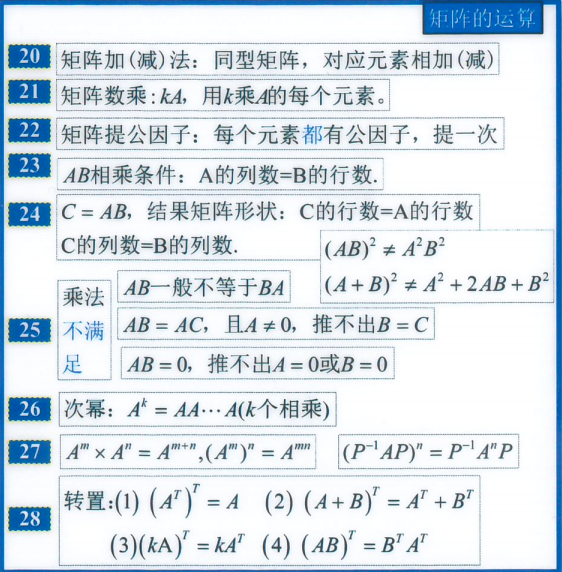

### $Part\ \ 2$ 逆矩阵

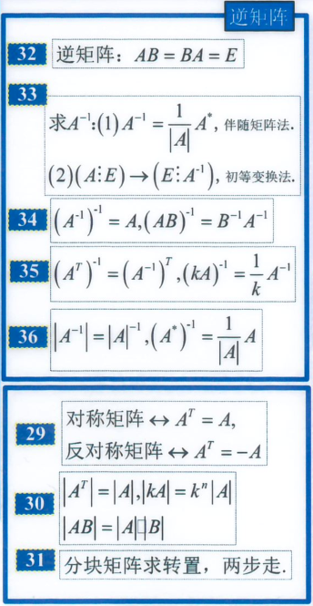

> 矩阵 $A$ 可逆
>  $\Leftrightarrow|A|\neq0\Leftrightarrow r(A)=n\Leftrightarrow A$ 的特征值全不为零
>  $\Leftrightarrow Ax=0$ 只有零解 $\Leftrightarrow A$ 的行(列) 向量组线性无关
>  $\Leftrightarrow A$ 的行 (列) 向量组可以线性表示任意 $n$ 维向量，且表示法唯一。
>  $\Leftrightarrow$ 对任意非零列向量 $b$ , $Ax=\boldsymbol{b}$ 有唯一解
>  $\Leftrightarrow A$ 与同阶单位阵 $E$ 等价
>  $\Leftrightarrow A=P_1P_2\cdots P_s$ , $P_i$ 是初等阵
>  $\Leftrightarrow A$ 的行(列) 向量组为 $R^n$ 的一个基
>  $\Leftrightarrow A^TA$ 为正定矩阵.

### $Part\ \ 3$ 初等矩阵初等变换

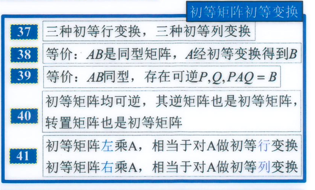

矩阵等价、行等价、列等价的定义及**充要条件**

若矩阵 $A$ 通过有限次**初等变换**得到矩阵 $B$ ，则称 $A$ 与 $B$ 等价

若矩阵 $A$ 通过有限次**初等行变换**得到矩阵 $B$ ，则称 $A$ 与 $B$ 行等价

若矩阵 $A$ 通过有限次**初等列变换**得到矩阵 $B$ ，则称 $A$ 与 $B$ 列等价

$$
\mathbf{{\color{brown}{Section\ \ 2.3.1\ \ 等价的性质}}}
$$

$$
\Leftrightarrow存在可逆矩阵P,Q\ \ \ 使得PAQ=B
$$

$$
\Leftrightarrow r(A)=r(B)
$$

$$
\nRightarrow Ax=0与Bx=0同解
$$

$$
\Rightarrow 若Ax=0有非零解，则Bx=0也有非零解
$$

$$
\mathbf{{\color{brown}{Section\ \ 2.3.2\ \ 行等价的性质}}}
$$

$$
\Leftrightarrow存在可逆矩阵P\ \ \ 使得PA=B
$$

$$
\Leftrightarrow A与B的行向量组等价
$$

$$
\Leftrightarrow r(A)=r(B)=r\begin{pmatrix}A \\B\end{pmatrix}
$$

$$
\Leftrightarrow Ax=0与Bx=0同解
$$

$$
\mathbf{{\color{brown}{Section\ \ 2.3.3\ \ 列等价的性质}}}
$$

$$
\Leftrightarrow存在可逆矩阵Q\ \ \ 使得AQ=B
$$

$$
\Leftrightarrow A与B的列向量组等价
$$

$$
\Leftrightarrow r(A)=r(B)=r\begin{pmatrix}A &B\end{pmatrix}
$$

$$
\nRightarrow Ax=0与Bx=0同解
$$

$$
\Rightarrow 若Ax=0有非零解，则Bx=0也有非零解
$$

### $Part\ \ 4$ 矩阵的秩

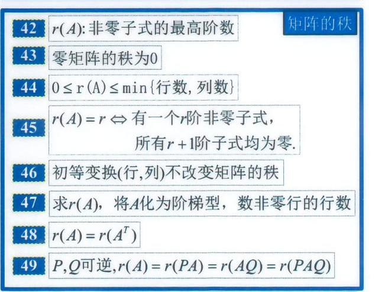

矩阵秩的性质:

(1)若 $A$ 为 $m \times n$ 阶矩阵,则 $0 \leqslant  R(A) \leqslant \min (m,n)$ ;

(2) $R(A)=R( A^ {T}  )=R(-A)$ ;

(3)初等变换不改变矩阵的秩,即若 $A\rightarrow B$ ,则有 $R(A)=R(B)$ ;

(4)设 $A$ 为 $n$ 阶方阵, $|A| \neq 0 \Leftrightarrow R(A)=n$ ;

(5) 设 $A$ 为 $n$ 阶方阵, 矩阵 $A$ 满秩 $\Leftrightarrow  A  \rightarrow  E$ ;

(6)若 $A$ 为 $m \times  n$ 阶矩阵, $P$ 为 $m$ 阶可逆矩阵, $Q$ 为 $n$ 阶可逆矩阵,则 $R(PA)=R(AQ)=R(PAQ)=R(A)$ ;

(7) $\max \{R(A),R(B)\}\leqslant R(A,B) \leqslant R(A)+R(B)$ ;

$\min\{r(A),r(B)\}\geqslant r(AB)\geqslant r(A)+r(B)-n$ ;( $Sylverster$ **不等式**)

(8) $R(AB)\leqslant R(A),R(AB)\leqslant R(B)$ ;

(9) $r(A|B)\ge r(A),r(A|B)\ge r(B)$

(10)设 $A_ {m\times n} B_ {n\times k}  = O_ {m\times k} ,则R(A)+R(B)\leqslant n$ ;

(11)设 $A$ 为 $n$ 阶方阵,则 

$$
R(A^*)= \begin{cases}n\Leftrightarrow R(A)=n,\\1\Leftrightarrow R(A)=n-1,\\0\Leftrightarrow R(A)<n-1.\end{cases}
$$

(12) $r(A+B)\le r(A)+r(B)$

(13) 

$$
r\begin{pmatrix}A \\0\end{pmatrix}=r\begin{pmatrix}0\\A\end{pmatrix}=r\begin{pmatrix}A &0\end{pmatrix}=r\begin{pmatrix}0 &A\end{pmatrix}=r(A)
$$

(14) 

$$
\max \{r(A),r(B)\}\le r\begin{pmatrix}A \\B\end{pmatrix}=r\begin{pmatrix}A^T &B^T\end{pmatrix} =r\begin{bmatrix}\begin{pmatrix}A^T &B^T\end{pmatrix} &\begin{pmatrix}A \\B\end{pmatrix}\end{bmatrix} \le r(A)+r(B)
$$

(15) $r(A)\leqslant  r(A,B);r(B)\leqslant  r(A,B)$ ;

(16) $r(A^TA)=r(A)$

> 证明： 只要证明$Ax=0与A^TAx=0同解$ 即可。
> 显然，前者必然为后者的解。
> 只需证后者的解是否为前者的解，后者两边左乘 $x^T$ 得： $(Ax)^T(Ax)=0$
> 令 $y=Ax$ , $y^Ty=0,即Σy_i^2=0，y_i=0, y=0, Ax=0$ 所以后者必然为前者的解。
> 综上，两者同解，秩相等。

(17)若 $r(A_{m\times n})=n$ ,则 $r(AB)=r(B)$ ;若 $r(B_{n\times s})=n$ ,则 $r(AB)=r(A)$ ;

(18) $Ax=\alpha$ 有解 $\Leftrightarrow r(A)=r(A,\alpha)$ ;

(19) 

$$
\begin{pmatrix}A \\B\end{pmatrix}x=\begin{pmatrix}\alpha \\\beta\end{pmatrix}
$$

 无解 

$$
\Leftrightarrow r\begin{pmatrix}A \\B\end{pmatrix}\neq r\begin{pmatrix}A&\alpha \\B&\beta\end{pmatrix}\Leftrightarrow r\begin{pmatrix}A \\B\end{pmatrix}+1= r\begin{pmatrix}A&\alpha \\B&\beta\end{pmatrix}
$$

 $\Leftrightarrow$ $Ax=\alpha$ 和 $Bx=\beta$ 没有公共解;

(20) 

$$
\begin{pmatrix}A \\B\end{pmatrix}x=\begin{pmatrix}\alpha \\\beta\end{pmatrix}
$$

 的解向量是 $Ax=\alpha$ 和 $Bx=\beta$ 的公共解

(21) $A_{m\times n}$ 列满秩 $\Leftrightarrow$ $r(A)=n$ $\Leftrightarrow A$ 列向量组线性无关(这里联系 $Part\ \ 3$ ) $\Leftrightarrow Ax=0$ 只有零解

(22) $r(ABC)\geqslant r(AB)+r(BC)-r(B)$ ;( $Frobenius$ **不等式**)

$e.g.$ 设线性方程组 $Ax= \alpha$ 有解, 

$$
\begin{pmatrix}A \\B\end{pmatrix}x=\begin{pmatrix}\alpha \\\beta\end{pmatrix}
$$

 无解,则下列结论中正确的是( )

$$
A.r(B, \beta)=r(B)+1
$$

$$
B.r\begin{pmatrix}A&\alpha \\B&\beta\end{pmatrix}x\le r\begin{pmatrix}A \\B\end{pmatrix}+1
$$

$$
C.r[B^T(B, \beta)]>r(B^TB)
$$

$$
D.r\begin{bmatrix}\begin{pmatrix}A^T&B^T\end{pmatrix}\begin{pmatrix}A&\alpha \\B&\beta\end{pmatrix}\end{bmatrix}=r\begin{bmatrix}\begin{pmatrix}A^T&B^T\end{pmatrix}\begin{pmatrix}A \\B\end{pmatrix}\end{bmatrix}
$$

> 对于 $A$ 选项
> 错误理解: 
> $$
> \left\{\begin{matrix}Ax=\alpha   &有解 \\\begin{pmatrix}A \\B\end{pmatrix}x=\begin{pmatrix}\alpha \\\beta\end{pmatrix}   &无解 \end{matrix}\right.\Rightarrow \left\{\begin{matrix}Ax=\alpha   &有解 \\Bx=\beta&无解 \end{matrix}\right.
> $$
> 
>  
> $$
> \begin{pmatrix}A \\B\end{pmatrix}x=\begin{pmatrix}\alpha \\\beta\end{pmatrix}   无解\Leftrightarrow Ax= \alpha 与Bx= \beta 无公共解
> $$
> 
>  
> $$
> \begin{pmatrix}A \\B\end{pmatrix}=\begin{pmatrix}1&1\\1&1\end{pmatrix},\begin{pmatrix}\alpha \\\beta\end{pmatrix}=\begin{pmatrix}1\\2\end{pmatrix}
> $$
> 
> 此时 
> $$
> Ax= \alpha :(1,1) \begin{pmatrix}x_1 \\x_1\end{pmatrix}  =1有解,且Bx= \beta :(1,1)\begin{pmatrix}x_1 \\x_1\end{pmatrix}=2也有解
> $$
> 
> 对于 $B$ 选项
> 非齐次线性方程组无解 $\Leftrightarrow$ $r(系数矩阵)+1=r(增广矩阵)$
> 非齐次线性方程组有解 $\Leftrightarrow$ $r(系数矩阵)=r(增广矩阵)$
> 对于 $C$ 选项
>  $B^ {T}  (B, \beta)=(B^ {T} B, B^ {T}\beta )$
>  $r[B^ {T} B, B^ {T} \beta ] \geqslant r( B^ {T} B)$
>  $r(B^ {T}) \geqslant r[ B^ {T} (B, \beta)]$
>  $r( B^ {T} )=r( B^ {T} B)$
>  $r[B^ {T} (B,  \beta  )]=r[ B^ {T} B, B^ {T} \beta ]  \geqslant  r(  B^ {T} B)$
>  $r[ B^ {T} (B, \beta )]  \leqslant r( B^ {T} )=r( B^ {T} B)$
> 对于 $D$ 选项
>  
> $$
> r\begin{bmatrix}\begin{pmatrix}A^T&B^T\end{pmatrix}\end{bmatrix}=r\begin{bmatrix}\begin{pmatrix}A^T&B^T\end{pmatrix}\begin{pmatrix}A \\B\end{pmatrix}\end{bmatrix}
> $$
>  即公式 $r(A^TA)=r(A)$
> 故 
> $$
> r\begin{bmatrix}\begin{pmatrix}A^T&B^T\end{pmatrix}\begin{pmatrix}A&\alpha \\B&\beta\end{pmatrix}\end{bmatrix}\le r\begin{bmatrix}\begin{pmatrix}A^T&B^T\end{pmatrix}\begin{pmatrix}A \\B\end{pmatrix}\end{bmatrix}
> $$
> 
>  
> $$
> r\begin{bmatrix}\begin{pmatrix}A^T&B^T\end{pmatrix}\begin{pmatrix}A&\alpha \\B&\beta\end{pmatrix}\end{bmatrix}=r\begin{bmatrix}\begin{pmatrix}A^T&B^T\end{pmatrix}\begin{pmatrix}A \\B\end{pmatrix},\begin{pmatrix}A^T&B^T\end{pmatrix}\begin{pmatrix}\alpha \\\beta\end{pmatrix}\end{bmatrix}\ge r\begin{bmatrix}\begin{pmatrix}A^T&B^T\end{pmatrix}\begin{pmatrix}A \\B\end{pmatrix}\end{bmatrix}
> $$
> 

### $Part\ \ 5$ 分块矩阵

分块矩阵定义—— 

$$
\left[\begin{array}{c:c} A&B\\ \hdashline C&D\\  \end{array}\right]
$$

行列式—— 

$$
\left|\begin{array}{c:c} A&B\\ \hdashline 0&D\\  \end{array}\right|=\left|\begin{array}{c:c} A&0\\ \hdashline C&D\\  \end{array}\right|=\left|\begin{array}{c:c} A&0\\ \hdashline 0&D\\  \end{array}\right|=|A||D|
$$

$$
\left|\begin{array}{c:c} A&B\\ \hdashline C&0\\  \end{array}\right|=\left|\begin{array}{c:c} 0&B\\ \hdashline C&D\\  \end{array}\right|=\left|\begin{array}{c:c} 0&B\\ \hdashline C&0\\  \end{array}\right|=(-1)^{mn}|B_{m\times m}||C_{n\times n}|
$$

$$
\begin{vmatrix} A&B \\ C&D \\ \end{vmatrix} =|A||D-CA^{-1}B|=|D||A-BD^{-1}C|
$$

转置—— 

$$
\left[\begin{array}{c:c} A&B\\ \hdashline C&D\\  \end{array}\right]^T=\left[\begin{array}{c:c} A^T&C^T\\ \hdashline B^T&D^T\\  \end{array}\right]
$$

伴随—— 

$$
\left[\begin{array}{c:c} A&0\\ \hdashline 0&D\\  \end{array}\right]^*=\left[\begin{array}{c:c} A^*|D|&0\\ \hdashline 0&D^*|A|\\  \end{array}\right]
$$

 , 

$$
\left[\begin{array}{c:c} 0&B\\ \hdashline C&0\\  \end{array}\right]^*=(-1)^{mn}\left[\begin{array}{c:c} 0&|B|C^*\\ \hdashline |C|B^*&0\\  \end{array}\right]
$$

$$
\left[\begin{array}{c:c} A&B\\ \hdashline 0&D\\  \end{array}\right]^*=\left[\begin{array}{c:c} A^*|D|&-A^*BD^*\\ \hdashline 0&D^*|A|\\  \end{array}\right]
$$

 , 

$$
\left[\begin{array}{c:c} A&B\\ \hdashline C&0\\  \end{array}\right]^*=(-1)^{mn}\left[\begin{array}{c:c} 0&|B|C^*\\ \hdashline |C|B^*&-B^*AC^*\\  \end{array}\right]
$$

逆—— 

$$
\left[\begin{array}{c:c} A&0\\ \hdashline 0&D\\  \end{array}\right]^{-1}=\left[\begin{array}{c:c} A^{-1}&0\\ \hdashline 0&D^{-1}\\  \end{array}\right]
$$

 , 

$$
\left[\begin{array}{c:c} 0&B\\ \hdashline C&0\\  \end{array}\right]^{-1}=\left[\begin{array}{c:c} 0&C^{-1}\\ \hdashline B^{-1}&0\\  \end{array}\right]
$$

 ,

$$
\left[\begin{array}{c:c} 0&B\\ \hdashline C&D\\  \end{array}\right]^{-1}=\left[\begin{array}{c:c} -C^{-1}DB^{-1}&C^{-1}\\ \hdashline B^{-1}&0\\  \end{array}\right]
$$

 ,

$$
\left[\begin{array}{c:c} A&0\\ \hdashline C&D\\  \end{array}\right]^{-1}=\left[\begin{array}{c:c} A^{-1}&0\\ \hdashline -D^{-1}CA^{-1}&D^{-1}\\  \end{array}\right]
$$

 ,

$$
\left[\begin{array}{c:c} A&B\\ \hdashline 0&D\\  \end{array}\right]^{-1}=\left[\begin{array}{c:c} A^{-1}&-A^{-1}BD^{-1}\\ \hdashline 0&D^{-1}\\  \end{array}\right]
$$

 ,

$$
\left[\begin{array}{c:c} A&B\\ \hdashline C&0\\  \end{array}\right]^{-1}=\left[\begin{array}{c:c} 0&C^{-1}\\ \hdashline B^{-1}&-B^{-1}AC^{-1}\\  \end{array}\right]
$$

 ,

$n$ 次幂矩阵—— 

$$
\left[\begin{array}{c:c} A&0\\ \hdashline 0&D\\  \end{array}\right]^{n}=\left[\begin{array}{c:c} A^{n}&0\\ \hdashline 0&D^{n}\\  \end{array}\right]
$$

<https://www.zhihu.com/question/47760591>

> 分块矩阵求逆有的过于复杂，考察几率不大，放在这，只是方便感兴趣的同学查看

## $\mathcal{\mathit{Chapter\ \ 3\ \ } }$ 矩阵的特征值与特征向量[[2]](#ref_2)

在之前我们已经学习认识了矩阵，向量，行列式。他们的同属本质其实是方程组，我们更关心的是抽象出来的 $Ax=b$ 是否有解，以及解的情况如何如何。

到这里我们基本把未知量次数幂为1的情况遍历完了。但如果方程中有幂次数为2的变量呢？而且我们也知道任何

实数域上高于或等于三次的多项式是一定可以被因式分解的，在复数域上也成立，不过在这里我们不多讨论复数域的情形。

关于有幂次数为2的变量，二元中我们最熟悉的便是椭圆，抛物线，双曲线

> 我们知道，矩阵乘法对应了一个变换，是把任意一个向量变成另一个方向或长度都大多不同的新向量。在这个变换的过程中，原向量主要发生旋转、伸缩的变化。如果矩阵对某一个向量或某些向量只发生伸缩变换，不对这些向量产生旋转的效果，那么这些向量就称为这个矩阵的特征向量，伸缩的比例就是特征值。 实际上，上述的一段话既讲了矩阵变换特征值及特征向量的几何意义（图形变换）也讲了其物理含义。物理的含义就是运动的图景：特征向量在一个矩阵的作用下作伸缩运动，伸缩的幅度由特征值确定。特征值大于1，所有属于此特征值的特征向量身形暴长；特征值大于0小于1，特征向量身形猛缩；特征值小于0，特征向量缩过了界，反方向到0点那边去了。 关于特征值和特征向量，这里请注意两个亮点。这两个亮点一个是线性不变量的含义，二个是振动的谱含义。
> ——《线性代数的几何意义》

此外更多关于特征值，特征向量，以及二次型的理解请见以下内容

<https://link.zhihu.com/?target=https%3A//d.wanfangdata.com.cn/periodical/ChlQZXJpb2RpY2FsQ0hJTmV3UzIwMjMwODMxEhBzeGd4eXhiMjAyMTA1MDExGghkNWNkOHkyaQ%253D%253D>

<https://link.zhihu.com/?target=https%3A//github.com/Visualize-ML/Book4_Power-of-Matrix>

> 大佬在知乎也有号，大家可以关注一下

<https://www.zhihu.com/people/jamestong-xue>

$|A-\lambda E|=0$ 可求得特征值 $\lambda$

> 求解方法
> ①完全展开(三阶以上便无能为力，甚至三阶对于一般同学也无能为力，正经人谁没事记三次幂的求根公式啊，考试也多考三阶的情形)
> ②把某一行(列)的元素尽可能多的化为0，并按这一行(列)展开
> ③提出含 $\lambda$ 的因子

### $Part\ \ 1$ 基本概念

内积： $\alpha=(a_1,\cdots,a_n)^T,\beta=(b_1,\cdots,b_n)^T,\langle \alpha, \beta^T\rangle =\langle \alpha^T, \beta\rangle=a_1b_1+\cdots+a_nb_n$

内积的基本性质：

> ① $\langle \alpha, \alpha\rangle\ge0$
> ② $\langle \alpha, \beta\rangle=\langle \beta ,\alpha\rangle$
> ③ $\langle k\alpha, \beta\rangle=k\langle \alpha, \beta\rangle$
> ④$\langle \alpha+\gamma, \beta\rangle=\langle \alpha, \beta\rangle+\langle \gamma, \beta\rangle$

长度(范数,模)

$||\alpha||=\sqrt{\langle \alpha, \alpha\rangle}$ , $||\alpha||^2=\langle \alpha, \alpha\rangle$

长度(范数,模)的基本性质

> ① $||\alpha||\ge0$
> ② $||k\alpha||=|k|\cdot||\alpha||$
> ③ $|\langle \alpha, \beta\rangle|\le||\alpha||\cdot||\beta||$
> ④ $||\alpha+\beta||\le||\alpha||+||\beta||$

正交(垂直)

$\langle \alpha, \beta\rangle=0$ , $\alpha\bot\beta$

正交向量组 $(\alpha_1,\cdots,\alpha_s)$ 任意向量两两正交,且不含零向量

标准正交向量组， $\langle \alpha_i, \alpha_i\rangle=1,\langle \alpha_i, \alpha_j\rangle=0$ ,$(\alpha_1,\cdots,\alpha_s)$ 必定是线性无关的

### $Part\ \ 1$ 特征值的基本性质

$$
{\Large {\color{red} {n阶矩阵A的特征值\lambda的重数\ge n-r(\lambda E-A)}}}
$$

> ① $A$ 与 $A^T$ 具有相同的特征值
> ② $\sum |a_{ij}|\lt1,i=1,2,\cdots,n$ 和$\sum |a_{ij}|\lt1,j=1,2,\cdots,n$ $|\lambda_k|\lt1$
> ③a.若矩阵 $A$ 有 $n$ 个特征值，则 $\sum\lambda_i=\sum\limits_{i=1}^n a_{ii}$ ,即特征值之和等于主对角线上元素之和，为方便我们称主对角线上元素之和为**迹** $(trace)$
>  b.若矩阵 $A$ 有 $n$ 个特征值，则 $\prod\lambda_i=|A|$ ,即特征值之积等于行列式
> ④互不相同的特征值 $\lambda_1,\lambda_,\cdots,\lambda_m$ 对应的向量 $\alpha_1,\alpha_2,\cdots,\alpha_m$ 互相线性不相关
> ⑤a. $k$ 重特征根对应的线性无关的特征向量的个数 $\le k$
>  b. $n$ 阶矩阵 $A$ 所有线性无关的特征向量的个数最多为 $n$ 个
> ⑥a. $k\lambda是kA$ 的特征值
>  b. $\lambda^k是A^k$ 的特征值
>  c.若 $\lambda$ 是矩阵 $A$ 的特征值，则 $\frac{1}{\lambda}$ 是 $A^{-1}$ 的特征值，$\frac{|A|}{\lambda}$ 是 $A^{*}$ 的特征值，$\lambda|A|^{n-2}$ 是 $(A^{*})^*$ 的特征值

相似的概念：若存在 $n$ 阶方阵 $A$ 、 $B$ 以及$n$ 阶可逆矩阵 $P$ ，存在以下关系 $P^{-1}AP=B$ ，则称 $A\sim B$

相似矩阵与矩阵可对角化的条件也可以是有 $n$ 个线性无关的特征向量，具体判断为

1.实对称矩阵必定可以相似对角化

2.如果特征值两两互不相同或，那么也可以立马断定矩阵可以相似对角化

3.如果有 $k$ 重特征值 $\lambda$ ，那么 $n-r(\lambda E-A)=k$ ，因为只有这个等式成立，才能说明特征值取 $\lambda$ 时有 $k$ 个线性无关的解向量，即特征向量

常用表——

$$
\begin{array}\ 矩阵(可逆)  &A  &A^{-1}  &A^*  &P^{-1}AP  &PAP^{-1}  &A^T \\ 特征值  &\lambda  &\frac{1}{\lambda}  &\frac{|A|}{\lambda}  &\lambda  &\lambda  &\lambda \\ 特征向量  &\alpha  &\alpha  &\alpha  &P^{-1}\alpha  &P\alpha  &/ \end{array}
$$

### $Part\ \ 2$ 相似的基本性质

> 相似反映的是同一个线性变换在不同基下的矩阵之间的关系，相似的两个矩阵可以看做同一线性变换在不同基下的矩阵。为了方便研究特征值和特征向量，大家想要找形式最简单的矩阵，这种矩阵可以认为是对角形矩阵，所以最常见的应用在于矩阵的相似对角化问题。

> ①反身性 $A\sim A$
> ②对称性若$A\sim B$ ，则$B\sim A$
> ③传递性若 $A\sim B,B\sim C$ ，则$A\sim C$
> ④若 $A\sim B$ ,则 $A$ 和 $B$ 有相同的特征值，$|A|=|B|,tr(A)=tr(B)$ , $R(A)=R(B)$ 。
> ⑤若 $A\sim B$ ,且 $A$ 可逆，则 $B$ 也可逆，且 $A^{-1}\sim B^{-1}$ , $A^*\sim B^*$
> ⑥若 $A\sim B$ , $A^T\sim B^T$ , $A^k\sim B^k$ , $\varphi(A)\sim \varphi(B)$
> ⑦ $A$ 与 $B$ 的特征多项式相等，且 $A$ 与 $B$ 的特征值相等；需要注意的是， $\mathbf{{\color{red}{以上都是必要条件，满足则可能相似，不满足一定不相似)}}}$

一般我们从定义出发，要求满足 $P^{-1}AP=\Lambda$ ，其中 $\Lambda$ 是对角形，更进一步，我们要求满足可对角化条件即

> ① $A\sim\Lambda\Leftrightarrow A有n个线性无关的特征向量$
> 假使存在矩阵 $P=(\alpha_1,\cdots,\alpha_n),其中\alpha_1,\cdots,\alpha_n为列向量组$ ，使得 
> $$
> P^{-1}AP=\Lambda=\begin{bmatrix} \lambda_1&&\\ &\ \ddots&\\ &&\lambda_n\\ \end{bmatrix}
> $$
>  ，进而有 
> $$
> AP=A(\alpha_1,\cdots,\alpha_n)=P\Lambda=(\alpha_1,\cdots,\alpha_n)\Lambda=\begin{bmatrix} \lambda_1&&\\ &\ \ddots&\\ &&\lambda_n\\ \end{bmatrix} \Rightarrow(A\alpha_1,\cdots,A\alpha_n)=(\lambda_1\alpha_1,\cdots,\lambda_n\alpha_n)
> $$
> 
> ②对于 $k$ 重特征根，其基础解系有 $k$ 个，则 $n-r(\lambda_iE-A)=k$$n-r(\lambda_iE-A)=k$ ，即$n-k=r(\lambda_iE-A)$

实对称矩阵的对角化

> ①求特征值；
> ②求特征向量；
> ③将同一个特征值所对应的不同特征向量施密特正交化；
> ④将所有正交特征向量规范化
> ⑤得到 $Q$ 与 $\Lambda$ ，使得正交矩阵 $Q$ 满足 $Q^{-1}AQ=\Lambda$ 或 $Q^{T}AQ=\Lambda$ 。

### $Part\ \ 3$ $n$ 阶矩阵 $A$ 与其伴随矩阵 $A^*$ 的关系研究

$\mathbf{{\color{brown}{Section\ \ 3.3.1\ \ n阶矩阵A与其伴随矩阵 A^∗特征值的关联性}}}$ [[3]](#ref_3)

设 $A$ 的特征值为 $\lambda_1,\lambda_2,\cdots,\lambda_n$

$$
\left\{\begin{array} 若|A|\neq 0,A^*=|A|A^{-1}\Rightarrow A^*的特征值为\lambda_2\lambda_3\cdots\lambda_n, \lambda_1\lambda_3\cdots\lambda_n,\cdots,\lambda_1\lambda_2\cdots\lambda_{n-1} \\ 若|A|= 0  \left\{\begin{array} \ R(A)=n-1,R(A^*)=1\Rightarrow A的特征值至少有一个为0,A^*的特征值为0,0,\cdots,tr(A^*);特别A只有一个特征值为0,tr(A^*)为非0的其余特征值乘积。\\ R(A)\lt n-1,R(A^*)=0\Rightarrow A的特征值至少有两个为0,A^*的特征值为0,0,\cdots,0 \end{array}\right. \end{array}\right.
$$

推论 1任意二阶矩阵 $A$ 与 $A^*$ 有完全相同的特征根.

推论 2若 $n$ 阶矩阵 $A$ 有 $n$ 个单特征根，则 $A^*$ 也有 $n$ 个单特征根.

推论 3若 $n$ 阶矩阵 $A$ 可逆，则 $A^*$ 的特征根皆不等于零。

推论 4若 $A$ 为 $n$ 阶实对称矩阵，则 $A^*$ 的特征根皆为实数.

推论 5若 $A$ 为 $n$ 阶正定矩阵，则 $A^*$ 的特征根皆为正数.

推论 6若 $A$ 是 $n$ 阶矩阵, $A^*$ 是 $A$ 的伴随矩阵,

(I)若 $r(A)=n$ ,则方程组 $Ax=0$ 与 $A^*x=0$ 无非零公共解;

(Ⅱ)若 $r(A)<n-1$ ,则方程组 $Ax=0$ 的非零解都是 $A^*x=0$ 的解;

(Ⅲ)若 $r(A)=n-1$ ,且 $tr(  A^ {*} )=0$ ,则 $Ax=0$ 的非零解都是 $A^*x=0$ 的解.

> 证明：(I)由 $r(A)=n$ ,得 $r(A^ {*} )=n$ ,故 $|A| \neq 0, |A^ {*} | \neq  0$ ,则方程组 $Ax=0$ 与 $A^ {*} x=0$
> 只有零解, 故没有非零公共解;
> (Ⅱ)由 $r(A)<n-1$ ,得 $r(A^ {*})=0$ ,则 $A^ {*}=0$ ,故 $Ax=0$ 的非零解都是 $A^ {*}x=0$ 的解;
> (Ⅲ)由 $r(A)=n-1$ ,得 $r( A^ {*})=1$ ,则 $A^ {*}= \alpha \beta ^ {T}$ ,其中 $\alpha , \beta \neq  0$ (否则 $A^ {*}=O$ ),且
>  $\beta ^ {T} \alpha =tr(A^ {*})$ ,于是可得 $AA^ {*}=A \alpha \beta ^ {T}  =|A|E=0$ 即 $A \alpha \beta ^ {T} =O$ ,因为 $\beta ^ {T}  \neq 0$ ,所以 $A \alpha =0$ ,由 $s_ {Ax=0} =n-r(A)=1$ ,且 $\alpha \neq O得 \alpha$ 是 $Ax=0$ 的基础解系,也是 $Ax=0$ 的非零解;
> 下面证明 $A^ {*}  \alpha =O$ ,由 $A^ {*}=  \alpha  \beta ^ {T}$ 得 $(A^ {*})^ {2} = A^ {*} \alpha \beta ^ {T} =k \alpha \beta ^ {T}$ 其中 $k=tr( A^ {*}  )= \beta ^ {T}  \alpha$ ,由题设条件 $tr(A^ {*} )=0,即 A^ {*} \alpha \beta ^ {T} =0,又因为 \beta ^ {T} \neq 0$ ,所以 $A^ {*}\alpha =0$ ,即 $Ax=0$ 的非零解都是 $A^ {*}x=0$ 的解

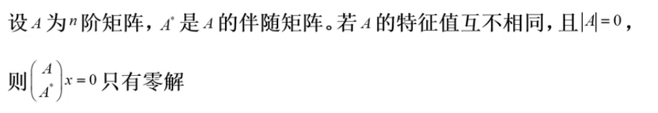

> 解：因为 $r(A)=n-1,r(A^*)=1$ ,所以存在一个 $i$ 使得 $A^*$ 的第 $i$ 列的列向量 $\beta\neq0$ ,
> 于是由 $AA^*=0$ 可知 $A\beta=0$ ,因此 $\beta$ 是 $Ax=0$ 的基础解系,
> 所以 $(A,A^*)^Tx=0$ 的非零解必定是 $k\cdot\beta$ ,其中 $k\neq0$ ,
> 因此 $(A,A^*)^Tx=0$ 有公共的非零解的充分必要条件是 $A^*\beta=0$ ，
> 由 $r(A^*)=1$ 可知 $A^*·A^*=tr(A^*)·A^*$ ,因此 $A^*\beta=tr(A^*)\cdot\beta$ ,
> 由于 $tr(A^*)$ 等于 $A$ 的 $n-1$ 个非零特征值乘积,
> 因此 $tr(A^*)\neq0$ ,因此 $A^*\beta\neq0$ ,这说明 $(A,A^*)^Tx=0$ 的公共解只有零解

$$
\mathbf{{\color{brown}{Section\ \ 3.3.2\ \ n阶矩阵A与其伴随矩阵 A^∗元素的关联性}}}
$$

$$
a_{ij}+A_{ij}=0\Rightarrow a_{ij}=-A_{ij}
$$

即 

$$
A=\begin{bmatrix} a_{11}&a_{12}&\cdots&a_{1j}\\ a_{21}&a_{22}&\cdots&a_{2j}\\ a_{31}&a_{32}&\cdots&a_{3j}\\ \vdots&\vdots&\ddots&\vdots\\ a_{i1}&a_{i2}&\cdots&a_{ij} \end{bmatrix}=\begin{bmatrix} A_{11}&A_{12}&\cdots&A_{1j}\\ A_{21}&A_{22}&\cdots&A_{2j}\\ A_{31}&A_{32}&\cdots&A_{3j}\\ \vdots&\vdots&\ddots&\vdots\\ A_{i1}&A_{i2}&\cdots&A_{ij} \end{bmatrix}=-(A^*)^T
$$

类似的还可以得出 $a_{ij}-A_{ij}=0$ , $a_{ij}+A_{ji}=0$ , $a_{ij}-A_{ji}=0$ , $a_{ji}+A_{ij}=0$ , $a_{ji}-A_{ij}=0$ , $a_{ji}+A_{ji}=0$ , $a_{ji}-A_{ji}=0$

### $Part\ \ 4$ 施密特正交化

给一组无关的 $(\alpha_1,\cdots,\alpha_s)$ ，求与之等价并正交的向量 $(\beta_1,\cdots,\beta_s)$

内积： $\langle \alpha, \beta\rangle =a_1b_1+\cdots+a_nb_n$

计算方式

> $\beta_1=\alpha_1$
>  $\beta_2=\alpha_2-\frac{\langle \alpha_2, \beta_1\rangle}{\langle \beta_1, \beta_1\rangle}\beta_1$
> $\beta_3=\alpha_3-\frac{\langle \alpha_3, \beta_1\rangle}{\langle \beta_1, \beta_1\rangle}\beta_1-\frac{\langle \alpha_3, \beta_2\rangle}{\langle \beta_2, \beta_2\rangle}\beta_2$
>  $\vdots$
>  $\beta_n=\alpha_n-\frac{\langle \alpha_n, \beta_1\rangle}{\langle \beta_1, \beta_1\rangle}\beta_1-\frac{\langle \alpha_n, \beta_2\rangle}{\langle \beta_2, \beta_2\rangle}\beta_2-\cdots-\frac{\langle \alpha_n, \beta_{n-1}\rangle}{\langle \beta_{n-1}, \beta_{n-1}\rangle}\beta_{n-1}$
> 再单位化
>  $\eta_1=\frac{\beta_1}{||\beta_1||}$
>  $\vdots$
> $\eta_n=\frac{\beta_n}{||\beta_n||}$

正交矩阵：满足 $\langle A, A^T\rangle=E$

### $Part\ \ 5$ 正交矩阵的基本性质

> ① $|A|=1或-1$
> ② $A^T=A^{-1}$
> ③ $A$ ， $B$ 正交，则 $AB$ 也正交
> ④若 $A$ 正交， $\alpha$ 和 $\beta$ 分别为 $n$ 维列向量，则$\langle A\alpha, A\beta\rangle=\langle \alpha, \beta\rangle$
> ⑤若 $A$ 正交，则 $A$ 的 $n$ 维列(行)向量组为标准正交向量组

例：三阶非零矩阵 $A$ ， $a_{ij}=A_{ij}$ , $|A|=1$ ,试证 $A$ 正交

$$
A^*=\begin{bmatrix} A_{11}&A_{21}&A_{31}\\  A_{12}&A_{22}&A_{32}\\ A_{13}&A_{23}&A_{33}\\ \end{bmatrix} \Rightarrow A^*=A^T
$$

 ， $A^TA=A^*A=|A|E\Rightarrow|A^T|\cdot|A|=||A|E|$

进而有 $|A|^{2}=|A|^3|E|\Rightarrow|A|=0或1$ ，由于三阶非零矩阵 $A$ 是三阶非零矩阵，设 $a_{11}\neq0$ ,

则 $|A|=a_{11}A_{11}+a_{12}A_{12}+a_{13}A_{13}=a_{11}^2+a_{12}^2+a_{13}^2\gt0$ ，故 $|A|=1$

### $Part\ \ 6$ 实对称矩阵的对角化

定理：实对称矩阵的不同特征值的特征向量正交

正交相似：若存在 $n$ 阶方阵 $A$ 、 $B$ 以及$n$ 阶正交矩阵 $Q$ ，存在以下关系 $Q^{-1}AQ=B$ ，则称 $A正交相似 B$

如果矩阵能够找到 $n$ 个线性无关的特征向量，则有 $Q^{-1}AQ=\Lambda$ ,如果没有，则无法对角化

计算步骤

> ①求特征值
> ②求特征向量
> ③进行施密特正交化，单位化(考试也一般只出到三阶)
>  a.对于全部单根情况，直接单位化
>  b.对于有部分是单根，有部分是二重根的情况，只需要将二重根做正交化，再对全部做单位化
>  c.有三重根，要全部做正交化，单位化
> ④做成列构成 $Q$
> ⑤按特征向量对应的特征值按序构成 $\Lambda$

设对称矩阵 

$$
A=  \begin{bmatrix}-2&0&1\\0&-2&0\\1&0&-2\end{bmatrix}
$$

(1)矩阵 $A$ 的特征值与特征向量;

(2)正交矩阵 $P$ ,使 $P^ {-1} AP$ 为对角矩阵.

> 解：
> (1)由于
>  
> $$
> |A-  \lambda  E|= \begin{vmatrix}-2-\lambda&0&1\\0&-2-\lambda&0\\1&0&-2-\lambda\end{vmatrix}  =(-1-  \lambda  )(-2-  \lambda  )(-3-  \lambda  )
> $$
> 
> 所以A的特征值为 $\lambda_1=-1，\lambda_2=-2，\lambda_3=-3.$
> 当 $\lambda _ {1}  =-1$ 时,解方程组 $(A+E)x=0$ ,由
>  
> $$
> |A+E|=  \begin{vmatrix}-1&0&1\\0&-1&0\\1&0&-1\end{vmatrix}  =\begin{vmatrix}1&0&-1\\0&1&0\\0&0&0\end{vmatrix}
> $$
> 
> 解得基础解系 
> $$
> \eta_1  =  \begin{pmatrix}1\\0\\1\end{pmatrix}
> $$
>  ,则 $A$ 的对应于 $\lambda _ {1}  =-1$ 的全部特征向量为 $k_ {1}   \eta_1  (  k_ {1}   \neq  0)$
> 当 $\lambda _ {2}  =-2$ 时,解方程组 $(A+2E)x=0$ ,由
>  
> $$
> |A+2E|= \begin{vmatrix}0&0&1\\0&0&0\\1&0&0\end{vmatrix}  =\begin{vmatrix}1&0&0\\0&0&1\\0&0&0\end{vmatrix}
> $$
> 
> 解得基础解系 
> $$
> \eta_2  =  \begin{pmatrix}0\\1\\0\end{pmatrix}
> $$
>  ,则 $A$ 对应于 $\lambda _ {2}  =-2$ 的全部特征向量为 $k_ {2}   \eta_2  (  k_ {2}   \neq  0)$
> 当 $\lambda _ {3}  =-3$ 时,解方程组 $(A+3E)x=0$ ,由
>  
> $$
> |A+3E|=  \begin{vmatrix}1&0&1\\0&1&0\\1&0&1\end{vmatrix} = \begin{vmatrix}1&0&1\\0&1&0\\0&0&0\end{vmatrix}
> $$
> 
> 解得基础解系中 
> $$
> \eta_3  =  \begin{pmatrix}-1\\0\\1\end{pmatrix}
> $$
>  ,则 $A$ 的对应于 $\lambda _ {3}  =-3$ 的全部特征向量为 $k_ {3}   \eta_3 (  k_ {3}   \neq  0)$
> (2)由于特征值互异,因此向量组 $\eta_1  ,  \eta_2 ,\eta_3$ 正交,将向量组 $\eta_1  ,  \eta_2 ,\eta_3$ 单位化得
> 
> $$
> p_ {1}  =  \frac {1}{\sqrt {2}}   \begin{pmatrix}1\\0\\1\end{pmatrix}   ,  p_ {2}  =  \begin{pmatrix}0\\1\\0\end{pmatrix},p_ {3}  =  \frac {1}{\sqrt {2}}   \begin{pmatrix}-1\\0\\1\end{pmatrix}
> $$
> 
> 因此所求的正交矩阵为
>  
> $$
> P=(  p_ {1}  ,  p_ {2}  ,  p_ {3}  )=  \begin{pmatrix}\frac{1}{\sqrt{2}}&0&-\frac{1}{\sqrt{2}}\\0&1&0\\\frac{1}{\sqrt{2}}&0&\frac{1}{\sqrt{2}}\end{pmatrix}
> $$
> 

### $Part\ \ 7$ 秩一矩阵

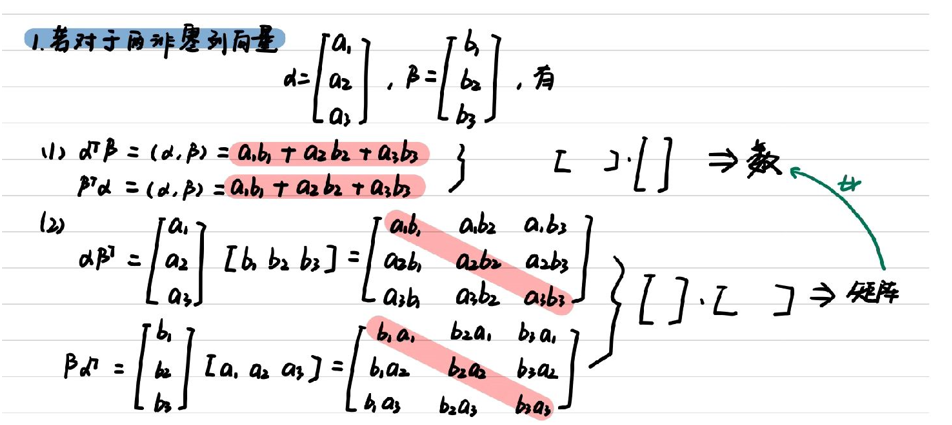

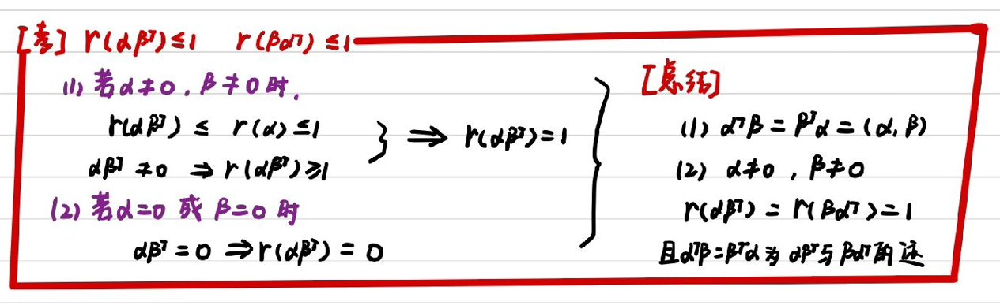

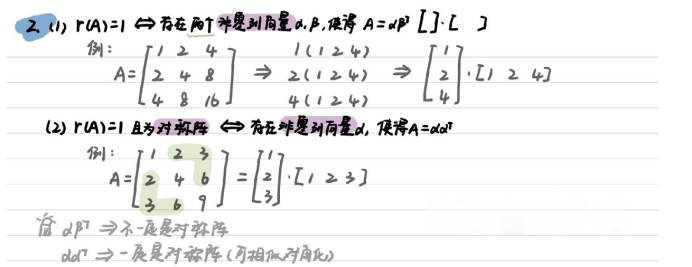

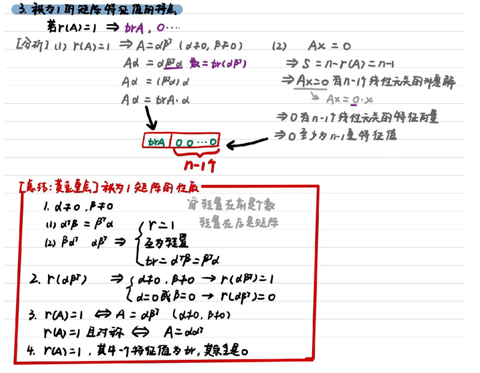

### $Part\ \ 8$ 谱分解定理

在线性代数中，特征分解 $(Eigendecomposition)$ ，又称谱分解 $(Spectral decomposition)$ 是将矩阵分解为由其特征值和特征向量表示的矩阵之积的方法。

设 $A$ 为 $n$ 阶方阵， $A\alpha=\lambda\alpha(\alpha\neq0)$ 。由于 $|\lambda E-A\mid=|\lambda E-A^{T}|$ ，因此 $\lambda$ 也是 $A^T$ 的特征值。这样就存在 $\beta\neq0$ ，使得 $A^{T}\beta=\lambda\beta$ 。

若 $A$ 可对角化，即存在可逆 $P$ ，使 $P^{-1}AP=diag\{\lambda_{1},\lambda_{2},\cdots,\lambda_{n}\}$ ，其中 $\lambda_{1},\lambda_{2},\cdots,\lambda_{n}$ 为 $A$ 的特征值。这时有 $P^TA^T(P^T)^{-1}=diag\{\lambda_1,\lambda_2,\cdots,\lambda_n\}$ 。

设 $P=\{\alpha_{1},\alpha_{2},\cdots,\alpha_{n}\},P^{-1}=\{\beta_{1},\beta_{2},\cdots,\beta_{n}\}^{T}$ ，则 $\alpha_{1},\alpha_{2},\cdots,\alpha_{n}$ 线性无关， $\beta_{1},\beta_{2},\cdots,\beta_{n}$ 也线性无关，且 $A\alpha_{i}=\lambda\alpha_{i},A^{T}\beta_{i}=\lambda_{i}\beta_{i}.\left(1\leq i\leq n\right)$ 。这样就有 

$$
A=P\begin{bmatrix}\lambda_1\\&\lambda_2\\&&\ddots\\&&&\lambda_n\end{bmatrix}P^{-1}=(\alpha_1,\alpha_2,\cdots,\alpha_n)\begin{bmatrix}\lambda_1\\&\lambda_2\\&&\ddots\\&&&\lambda_n\end{bmatrix}\begin{bmatrix}\beta_1^T\\\beta_2^T\\\vdots\\\beta_n^T\end{bmatrix}=\sum_{i=1}^n\lambda_i\alpha_i\beta_i^T
$$

 称为 $A$ 的谱分解，特征值 $\{\lambda_{1},\lambda_{2},\cdots,\lambda_{n}\}$ 也称为 $A$ 的谱。若 $A_{i}=\alpha_{i}\beta_{i}^{T}$ ，则可记为 $A=\sum\limits_{i=1}^n\lambda_iA_i$ ，其中 $A_{i}$ 有如下性质：

> 1. $A_{i}^{2}=A_{i}(i=1,2,\cdots,n)$
> 2. $A_{i}A_{j}=0(i\neq j)$
> 3. $\sum\limits_{i=1}^nA_i=E$

由于实对称阵可对角化，因此实对称阵谱分解存在。不可对角化的方阵 $A$ 没有谱分解。

$e.g.$ 矩阵 $A$ 的特征值为2,1,1, $\xi_1=(1,1,1)^T$ 是属于特征值2的特征向量,求实对称矩阵 $A$

> 解 $A-\boldsymbol{E}$ 的特征值为1,0,0, $\boldsymbol{\xi}_1=(1,1,1)^T$ 是属于特征值 1 的特征向量
>  
> $$
> \boldsymbol{A}-\boldsymbol{E}=1\times\frac{1}{\sqrt{3}}\begin{pmatrix}1\\1\\1\end{pmatrix}\times\frac{1}{\sqrt{3}}\left(1,1,1\right)=\frac{1}{3}\begin{pmatrix}1&1&1\\1&1&1\\1&1&1\end{pmatrix}
> $$
> 
> 易得 
> $$
> A=\frac{4}{3}\begin{pmatrix}1&1&1\\1&1&1\\1&1&1\end{pmatrix}
> $$
> 

### $Part\ \ 9$ $AB$ 与 $BA$ 特辑[[4]](#ref_4)[[5]](#ref_5)

①若 $A$ 、 $B$ 都是 $n$ 阶可逆矩阵，则矩阵乘法 $AB=BA$ 成立的**充要条件**是

$$
(AB)^{-1}=A^{-1}B^{-1}.
$$

②若 $A$ 、 $B$ 都是 $n$ 阶可逆矩阵，则矩阵乘法 $AB=BA$ 成立的**充要条件**是

$$
(AB)^{T}=A^{T}B^{T}.
$$

> 这条可以和秩一矩阵相联系方便求特征值

③若 $A$ 、 $B$ 都是 $n$ 阶可逆矩阵，则矩阵乘法 $AB=BA$ 成立的**充分条件**是

$$
A=(A-\lambda E)B
$$

 其中 $E$ 为 $n$ 阶单位矩阵， $\lambda$ 为任意实数，则 $AB=BA$ 。

> 证：当 $\lambda=0$ 时, $A=(A-\lambda E)B$ 变为 $A=AB$ ,从而有 $B=EB=(A^{-1}A)B=A^{-1}(AB)=A^{-1}A=E$ . 结论显然成立。
> 当 $\lambda$ 为任意非零实数时，因为已知 $A$ , $B$ 可逆，所以 $A-\lambda E$ 也是可逆的。由 $A=(A-\lambda E)B$ 式，得 
> $$
> B=(A-\lambda E)^{-1}A
> $$
>  .
> 根据矩阵运算性质，由 $A=(A-\lambda E)B$ 、 $B=(A-\lambda E)^{-1}A$ 两式，可得 
> $$
> \begin{array} \ A^{\prime}B^{\prime}&=(A-\lambda E)B^{\prime}[(A-\lambda E)^{-1}A ]^{\prime}  \\&=B^{\prime}(A-\lambda E)^{\prime}A^{\prime}[(A-\lambda E)^{-1}]^{\prime}  \\&=B^{\prime}(A^{\prime}-\lambda E)A^{\prime}\bigl[(A-\lambda E)^{\prime}\bigr]^{-1} \\&=B^{\prime}(A^{\prime}A^{\prime}-\lambda A^{\prime})\bigl(A^{\prime}-\lambda E\bigr)^{-1} \\&=B^{\prime}A^{\prime}(A^{\prime}-\lambda E)(A^{\prime}-\lambda E)^{-1} \\& =B^{\prime}A^{\prime}E \\&=B^{\prime}A^{\prime}  \end{array}
> $$
>  .
>
> 又 $(AB)^{\prime}=B^{\prime}A^{\prime}$ .故 $(AB)^{\prime}=A^{\prime}B^{\prime}$ .
> 此外，由 $AB=BA$ 我们可以继续推导。
> ①朴素方法 
> $$
> AB=BA\Rightarrow E^{-1}ABE=BA 
> $$
>  可得 $AB\sim BA$
> ②炫技
> 构造两矩阵 $E-AB$ 、 $E-BA$ 
> $$
> \begin{array} \ E-BA&=BB^{-1}-BA\\&=B(B^{-1}-A)\\&=B(E-AB)B^{-1} \end{array}
> $$
>  我们可以知道这是相似的定义，可得$E-AB\sim E-BA$ ，进一步，他的特征多项式也相似，可得$AB\sim BA$ .

更进一步，若 $A$ 是 $m\times n$ 矩阵， $B$ 是 $n\times m$ 矩阵，则 $AB$ 与 $BA$ 有相同的特征值，且阶数较高的那个乘积还有 $|{m-n}|$ 个零特征值.—— $Sylvester$ 公式

> 设 $A$ 是 $m\times n$ 矩阵， $B$ 是 $n\times m$ 矩阵，且 $m\geqslant n$ ,则 
> $$
> |\lambda I_m-AB|=\lambda^{m-n}|\lambda I_n-BA|
> $$
>  证明：考虑到等式左右的行列式形式，构造分块矩阵 
> $$
> \left.\left[\begin{array}{cc}\lambda I_m&A\\B&I_n\end{array}\right.\right],
> $$
> 
> 然后构造广义初等矩阵： 
> $$
> \color{red}{\begin{bmatrix}I_m&-A\\0&I_n\end{bmatrix},\begin{bmatrix}I_m&-\frac1\lambda A\\0&I_n\end{bmatrix}.}
> $$
> 
>
> 则有 
> $$
> \begin{bmatrix}I_m&-A\\0&I_n\end{bmatrix}\begin{bmatrix}\lambda I_m&A\\B&I_n\end{bmatrix}=\begin{bmatrix}\lambda I_m-AB&0\\B&I_n\end{bmatrix}
> $$
>  
> $$
> \begin{bmatrix}\lambda I_m&A\\B&I_n\end{bmatrix}\begin{bmatrix}I_m&-\frac{1}{\lambda}A\\0&I_n\end{bmatrix}=\begin{bmatrix}\lambda I_m&0\\B&I_n-\frac{1}{\lambda}BA\end{bmatrix}
> $$
> 
>
> 取行列式，即有：
>  
> $$
> |\lambda I_n||\lambda I_m-AB|=\begin{vmatrix}\lambda I_m&A\\B&I_n\end{vmatrix}=|\lambda I_m||I_n-\frac{1}{\lambda}BA|
> $$
> 

## $\mathcal{\mathit{Chapter\ \ 4\ \ } }$ 二次型

### $Part\ \ 1$ 二次型的定义

定义形同 $x^2$ 的项称之为平方项，形同 $xy$ 的项称之为交叉项

> ①平方项的系数，一般被放在主对角线上
> ②交叉项的系数除以2，分别对称地放在与之相关未知量所在的列
> ③一般可写作 $X^TAX$
> 例： $x_1^2+2x_1x_2+x_2^2-x_2x_3+2x_3^2-2x_1x_3$
>  
> $$
> \begin{bmatrix} x_1&x_2&x_3 \end{bmatrix} \begin{bmatrix} 1&1&-1\\  1&1&-\frac{1}{2}\\ -1&-\frac{1}{2}&2\\ \end{bmatrix} \begin{bmatrix} x_1\\ x_2\\ x_3\\ \end{bmatrix}
> $$
> 

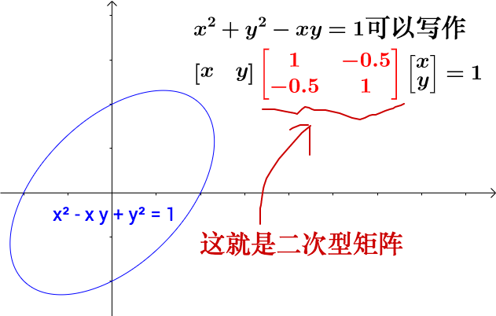

$X=CY$ 线性替换

合同：若存在 $n$ 阶方阵 $A$ 、 $B$ 以及$n$ 阶可逆矩阵 $C$ ，存在以下关系 $C^TAC=B$ ，则称 $A\simeq B$

> ① 反身性：$A\simeq B$
> ② 对称性：$A\simeq B$ ， $B\simeq A$
> ③ 传递性：$A\simeq B$ ， $B\simeq C$ ，$A\simeq C$
> ④ 若 $A\simeq B$ ，则 $r(A)=r(B)$ ，若 $A$ 为对称阵，则 $B$ 也是对称阵; $A^T=A,B^T=B$ ;若 $A$ ， $B$ 可逆，则 $A^{-1}\simeq B^{-1}$ ; $A^T\simeq B^T$
> ⑤ 矩阵 $A$ 、 $B$ 合同的充要条件是对矩阵 $A$ 的行和列实施相同的初等变换变成 $B$

总结：

$$
等价：矩阵A,B\mathbf{{\color{red}{同型}}},存在\mathbf{{\color{red}{可逆}}}矩阵P,Q，使得PAQ=B\\ 相似：矩阵A,B是\mathbf{{\color{red}{同阶方阵}}} ,存在\mathbf{{\color{red}{可逆}}}矩阵P，使得P^{-1}AP=B\\ 正交相似：矩阵A,B是\mathbf{{\color{red}{同阶方阵}}} ,存在\mathbf{{\color{red}{正交}}}矩阵P(P^T=P^{-1})，使得P^{-1}AP=B,P^TAP=B\\ 合同：矩阵A,B是\mathbf{{\color{red}{同阶方阵}}} ,存在\mathbf{{\color{red}{可逆}}}矩阵P，使得P^TAP=B
$$

其中，正交相似必然是相似且合同的

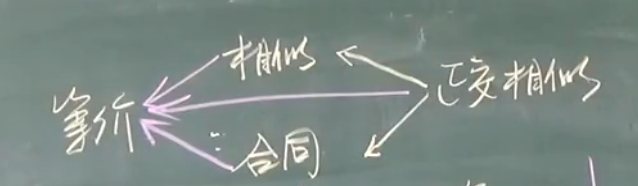

### $Part\ \ 2$ 化二次型为标准型

> ①配方法(或称拉格朗日配方法)
>  a.先 $x_1$ ,后$x_2$ ，再$x_3$ ，再 $\cdots x_n$
>  b.配完 $x_1$ ，之后的项不能再出现 $x_1$
>  c.解算
> 如果你喜欢在考场上用这种方法，我只能说，老爷又高又硬
> 例 $x_1^2-3x_2^2+4x_3^2-2x_1x_2+2x_1x_3-6x_2x_3\\ =x_1^2-2x_1(x_2-x_3)+(x_2-x_3)^2-(x_2-x_3)^2-3x_2^2+4x_3^2-6x_2x_3\\ =(x_1-x_2+x_3)^2-(4x_2^2+4x_2x_3+x_3^2)+x_3^2+3x_3^2\\ =(x_1-x_2+x_3)^2-(2x_2+x_3)^2+4x_3^2\\ =y_1^2-y_2^2+4y_3^2$
>  
> $$
> \left\{\begin{matrix}x_1=y_1+\frac{y_2-3y_3}{2}  \\x_2=\frac{y_2-y_3}{2}  \\x_3=y_3  \end{matrix}\right.
> $$
> 
> 而特别的，我们对于只有交叉项的情形，需要一点技巧
>  $2x_1x_2-4x_1x_3+10x_2x_3+5x_3x_4+x_1x_4$
> 令 
> $$
> \left\{\begin{matrix}x_1=y_1-y_2 \\x_2=y_1+y_2 \\x_3=y_3 \\x_4=y_4\\ \end{matrix}\right.
> $$
>  ，便可又回到上边的情形
>
> ②初等变换
>  a.对 $A$ 和 $E$ 做相同的初等列变换
>  b.只对 $A$ 做相应的初等行变换
>  c.当 $A$ 变为对角形 $\Lambda$ 时， $E$ 就变成了 $C$ ,每做一次初等列变换，都要做一次对偶的初等行变换
> 例：
>  
> $$
> A=\begin{pmatrix} 1  &1  &1 \\ 1  &2  &2 \\ 1  &2  &1 \end{pmatrix}
> $$
>  ，构造 
> $$
> \begin{pmatrix} A\\ \hdashline E \end{pmatrix}
> $$
> 
>  
> $$
> \begin{pmatrix} 1  &1  &1 \\ 1  &2  &2 \\ 1  &2  &1\\ \hdashline 1&0  &0 \\  0 &1  &0 \\  0 &0  &1 \end{pmatrix}
> $$
>  $\xrightarrow[column_1\times(-1)+c olumn_2]{}$ 
> $$
> \begin{pmatrix} 1  &0  &1 \\ 1  &1  &2 \\ 1  &1 &1\\ \hdashline 1&-1  &0 \\  0 &1  &0 \\  0 &0  &1 \end{pmatrix}
> $$
>  $\xrightarrow[row_1\times(-1)+row_2]{}$ 
> $$
> \begin{pmatrix} 1  &0  &1 \\ 0  &1  &1 \\ 1  &1 &1\\ \hdashline 1&-1  &0 \\  0 &1  &0 \\  0 &0  &1 \end{pmatrix}
> $$
>  $\xrightarrow[column_1\times(-1)+column_3]{}$ 
> $$
> \begin{pmatrix} 1  &0  &0 \\ 0  &1  &1 \\ 1  &1 &0\\ \hdashline 1&-1  &-1 \\  0 &1  &0 \\  0 &0  &1 \end{pmatrix}
> $$
>  $\xrightarrow[row_1\times(-1)+row_3]{}$ 
> $$
> \begin{pmatrix} 1  &0  &0 \\ 0  &1  &1 \\ 0  &1 &0\\ \hdashline 1&-1  &-1 \\  0 &1  &0 \\  0 &0  &1 \end{pmatrix}
> $$
>  $\xrightarrow[column_2\times(-1)+column_3]{}$ 
> $$
> \begin{pmatrix} 1  &0  &0 \\ 0  &1  &0 \\ 0  &1 &-1\\ \hdashline 1&-1  &0 \\  0 &1  &-1 \\  0 &0  &1 \end{pmatrix}
> $$
>  $\xrightarrow[row_2\times(-1)+row_3]{}$ 
> $$
> \begin{pmatrix} 1  &0  &0 \\ 0  &1  &0 \\ 0  &0 &-1\\ \hdashline 1&-1  &0 \\  0 &1  &-1 \\  0 &0  &1 \end{pmatrix}
> $$
> 
> 特别的，我们又称形如 
> $$
> \begin{pmatrix}   1&  &  &  &  &  &  &  & \\   &\ddots  &  &  &  &  &  &  & \\   &  &1  &  &  &  &  &  & \\   &  &  &-1  &  &  &  &  & \\   &  &  &  &\ddots  &  &  &  & \\   &  &  &  &  &-1  &  &  & \\   &  &  &  &  &  &0  &  & \\   &  &  &  &  &  &  &\ddots  & \\   &  &  &  &  &  &  &  &0 \end{pmatrix}
> $$
>  的矩阵为规范型，即 $y_1^2+\cdots+y_p^2-y_{p+1}^2-\cdots-y_r^2$ ，其中我们称 $r$ 为他的秩，正数个数为正惯性指数，负数个数为负惯性指数，正惯性指数-负惯性指数为符号差。
>  $A$ 与 
> $$
> {\tiny \begin{pmatrix}   1&  &  &  &  &  &  &  & \\   &\ddots  &  &  &  &  &  &  & \\   &  &1  &  &  &  &  &  & \\   &  &  &-1  &  &  &  &  & \\   &  &  &  &\ddots  &  &  &  & \\   &  &  &  &  &-1  &  &  & \\   &  &  &  &  &  &0  &  & \\   &  &  &  &  &  &  &\ddots  & \\   &  &  &  &  &  &  &  &0 \end{pmatrix}}
> $$
>  合同的条件：有相同的秩，且正惯性指数或负惯性指数相同
> ③正交变换法(或者叫正交相似变换法，近几年考研考的都是它)
>  a.求特征值
>  b.求特征向量
>  c.正交化，单位化
>  d.做成列构成 $C$
>  e.按特征向量对应的特征值按序构成 $\Lambda$

---

> 2024.02.20
> 这里可能有些同学看的有点懵，故加入正交变换的几何意义
> 设变换矩阵为 $P$ ，原始矩阵为 $x$ ，目标矩阵为 $y$ ，还记得我们那个巧妙的变换吗？
> 抢答—— $y=Px$
> ①在几何上(二、三维)，正交变换是等距的，即能保证以欧氏空间中任意两(三)个向量为邻边的平行四边形(体)的对角线之长不变。
>  $Proof:$
>  $\left \| y \right \| =\sqrt{y^Ty}=\sqrt{(Px)^TPx}=\sqrt{x^TP^TPx}=\sqrt{x^TP^{-1}Px}=\sqrt{x^Tx}=\left \| x \right \|$
> ②如果欧氏空间的一个变换 $\sigma$ 既是保长度变换又是保夹角变换(即 $\sigma$ 保证欧氏空间中任意两个非零向量间的夹角不变)，那么 $\sigma$ 就应该保持对角线长，从而 $\sigma$ 是一个正交变换
> $Proof:$
> 设变换 $\sigma$ 是欧氏空间 $V$ 的一个既保长度变换又保夹角变换， $\overrightarrow{\xi} ,\overrightarrow{\eta} \neq\overrightarrow{0} 且\in V$ 。
> 可得
> 
> $$
> |\sigma(\xi)|=|\xi|,|\sigma(\eta)|=|\eta|
> $$
>  从而使得
>  
> $$
> \frac{\left \langle \sigma(\xi),\sigma(\eta) \right \rangle }{|\sigma(\xi)||\sigma(\eta)|}=\frac{\left \langle \xi,\eta \right \rangle }{|\xi||\eta|}
> $$
>  即
>  
> $$
> \left \langle \sigma(\xi),\sigma(\eta) \right \rangle=\left \langle \xi,\eta \right \rangle
> $$
>  二者内积相同，由内积定义可知得证

---

> ***这里总结一下***
> 1.标准型是不唯一的，如果是配方法求得的，那么选取的可逆变换（配方的方式）不同，标准型结果也就不同。
> 2.**如果两个二次型的标准型一样** $\Rightarrow$
>  ①惯性指数相同 $\Rightarrow$ 正负特征值个数相同 $\Rightarrow$ 两矩阵合同
>  ②不能确定特征值
>  **如果两个二次型的规范型一样** $\Rightarrow$
>  ①惯性指数相同 $\Rightarrow$ 正负特征值个数相同 $\Rightarrow$ 两矩阵合同
>  ②不能确定特征值
> 3.配方法和初等变换法得到的标准型均不能确定特征值。
>  $e.g.$ 计算二次型 $X^TAX=x_1^2+5x_2^2+5x_3^2+2x_1x_2-4x_1x_3$ 的标准形.
> ①配方法
>  
> $$
> \begin{array} \ X^TAX&=x_1^2+2x_1(x_2-2x_3)+5x_2^2+5x_3^2 \\ &=(x_1+x_2-2x_3)^2-(x_2-2x_3)^2+5x_2^2+5x_3^2 \\ &=(x_1+x_2-2x_3)^2+4x_2^2+x_3^2+4x_2x_3 \\ &=(x_1+x_2-2x_3)^2+(2x_2+x_3)^2 \\ &=y_1^2+y_2^2\\ \end{array}
> $$
> 
> ②初等变换法
>  
> $$
> \begin{pmatrix} 1  &1  &-2 \\ 1  &5  &0 \\ -2  &0  &5\\ \hdashline 1&0  &0 \\  0 &1  &0 \\  0 &0  &1 \end{pmatrix}
> $$
>  $\xrightarrow[row_1\times(-1)+row_2]{}$ 
> $$
> \begin{pmatrix} 1  &1  &-2 \\ 0  &4  &2 \\ -2  &0  &5\\ \hdashline 1&0  &0 \\  0 &1  &0 \\  0 &0  &1 \end{pmatrix}
> $$
>  $\xrightarrow[column_1\times(-1)+column_2]{}$ 
> $$
> \begin{pmatrix} 1  &0  &-2 \\ 0  &4  &2 \\ -2  &2  &5\\ \hdashline 1&-1  &0 \\  0 &1  &0 \\  0 &0  &1 \end{pmatrix}
> $$
>  $\xrightarrow[row_1\times(2)+row_3]{}$ 
> $$
> \begin{pmatrix} 1  &0  &-2 \\ 0  &4  &2 \\ 0  &2  &1\\ \hdashline 1&-1  &0 \\  0 &1  &0 \\  0 &0  &1 \end{pmatrix}
> $$
>  $\xrightarrow[column_1\times(2)+column_3]{}$ 
> $$
> \begin{pmatrix} 1  &0  &0 \\ 0  &4  &2 \\ 0  &2  &1\\ \hdashline 1&-1  &2 \\  0 &1  &0 \\  0 &0  &1 \end{pmatrix}
> $$
>  $\xrightarrow[row_2\times(-\frac12)+row_3]{}$ 
> $$
> \begin{pmatrix} 1  &0  &0 \\ 0  &4  &2 \\ 0  &0  &0\\ \hdashline 1&-1  &2 \\  0 &1  &0 \\  0 &0  &1 \end{pmatrix}
> $$
>  $\xrightarrow[column_2\times(-\frac{1}{2})+column_3]{}$ 
> $$
> \begin{pmatrix} 1  &0  &0 \\ 0  &4  &0 \\ 0  &0  &0\\ \hdashline 1&-1  &\frac52 \\  0 &1  &-\frac12 \\  0 &0  &1 \end{pmatrix}
> $$
> 
>
> ③正交变换法
>  
> $$
> A=\begin{bmatrix}1&1&-2\\1&5&0\\-2&0&5\end{bmatrix}
> $$
>  , 
> $$
> \left.|\lambda E-A|=\left|\begin{array}{ccc}\lambda-1&-1&2\\-1&\lambda-5&0\\2&0&\lambda-5\end{array}\right.\right|
> $$
>  
> $$
> \stackrel{2r_2+r_3}{=}\begin{array}{|ccc|}\lambda-1&-1&2\\-1&\lambda-5&0\\0&2(\lambda-5)&\lambda-5\end{array}
> $$
>  
> $$
> \stackrel{-2c_3+c_2}=\begin{array}{|ccc|}\lambda-1&-5&2\\-1&\lambda-5&0\\0&0&\lambda-5\end{array}
> $$
>  $=(\lambda-5)(\lambda^2-6\lambda)$

### $Part\ \ 3$ 矩阵的有定性[[6]](#ref_6)[[7]](#ref_7)[[8]](#ref_8)[[9]](#ref_9)

> $f(X)=X^TAX\ \ ,\ \ X\neq0$
> 正定： $f(x_1,x_2,x_3)=x_1^2+2x_2^2+x_3^2\ \ x\neq0,f\gt0$
> 半正定： $f(x_1,x_2,x_3)=x_1^2+2x_2^2+0x_3^2\ \ x\neq0,f\ge0$
> 负定： $f(x_1,x_2,x_3)=-x_1^2-2x_2^2-x_3^2\ \ x\neq0,f\lt0$
> 半负定： $f(x_1,x_2,x_3)=-x_1^2-2x_2^2-0x_3^2\ \ x\neq0,f\le0$
> 不定： $f(x_1,x_2,x_3)=x_1^2-x_2^2+x_3^2\ \ x\neq0$ ，对于 $f$ 可能 $\gt0$ 也可能 $\lt0$ ；
> 例：取 
> $$
> \begin{pmatrix} 1  \\ 0 \\ 0\\  \end{pmatrix}f=1\gt0
> $$
>  ,取 
> $$
> \begin{pmatrix} 0  \\ 1 \\ 0\\  \end{pmatrix}f=-1\lt0
> $$
> 

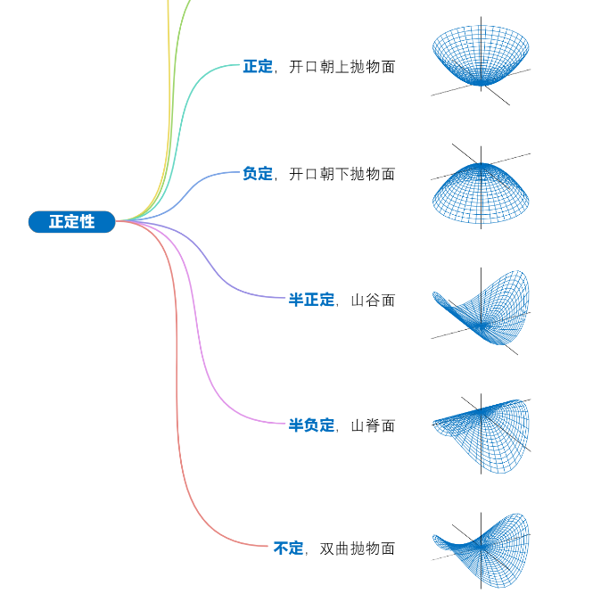

图源：Ch21\_曲面和正定性\_\_矩阵力量\_\_从加减乘除到机器学习

有定性的判定：

> 设 $A$ 是实对称阵，考研里一般都是实对称阵
> ①正定
>  a. $d_1y_1^2+d_2y_2^2+\cdots+d_ny_n^2,d_i\gt0$
>  b.正惯性指数为 $n$
>  c. $A\simeq E$
>  d. $|A|\gt0$
>  e. $n个特征值\gt0$
>  f.各阶顺序主子式 $\gt0$ ，且 $A$ 的所有顺序主子矩阵都是正定矩阵
>  g.存在可逆实矩阵 $P$ ,使 $A-P^{T}P=0$ ;
>  h.设 
> $$
> A=\begin{pmatrix}A_1&A_2\\A_2^T&A_3\end{pmatrix}
> $$
>  ,则 $A_1$ 和 $A_3-A_2^TA_1^{-1}A_2$ 都正定;
> ②负定
>  a. $d_1y_1^2+d_2y_2^2+\cdots+d_ny_n^2,d_i\lt0$
>  b.负惯性指数为 $n$
>  c. $A\simeq -E$
>  d. $|A|\lt0$
>  e. $n个特征值\lt0$
>  f.若 $A$ 的各阶主子式中，**奇数阶顺序主子式**为负，**偶数阶顺序主子式**为正
>  g.存在可逆实矩阵 $P$ ,使 $A+P^{T}P=0$ ;
>  h.设 
> $$
> A=\begin{pmatrix}A_1&A_2\\A_2^T&A_3\end{pmatrix}
> $$
>  ,则 $A_1$ 和 $A_3-A_2^TA_1^{-1}A_2$ 都负定;
> ③半正定
>  a .$d_1y_1^2+d_2y_2^2+\cdots+d_ny_n^2,d_i\ge0$
>  b.正惯性指数 $<n$ ,即它的正惯性指数与秩相等或负惯性指数等于零;
>  c. $n个特征值\ge0$
>  d.存在可逆实方阵 $P$ ,使 $A-P^{T}P=0$ ;
>  e.存在可逆实矩阵 $P$ ,使 
> $$
> P^{T}AP=\begin{bmatrix}d_1\\&d_2\\&&\ddots\\&&&d_r\\&&&&0\\&&&&&\ddots\\&&&&&&0\end{bmatrix},
> $$
>  其中 $d_i>0$ , $i=1,2,\cdots,r$ , $秩(A)=r$ ;
> ④半负定
>  a .$d_1y_1^2+d_2y_2^2+\cdots+d_ny_n^2,d_i\le0$
>  b.负惯性指数 $<n$ ,即它的负惯性指数与秩相等或正惯性指数等于零;
>  c. $n个特征值\le0$
>  d.存在可逆实方阵 $P$ ,使 $A+P^{T}P=0$ ;
>  e. $A$ 的所有**奇数阶顺序主子式**全小于或等于零,**偶数阶顺序主子式**全大于或等于零;
>  f.存在可逆实矩阵 $P$ ,使 
> $$
> P^{T}AP=\begin{bmatrix}d_1\\&d_2\\&&\ddots\\&&&d_r\\&&&&0\\&&&&&\ddots\\&&&&&&0\end{bmatrix},
> $$
>  其中 $d_i<0$ , $i=1,2,\cdots,r$ , $秩(A)=r$ ;

给定一个3×3矩阵：

> 
> $$
> \displaystyle A =  \begin{pmatrix}  a_{11} & a_{12} & a_{13} \\  a_{21} & a_{22} & a_{23} \\  a_{31} & a_{32} & a_{33}  \end{pmatrix}
> $$
> 
> 三阶顺序主子式： $det(A)$ 。
> 二阶顺序主子式： 
> $$
> \begin{vmatrix} a_{11} & a_{12} \\ a_{21} & a_{22} \end{vmatrix}
> $$
>  ；
> 一阶顺序主子式： $|a_{11}|$

正定的性质

> ①若 $A$ 正定，则 $A^{-1}$ 正定
> ②若 $A$ 正定，则 $A^{*}$ 正定
> ③若 $A$ 正定，则 $A^{k}$ 正定
> ④若 $A$ 正定， $B$ 正定(半正定)，则 $aA+bB$ 也正定 $(a>0,b>0)$ ,特别地当 $(a=1,b=1)$ ，对于其行列式 $\left|A+B\right|\geq\left|A\right|+\left|B\right|.$
> ⑤若 $A$ 正定，则 $A$ 的主对角线元素全大于0，即 $a_{ii}\gt0$
> ⑥若 $A$ 正定，则 $A$ 一定可以相似对角化
> ⑦若 $A$ 正定，矩阵 $B$ 也正定，则 $A$ 与 $B$ 也一定合同
> ⑧若 $A$ 正定，且 $A$ 与 $B$ 相似，不能推出 $B$ 一定是正定矩阵
> ⑨若 $A$ 正定，矩阵 $B$ 也正定，不能推出 $AB$ 一定是正定矩阵

### $Part\ \ 4$ 非对称实矩阵合同的条件[[10]](#ref_10)

设 $n$ 阶实方阵 $A$ , $B$ 都是非对称的，即 $A\neq A^T$ , $B\neq B^T$ ,其中上标 $T$ 表示方阵的转置. 并记 $A_s$ , $A_w$ 为矩阵 $A$ 的对称和反对称部分，即

$$
A_{s}=\frac{A+A^{T}}{2},\quad A_{w}=\frac{A-A^{T}}{2}.
$$

类似的，也用 $B_s$ , $B_{w}$ 表示矩阵 $B$ 的对称和反对称部分.为了叙述简单，用记号 $A\simeq B$ 表示矩阵 $A$ 与 $B$ 合同.

而如若 $A{\simeq}B$ ,则 $A_s{\simeq}B_s$

> 这个定理可以用来判定两个非对称实矩阵不合同，但不可判断合同

第一步 求解一元 $n$ 次方程组 $|B_i-\lambda A_i|=0$ ,得到 $n$ 个正实根 $\lambda_1,\lambda_2,\cdots,\lambda_n$

第二步 对每一个 $\lambda_i$ (相同的 $\lambda_i$ 只计算一次即可),求解线性方程组 $(B_s一\lambda_i\mathbf{A}_s)X=0$ ,得到通解的表达式.

第三步 对第二步中的每一个线性方程组，可以选取合适的基础解系并把这些基础解系中的向量作为列向量组成一个 $n$ 阶方阵 $P$ ,使得

$$
P^TAP=E_n,P^TBP=diag(\lambda_1,\lambda_2,\cdots,\lambda_n)
$$

 第四步 验证

$$
\operatorname{diag}(\sqrt{\lambda_{1}},\sqrt{\lambda_{2}},\cdots,\sqrt{\lambda_{n}})\cdot(\boldsymbol{P}^{T}\boldsymbol{A}_{w}\boldsymbol{P})\cdot\operatorname{diag}(\sqrt{\lambda_{1}},\sqrt{\lambda_{2}},\cdots,\sqrt{\lambda_{n}})=\boldsymbol{P}^{T}\boldsymbol{B}_{w}\boldsymbol{P}
$$

 是否成立，如果成立，则 $A{\simeq}B$

## 参考文献

- [MIT - Linear Algebra](https://link.zhihu.com/?target=https%3A//www.bilibili.com/video/BV1ix411f7Yp)
- [The-Art-of-Linear-Algebra-zh-CN](https://link.zhihu.com/?target=https%3A//github.com/kf-liu/The-Art-of-Linear-Algebra-zh-CN)
- [北大丘维声教授清华高等代数课程1080P高清修复版(全151集)](https://link.zhihu.com/?target=https%3A//www.bilibili.com/video/BV1jR4y1M78W)
- [《线性代数》高清教学视频 “惊叹号”系列 宋浩老师](https://link.zhihu.com/?target=https%3A//www.bilibili.com/video/BV1aW411Q7x1)
- [矩阵力量\_\_从加减乘除到机器学习](https://link.zhihu.com/?target=https%3A//github.com/Visualize-ML/Book4_Power-of-Matrix/tree/main)
- [线性代数的几何意义](https://link.zhihu.com/?target=https%3A//github.com/wnma3mz/Reading-Books/blob/master/%25E7%25BA%25BF%25E6%2580%25A7%25E4%25BB%25A3%25E6%2595%25B0%25E7%259A%2584%25E5%2587%25A0%25E4%25BD%2595%25E6%2584%258F%25E4%25B9%2589--%25E5%259B%25BE%25E8%25A7%25A3%25E7%25BA%25BF%25E6%2580%25A7%25E4%25BB%25A3%25E6%2595%25B0.pdf)
- [【线代】真题讲1送8！Kira完整梳理空间平面位置关系与线性方程组解的判定｜2019数一第6题｜线性代数数一专项｜张宇团队考研数学Kira](https://link.zhihu.com/?target=https%3A//www.bilibili.com/video/BV1Vp4y1r7sP/%3Fvd_source%3D143406279634ec39026be9d724d5ac8c)
- [矩阵的舒尔补(Schur complement)](https://link.zhihu.com/?target=https%3A//blog.csdn.net/sheagu/article/details/115771184)
- [线性代数拾遗[1]——分块矩阵](https://link.zhihu.com/?target=https%3A//www.lizhechen.com/2018/03/22/Before-Baoyan-Linear-Algebra-1-Block-Matrix/)
- [【线性方程组】进来秒杀同解与公共解！！](https://link.zhihu.com/?target=https%3A//www.bilibili.com/video/BV1TX4y1q74Y)

## 日志

> 2023.07.18 version1.0 基本完稿，调整了部分章节顺序
> 选择一种弹幕最多的打法φ(゜▽゜\*)♪

> 2023.08.01 增加一些例子，平滑一下学习曲线，让大家更好更快地理解
> 2023.08.10 应评论要求增加新目录
> 2023.08.21 增加新目录，补充了部分总结
> 2023.08.24 偶然发现Chapter3&4的例题有点少，补充一些
> 2023.09.16 删除内容 $\enclose{horizontalstrike}{阐述个人的线代学习之路}$ ，感谢评论区 [@鬼谷觅林](https://www.zhihu.com/people/b9a0b9ba6e625262572e8b33186a6a30) 的意见
> 2023.09.28 增加内容Chapter 1 Part 4 **线性相关性与秩、方程组的解、行列式之间的关系**
> 调整原内容Chapter 1 Part 4 行列式计算于Chapter 1 Part 5
> 2023.10.23 增加内容Chapter 2 Part 4 **矩阵的秩**中的20个秩的不等式、Chapter 2 Part 5**分块矩阵**和Chapter 3 Part 7 **秩一矩阵**
> 2024.02.20 补充线性代数的几何意义,平滑学习曲线

## 参考

1. [^](#ref_1_0)非齐次线性方程组的同解类 <https://d.wanfangdata.com.cn/periodical/ChlQZXJpb2RpY2FsQ0hJTmV3UzIwMjMwODMxEhFteXNmeHl4YjIwMDYwMjAwMhoIN2JzbWNrZHQ%3D>
2. [^](#ref_2_0)矩阵特征值与特征向量的几何意义 <https://d.wanfangdata.com.cn/periodical/ChlQZXJpb2RpY2FsQ0hJTmV3UzIwMjMwODMxEhBzeGd4eXhiMjAyMTA1MDExGgg1eWo4NGNtMg%3D%3D>
3. [^](#ref_3_0)n阶矩阵A与其伴随矩阵 A^∗特征值的关联性 <https://www.doc88.com/p-7758008547504.html>
4. [^](#ref_4_0)矩阵ab与ba的特征值问题 <https://d.wanfangdata.com.cn/periodical/ChlQZXJpb2RpY2FsQ0hJTmV3UzIwMjMwODMxEhdobmp5eHl4Yi16cmt4YjIwMDcwMTAwORoIdnlmbnR3Nmk%3D>
5. [^](#ref_5_0)矩阵乘法AB＝BA成立的两个充要条件与一个充分条件  <https://d.wanfangdata.com.cn/periodical/ChlQZXJpb2RpY2FsQ0hJTmV3UzIwMjMwODMxEg5RSzE5OTUwMDExMjAyNRoId20ydDFsdGk%3D>
6. [^](#ref_6_0)负定二次型与半负定二次型 <https://d.wanfangdata.com.cn/periodical/ChlQZXJpb2RpY2FsQ0hJTmV3UzIwMjMwODMxEhF0aHNmeHl4YjIwMDIwMjAwNhoIbmpqbzQ0YWg%3D>
7. [^](#ref_7_0)正定矩阵的性质及一些正定矩阵不等式 <https://d.wanfangdata.com.cn/thesis/ChJUaGVzaXNOZXdTMjAyMzA5MDESB0QzNTQzNDUaCHF0dTJkYnE5>
8. [^](#ref_8_0)关于正定矩阵的性质及应用的研究 <https://d.wanfangdata.com.cn/periodical/ChlQZXJpb2RpY2FsQ0hJTmV3UzIwMjMwODMxEg9uZWlqa2oyMDE5MDYwODEaCHoxd2VmcXQ5>
9. [^](#ref_9_0)负定矩阵的性质及其证明 <https://d.wanfangdata.com.cn/periodical/ChlQZXJpb2RpY2FsQ0hJTmV3UzIwMjMwODMxEhN5bHNmeHl4Yi16MjAxNDAzMDA0GghxOGw3azU5ZQ%3D%3D>
10. [^](#ref_10_0)非对称实矩阵合同的条件 <https://www.doc88.com/p-9723196679559.html>
